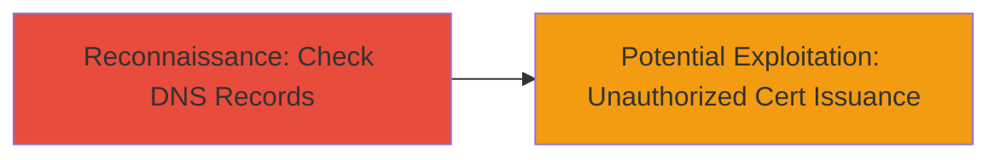

# Discover Missing CAA Records Enabling Unauthorized Certificate Issuance

Multi-stage attack chain demonstrating a complete attack workflow.

## Chain Metrics Dashboard

| Metric | Value |
|--------|-------|
| Chain Status | Unverified |
| Total Steps | 1 |
| Execution Time | ~5 minutes |
| Skill Level | Beginner |
| Complexity | Low |
| Impact Level | High |

## Attack Flow Visualization

## Prerequisites & Requirements

### Required Tools

- [[tools/caatest-co-uk]]

### Target Environment

- DNS resolution for the target domain (e.g., sifchain.finance)
- Internet access to query public DNS
- No specific ports or services required beyond standard DNS (port 53)

### Initial Access Requirements

- No credentials needed
- Public network access
- No prior access to the target

## Detailed Attack Procedures

### Step 1: Reconnaissance - Check for CAA Records
procedure: [[procedures/Check-Domain-CAA-Records]]

**Objective**: Query the DNS for Certificate Authority Authorization (CAA) records to identify if the domain restricts certificate issuance to specific authorities.

**Instructions**: Use the [[tools/caatest-co-uk]] online service to perform a DNS lookup for CAA resource records (type 257) on the target domain.

Navigate to https://caatest.co.uk/ and enter the domain name (e.g., sifchain.finance). The tool will query DNS and display any CAA records.

**Expected Output**: A report showing no CAA records present, indicating the domain is open to issuance by any compliant Certificate Authority.

**Success Indicators**:
- No CAA records (type 257) returned in the DNS query
- Confirmation that the domain lacks restrictions on certificate authorities

## Attack Chain Summary

### Key Achievements

1. Identified missing CAA DNS records for the target domain
2. Highlighted risk of unauthorized certificate issuance
3. Enabled assessment of potential for phishing, MITM, or domain takeover attacks

## Technique & Tactic Coverage

### MITRE ATT&CK Techniques

- [[Domain Properties]]

### MITRE ATT&CK Tactics

- [[Reconnaissance]]

---
*Last updated: 2024-10-01T12:00:00Z*
