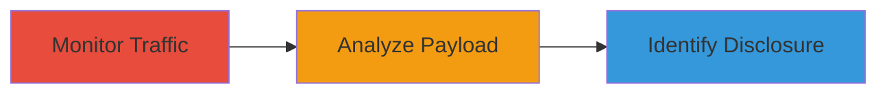

# Discover User Information Disclosure via Websocket Traffic Monitoring

Multi-stage attack chain demonstrating a complete attack workflow for identifying information disclosure in websocket communications.

## Chain Metrics Dashboard

| Metric | Value |
|--------|-------|
| Chain Status | Unverified |
| Total Steps | 1 |
| Execution Time | ~5 minutes |
| Skill Level | Beginner |
| Complexity | Low |
| Impact Level | Low |

## Attack Flow Visualization

## Prerequisites & Requirements

### Required Tools

- Browser with developer tools (e.g., Chrome DevTools)

### Target Environment

- Web application using websockets
- Active user session

### Initial Access Requirements

- Valid user credentials for the application
- Network access to the web application
- No prior elevated access needed

## Detailed Attack Procedures

### Step 1: Monitor Websocket Traffic
procedure: [[procedures/Monitor-Websocket-Traffic-for-Sensitive-Data]]

**Objective**: Intercept and inspect websocket messages to detect sensitive user information in JSON payloads.

**Instructions**: Open the web application in a browser and navigate to a page that triggers websocket activity, such as a dashboard or real-time feature. Use the browser's developer tools to monitor network traffic.

1. Press F12 to open DevTools.
2. Go to the Network tab and filter for WS (websockets).
3. Perform actions in the app to generate websocket messages.
4. Inspect the message payloads for JSON containing user details.

**Expected Output**: JSON payloads like {"t":"d","d":{"r":8,"a":"p","b":{"p":"/carts/3671079_xjdJHqx88J435eDW5zxN/users/-KRbGN8R6uIjy6_OPx_j","d":{"id":25390626,"name":"Username"}}}} revealing user ID and name.

**Success Indicators**:
- Websocket frames captured
- Sensitive data (e.g., user ID, name) visible in payloads
- Confirmation of client-side exposure without server-side restrictions

## Attack Chain Summary

### Key Achievements

1. Successful monitoring of websocket traffic during normal app usage
2. Identification of user account details in unencrypted JSON payloads
3. Assessment of disclosure impact as low severity (intended behavior)

## Technique & Tactic Coverage

### MITRE ATT&CK Techniques

- [[Network Sniffing]]

### MITRE ATT&CK Tactics

- [[Discovery]]

---
*Last updated: 2023-10-01T00:00:00Z*
