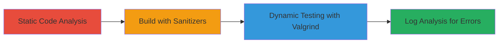

---
tags:
  - buffer-overflow
  - curl
  - static-analysis
  - dynamic-analysis
  - memory-corruption
  - websocket
  - ssl
  - wolfssl
type: attack_chain
tools:
  - '[[tools/grep]]'
  - '[[tools/sed]]'
  - '[[tools/git]]'
  - '[[tools/clang]]'
  - '[[tools/make]]'
  - '[[tools/valgrind]]'
  - '[[tools/python3]]'
tactics:
  - '[[Discovery]]'
  - '[[Execution]]'
verified: false
platforms:
  - Linux
submitted: true
complexity: medium
created_at: '2023-10-01T00:00:00Z'
procedures:
  - '[[procedures/Static-Analysis-of-Unsafe-strcpy-Calls-in-cURL]]'
  - '[[procedures/Building-cURL-with-Security-Debugging-Flags]]'
  - '[[procedures/Dynamic-Memory-Testing-of-cURL-with-Valgrind]]'
  - '[[procedures/Analyzing-Valgrind-Logs-for-Memory-Errors]]'
step_count: 4
techniques:
  - '[[Hardware]]'
  - '[[Exploitation for Client Execution]]'
updated_at: '2025-12-14T17:28:28.105Z'
description: >-
  A multi-stage vulnerability discovery and testing chain identifying potential
  buffer overflow risks in cURL 8.16.1-DEV through static analysis, secure
  building, dynamic memory testing, and log examination, targeting WebSocket,
  SSL/TLS, and WolfSSL components.
skill_level: intermediate
impact_level: high
id: f0a29af0-a452-42f0-a091-4380fb6123c7
validated: true
mitre_tactics:
  - '[[Discovery]]'
  - '[[Execution]]'
mitre_techniques:
  - '[[Hardware]]'
  - '[[Exploitation for Client Execution]]'
---
# Discovering Buffer Overflow Vulnerabilities via Unsafe strcpy() in cURL WebSocket and SSL Handling

Multi-stage vulnerability discovery chain demonstrating static and dynamic analysis to identify potential buffer overflows in cURL 8.16.1-DEV, focusing on unsafe strcpy() calls in WebSocket protocol, SSL/TLS backend, and WolfSSL error handling. This could lead to crashes, DoS, memory corruption, or rare code execution in networking applications using cURL.

## Chain Metrics Dashboard

| Metric | Value |
|--------|-------|
| Chain Status | Unverified |
| Total Steps | 4 |
| Execution Time | ~30 minutes |
| Skill Level | Intermediate |
| Complexity | Medium |
| Impact Level | High |

## Attack Flow Visualization



## Prerequisites & Requirements

### Required Tools

- [[tools/grep]]
- [[tools/sed]]
- [[tools/git]]
- [[tools/clang]]
- [[tools/make]]
- [[tools/valgrind]]
- [[tools/python3]]

### Target Environment

- Linux OS (Ubuntu/Debian recommended)
- Required services/ports: None (local build and testing)
- Network access requirements: Internet for git clone and test servers (e.g., echo.websocket.org, httpbin.org)

### Initial Access Requirements

- Local machine with sudo access for package installation
- No credentials needed
- Prior access: Administrative privileges for apt-get

## Detailed Attack Procedures

### Step 1: Static Code Analysis
procedure: [[procedures/Static-Analysis-of-Unsafe-strcpy-Calls-in-cURL]]

**Objective**: Locate and examine unsafe strcpy() calls in cURL source files related to WebSocket, SSL/TLS, and WolfSSL to identify potential buffer overflow sites.

**Instructions**: Use [[commands/grep-search-strcpy]] to search for strcpy calls:

```bash
grep -n "strcpy(" lib/ws.c lib/vtls/vtls.c lib/vtls/wolfssl.c
```

Then extract code snippets around vulnerable lines using [[commands/sed-extract-ws-lines]]:

```bash
sed -n '1260,1265p' lib/ws.c
```

Repeat for other files with [[commands/sed-extract-vtls-lines]] and [[commands/sed-extract-wolfssl-lines]].

**Expected Output**: Line numbers and code snippets showing strcpy(keyval, randstr); without bounds checks.

**Success Indicators**:
- strcpy calls identified at lib/ws.c:1261, lib/vtls/vtls.c:1066, lib/vtls/wolfssl.c:1540
- Code reveals fixed-size buffers without length validation

### Step 2: Build Verification
procedure: [[procedures/Building-cURL-with-Security-Debugging-Flags]]

**Objective**: Compile cURL with address and undefined behavior sanitizers to prepare for dynamic testing.

**Instructions**: Clone the repository using [[commands/git-clone-curl]]:

```bash
git clone https://github.com/curl/curl.git
```

Navigate and configure with [[commands/cd-curl-dir]]:

```bash
cd curl
./buildconf
export CC=clang
export CFLAGS="-fsanitize=address,undefined -fno-omit-frame-pointer -O1 -g"
export LDFLAGS="-fsanitize=address,undefined"
./configure --enable-debug --enable-maintainer-mode --enable-websockets --with-openssl --disable-shared --enable-static
```

Build using [[commands/make-parallel-build]]:

```bash
make -j$(nproc)
```

Verify with [[commands/echo-build-status]] and [[commands/ls-curl-binary]]:

```bash
echo $?
ls -la src/curl
./src/curl --version
```

**Expected Output**: Exit code 0, curl binary present, version shows 8.16.1-DEV with WebSocket support.

**Success Indicators**:
- Build completes without errors
- curl --version lists protocols including websockets and https

### Step 3: Dynamic Security Testing
procedure: [[procedures/Dynamic-Memory-Testing-of-cURL-with-Valgrind]]

**Objective**: Test cURL under WebSocket upgrade, SSL, error handling, and boundary conditions for memory errors.

**Instructions**: Run Valgrind on WebSocket test using [[commands/valgrind-websocket-upgrade]]:

```bash
valgrind --tool=memcheck --leak-check=full --track-origins=yes ./src/curl -v -H "Connection: upgrade" -H "Upgrade: websocket" -H "Sec-WebSocket-Version: 13" --http1.1 ws://echo.websocket.org/ 2>&1 | tee websocket_test.log
```

Test SSL with [[commands/valgrind-ssl-test]]:

```bash
valgrind --tool=memcheck --leak-check=full ./src/curl -v https://httpbin.org/get 2>&1 | tee ssl_test.log
```

Test SSL error with [[commands/valgrind-ssl-error-test]]:

```bash
valgrind --tool=memcheck --leak-check=full ./src/curl -v --cert /nonexistent/cert.pem https://httpbin.org/get 2>&1 | tee ssl_error_test.log
```

Boundary test with [[commands/valgrind-boundary-test]]:

```bash
valgrind --tool=memcheck ./src/curl -v -H "Sec-WebSocket-Key: $(python3 -c 'print("A"*100)')" -H "Connection: upgrade" -H "Upgrade: websocket" --http1.1 ws://echo.websocket.org/ 2>&1 | tee boundary_test.log
```

**Expected Output**: Valgrind logs with no invalid reads/writes or overflows.

**Success Indicators**:
- No heap/stack buffer overflows reported
- Tests complete without crashes

### Step 4: Results Analysis
procedure: [[procedures/Analyzing-Valgrind-Logs-for-Memory-Errors]]

**Objective**: Examine logs for memory errors, overflows, or triggers near vulnerable lines.

**Instructions**: Grep for errors using [[commands/grep-log-errors]]:

```bash
grep -n "Invalid\|heap-buffer-overflow\|stack-buffer-overflow\|ERROR SUMMARY" *.log
```

Check specific lines with [[commands/grep-specific-vuln-context]]:

```bash
grep -A5 -B5 "ws.c:1261\|vtls.c:1066\|wolfssl.c:1540" *.log
```

**Expected Output**: No matches for overflows; potential mentions of length checks preventing issues.

**Success Indicators**:
- No error summaries with defects
- Confirmation of potential but untriggered vulnerabilities

## Attack Chain Summary

### Key Achievements

1. Identified three unsafe strcpy() sites in cURL source.
2. Built and tested cURL with sanitizers and Valgrind.
3. Verified no active overflows but highlighted risks for DoS or RCE.
4. Demonstrated analysis workflow for memory safety in C libraries.

## Technique & Tactic Coverage

### MITRE ATT&CK Techniques

- [[Hardware]] Gather Victim Host Information: Software
- [[Exploitation for Client Execution]] Exploitation for Client Execution

### MITRE ATT&CK Tactics

- [[Discovery]] Discovery
- [[Execution]] Execution

---

*Last updated: 2023-10-01T00:00:00Z*
