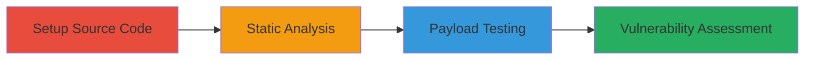

# Discovering Potential XSS in curl via Unsanitized URL Handling in glob_url and urlnode

Multi-stage attack chain demonstrating a vulnerability discovery workflow for identifying potential XSS in curl's URL processing, focusing on improper validation in glob_url() and urlnode->url structures.

## Chain Metrics Dashboard

| Metric | Value |
|--------|-------|
| Chain Status | Unverified |
| Total Steps | 3 |
| Execution Time | ~10 minutes |
| Skill Level | Intermediate |
| Complexity | Medium |
| Impact Level | Medium |

## Attack Flow Visualization



## Prerequisites & Requirements

### Required Tools

- [[tools/git]]
- [[tools/grep]]
- [[tools/curl]]

### Target Environment

- Linux OS
- Access to curl source code repository
- No specific services or ports required; local analysis

### Initial Access Requirements

- Internet access for cloning repository
- No credentials needed for public GitHub repo
- Basic command-line proficiency

## Detailed Attack Procedures

### Step 1: Setup curl Source Code

procedure: [[procedures/Clone-and-Setup-curl-Source-Code]]

**Objective**: Obtain and prepare the curl source code for analysis to enable static examination of potential vulnerabilities.

**Instructions**: Clone the curl repository using [[commands/git-clone-curl-repo]] and navigate into the directory with [[commands/cd-curl-directory]].

```bash
git clone https://github.com/curl/curl.git
cd curl
```

**Expected Output**: Cloned repository directory 'curl' created and current working directory changed to it.

**Success Indicators**:
- Repository cloned without errors
- Directory navigation confirmed via `pwd` or `ls`

### Step 2: Static Code Analysis

procedure: [[procedures/Static-Code-Analysis-for-Vulnerable-URL-Handling]]

**Objective**: Search the source code for patterns indicative of insecure URL handling that could lead to XSS, such as glob_url, urlnode, and unsafe strcpy usage.

**Instructions**: Perform recursive searches in the src/ directory using [[commands/grep-search-glob-url]], [[commands/grep-search-urlnode]], and [[commands/grep-search-strcpy]]. Review outputs for improper validation or escaping in user-controlled URL data.

```bash
grep -rn "glob_url" src/
grep -rn "urlnode" src/
grep -rn "strcpy" src/
```

**Expected Output**: Lists of files and line numbers containing the search terms, highlighting potential vulnerable code in glob_url() function and urlnode->url handling.

**Success Indicators**:
- Matches found in src/ files related to URL processing
- Identification of unsafe string operations like strcpy on user input

### Step 3: Payload Testing

procedure: [[procedures/Test-XSS-Payloads-in-curl-URL-Processing]]

**Objective**: Test curl's handling of encoded XSS payloads in URLs to observe if untrusted input is processed insecurely, potentially leading to XSS in downstream applications.

**Instructions**: Verify curl version with [[commands/curl-version-verbose]] if needed, then send a test request with an encoded XSS payload using [[commands/curl-xss-payload-test]]. Observe the effective URL and any reflection or processing behavior.

```bash
curl -v
curl "http://test.com?param=%3Cscript%3Ealert(1)%3C/script%3E" -w "%{url_effective}"
```

**Expected Output**: Version info displayed; effective URL after processing the payload, potentially showing unescaped or reflected input.

**Success Indicators**:
- Payload processed without sanitization
- No immediate errors, but potential for XSS in embedded contexts like CI pipelines or apps rendering curl outputs

## Attack Chain Summary

### Key Achievements

1. Cloned and analyzed curl source to identify risky URL handling patterns
2. Located potential insecure code in glob_url and urlnode structures
3. Tested XSS payloads to demonstrate processing risks, though deemed non-applicable by curl team

## Technique & Tactic Coverage

### MITRE ATT&CK Techniques

- [[Hardware]] Gather Victim Host Information: Software
- [[JavaScript]] Command and Scripting Interpreter: JavaScript

### MITRE ATT&CK Tactics

- [[Discovery]] Discovery
- [[Execution]] Execution

---

*Last updated: 2024-10-01T00:00:00Z*
