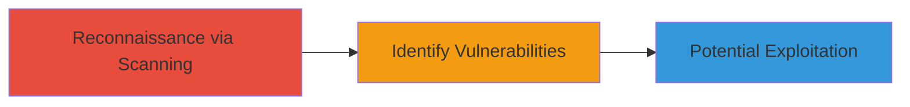

# Discovery of CSRF and XSS Vulnerabilities in Outdated WordPress Installation

Multi-stage attack chain demonstrating the discovery of web vulnerabilities in an outdated WordPress installation, leading to potential CSRF and XSS exploits.

## Chain Metrics Dashboard

| Metric | Value |
|--------|-------|
| Chain Status | Unverified |
| Total Steps | 1 |
| Execution Time | ~5 minutes |
| Skill Level | Beginner |
| Complexity | Low |
| Impact Level | Medium |

## Attack Flow Visualization



## Prerequisites & Requirements

### Required Tools

- [[tools/WPscan]]

### Target Environment

- Web platform with WordPress installation
- Accessible HTTP/HTTPS ports (80/443)
- No authentication required for initial scan

### Initial Access Requirements

- Publicly accessible WordPress site
- Network connectivity to the target
- No prior credentials needed

## Detailed Attack Procedures

### Step 1: Vulnerability Scanning
procedure: [[procedures/Scan-WordPress-Site-for-Vulnerabilities-using-WPscan]]

**Objective**: Identify outdated WordPress core and plugins that expose CSRF and XSS vulnerabilities.

**Instructions**: Install and run WPscan against the target WordPress site to detect known vulnerabilities in the core installation and plugins.

First, ensure WPscan is installed and updated. Then execute the scan using [[commands/wpscan-enumerate-vulnerabilities]]:

```bash
wpscan --url https://www.uberxgermany.com --enumerate vp
```

Review the output for outdated components and associated vulnerabilities.

**Expected Output**: A report listing vulnerable plugins, outdated core versions, and details on CSRF/XSS risks.

**Success Indicators**:
- Detection of outdated WordPress core or plugins
- Identification of CSRF and XSS vulnerability types
- No errors in scan execution

## Attack Chain Summary

### Key Achievements

1. Successful identification of outdated WordPress components
2. Discovery of exploitable CSRF and XSS vulnerabilities
3. Assessment of potential impact on user sessions and script injection

## Technique & Tactic Coverage

### MITRE ATT&CK Techniques

- [[Active Scanning]] Active Scanning
- [[Exploit Public-Facing Application]] Exploit Public-Facing Application

### MITRE ATT&CK Tactics

- [[Reconnaissance]] Reconnaissance
- [[Initial Access]] Initial Access

---
*Last updated: 2023-10-01T00:00:00Z*
