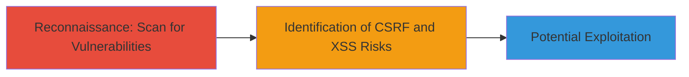

# Discovery of CSRF and XSS Vulnerabilities in Outdated WordPress Installation

Multi-stage attack chain demonstrating a reconnaissance workflow to identify vulnerabilities in an outdated WordPress installation on www.uberxgermany.com, leading to potential CSRF and XSS exploitation opportunities.

## Chain Metrics Dashboard

| Metric | Value |
|--------|-------|
| Chain Status | Unverified |
| Total Steps | 1 |
| Execution Time | ~5 minutes |
| Skill Level | Beginner |
| Complexity | Low |
| Impact Level | Medium |

## Attack Flow Visualization



## Prerequisites & Requirements

### Required Tools

- [[tools/WPScan]]

### Target Environment

- Target OS/Platform: Web
- Required services/ports: HTTP/HTTPS on port 80/443
- Network access requirements: Internet access to the target site

### Initial Access Requirements

- Credential requirements: None (public-facing site)
- Network position: External attacker
- Prior access needed: None

## Detailed Attack Procedures

### Step 1: Scan WordPress Site for Vulnerabilities
procedure: [[procedures/Scan-WordPress-Site-for-Vulnerabilities-Using-WPScan]]

**Objective**: Identify outdated WordPress core and plugins vulnerable to CSRF and XSS attacks using WPScan.

**Instructions**: Install and run WPScan against the target URL to enumerate vulnerabilities. Start by ensuring WPScan is updated, then execute the scan:

Use [[commands/wpscan-enumerate-vulnerabilities]] to perform the scan:

```bash
wpscan --url https://www.uberxgermany.com --enumerate vp
```

This command detects vulnerable plugins (vp flag) and reports known issues like unpatched CSRF and XSS flaws.

**Expected Output**: A report listing outdated plugins, such as those with known CSRF protections missing or XSS in input handling, including CVE references if available.

**Success Indicators**:
- Detection of outdated WordPress core or plugins
- Identification of CSRF and XSS vulnerability types
- No errors in scan execution, confirming site accessibility

## Attack Chain Summary

### Key Achievements

1. Successful vulnerability scan revealing CSRF risks allowing forged requests on behalf of users.
2. Detection of XSS flaws enabling malicious script injection for session theft or actions.
3. Assessment of impact on the target site www.uberxgermany.com without active exploitation.

## Technique & Tactic Coverage

### MITRE ATT&CK Techniques

- [[Vulnerability Scanning]] Vulnerability Scanning
- [[Exploit Public-Facing Application]] Exploit Public-Facing Application

### MITRE ATT&CK Tactics

- [[Reconnaissance]] Reconnaissance
- [[Initial Access]] Initial Access

---
*Last updated: 2023-10-01T12:00:00Z*
