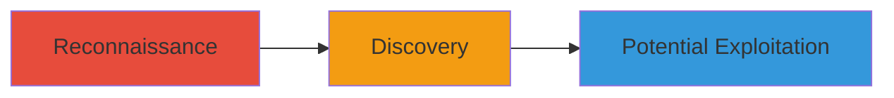

---
tags:
  - web
  - admin-panel
  - ghost.io
  - predictable-url
  - reconnaissance
type: attack_chain
tools: []
tactics:
  - '[[Discovery]]'
verified: false
platforms:
  - Web
submitted: true
complexity: low
created_at: '2023-10-01T00:00:00Z'
procedures:
  - '[[procedures/Enumerate-Admin-Panel-via-Predictable-URL]]'
step_count: 1
techniques:
  - '[[File and Directory Discovery]]'
updated_at: '2025-12-14T17:28:36.610Z'
description: >-
  A reconnaissance attack chain that identifies an exposed admin panel on a
  Ghost.io-powered blog through a predictable URL path, enabling potential
  credential attacks or exploitation.
skill_level: beginner
impact_level: medium
id: 26b5a061-4d3d-460a-ae30-83573c9bb685
validated: true
mitre_tactics:
  - '[[Discovery]]'
mitre_techniques:
  - '[[File and Directory Discovery]]'
---
# Discovery of Exposed Ghost.io Admin Panel via Predictable URL

Multi-stage attack chain demonstrating a complete attack workflow.

## Chain Metrics Dashboard

| Metric | Value |
|--------|-------|
| Chain Status | Unverified |
| Total Steps | 1 |
| Execution Time | ~1 minute |
| Skill Level | Beginner |
| Complexity | Low |
| Impact Level | Medium |

## Attack Flow Visualization



## Prerequisites & Requirements

### Required Tools

- None (uses standard browser or curl)

### Target Environment

- Web platform
- Ghost.io blogging service
- No specific ports or services required beyond HTTP/HTTPS

### Initial Access Requirements

- Public internet access to the target blog URL
- No credentials or prior access needed

## Detailed Attack Procedures

### Step 1: Admin Panel Enumeration
procedure: [[procedures/Enumerate-Admin-Panel-via-Predictable-URL]]

**Objective**: Identify and access the hidden admin login panel by guessing a common URL path, revealing the underlying Ghost.io infrastructure.

**Instructions**: Navigate to the suspected admin URL on the target blog site using a browser or curl. For example, append '/admin' to the blog domain:

```bash
curl -L https://blog.brave.com/admin
```

Observe the redirect to the Ghost.io admin login page.

**Expected Output**: A redirect to a subdomain like https://brave.ghost.io/ghost/signin/, confirming the admin panel exposure.

**Success Indicators**:
- HTTP redirect (3xx status) to a Ghost.io login page
- Access to the admin sign-in interface without authentication

## Attack Chain Summary

### Key Achievements

1. Successful discovery of the admin panel without brute-forcing
2. Identification of the Ghost.io backend, opening avenues for targeted attacks
3. Minimal effort required due to predictable path usage

## Technique & Tactic Coverage

### MITRE ATT&CK Techniques

- [[File and Directory Discovery]]

### MITRE ATT&CK Tactics

- [[Discovery]]

---
*Last updated: 2023-10-01T00:00:00Z*
