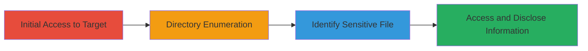

# Discovery of Exposed phpinfo() via Directory Enumeration for Server Configuration Disclosure

Multi-stage attack chain demonstrating reconnaissance through directory enumeration to uncover and access an exposed phpinfo() file, revealing server details like OS, PHP config, and environment variables.

## Chain Metrics Dashboard

| Metric | Value |
|--------|-------|
| Chain Status | Unverified |
| Total Steps | 4 |
| Execution Time | ~10 minutes |
| Skill Level | Intermediate |
| Complexity | Medium |
| Impact Level | High |

## Attack Flow Visualization

## Prerequisites & Requirements

### Required Tools

- [[tools/Burp-Suite-Intruder]]

### Target Environment

- Web application on Linux with PHP
- HTTP access to the target (HTTPS may be restricted)
- No authentication required for the exposed endpoint

### Initial Access Requirements

- Direct network access to the target web server
- No prior credentials needed
- Browser or proxy tool for interception

## Detailed Attack Procedures

### Step 1: Visit the Target Scope
procedure: [[procedures/Enumerate-Directories-to-Access-phpinfo]]

**Objective**: Establish initial connection to the target web application to confirm accessibility.

**Instructions**: Navigate to the main URL of the target asset using a web browser or proxy like Burp Suite to intercept traffic.

**Expected Output**: Successful HTTP response (e.g., 200 OK) from the target's homepage.

**Success Indicators**:
- Target site loads without errors
- Proxy intercepts the request successfully

### Step 2: Use Burp Suite Intruder to Find Sensitive Directories
procedure: [[procedures/Enumerate-Directories-to-Access-phpinfo]]

**Objective**: Perform directory fuzzing to identify hidden or sensitive paths on the web server.

**Instructions**: Configure Burp Suite Intruder with a wordlist of common directories (e.g., admin, info, config). Send the base request to Intruder and set the payload position for the path. Launch the attack to enumerate responses.

**Expected Output**: List of directories with varying response codes (e.g., 200 for existing paths, 404 for non-existent).

**Success Indicators**:
- Multiple 200 OK responses for potential sensitive paths
- Anomalous responses indicating hidden files

### Step 3: Identify the /info.php Directory
procedure: [[procedures/Enumerate-Directories-to-Access-phpinfo]]

**Objective**: Pinpoint the exposed phpinfo() file from the enumeration results.

**Instructions**: Review Intruder results for paths returning 200 OK or content indicating PHP info pages. Focus on /info.php if it appears in the hits.

**Expected Output**: Confirmation of /info.php existence via response code and partial content preview.

**Success Indicators**:
- /info.php returns 200 OK over HTTP
- HTTPS access to the same path returns 403 Forbidden

### Step 4: Access /info.php in the Browser Without Authentication
procedure: [[procedures/Enumerate-Directories-to-Access-phpinfo]]

**Objective**: Retrieve and view the detailed server configuration from the exposed file.

**Instructions**: Open http://target/info.php in a browser. Note that https://target/info.php is blocked. Capture the output for analysis.

**Expected Output**: Full phpinfo() page displaying OS (e.g., Linux kernel 5.4.17 on uggogamesdb), PHP version, extensions, and environment variables.

**Success Indicators**:
- Detailed server info disclosed without login
- No errors or redirects encountered

## Attack Chain Summary

### Key Achievements

1. Successful directory enumeration uncovering hidden files
2. Unauthenticated access to sensitive configuration data
3. Identification of protocol-specific access controls (HTTP open, HTTPS restricted)

## Technique & Tactic Coverage

### MITRE ATT&CK Techniques

- [[Vulnerability Scanning]] Active Scanning: Vulnerability Scanning
- [[Hardware]] Gather Victim Host Information: Hardware

### MITRE ATT&CK Tactics

- [[Reconnaissance]] Reconnaissance

---
*Last updated: 2023-10-01T00:00:00Z*
