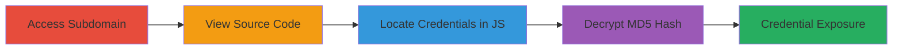

---
tags:
  - hardcoded-credentials
  - javascript-exposure
  - md5-crack
  - credential-leak
type: attack_chain
tools: []
tactics:
  - '[[Discovery]]'
verified: false
platforms:
  - Web
submitted: true
complexity: low
created_at: '2023-10-01T00:00:00Z'
procedures:
  - '[[procedures/Extract-and-Decrypt-Hardcoded-Credentials-from-Web-Source]]'
step_count: 4
techniques:
  - '[[Unsecured Credentials]]'
updated_at: '2025-12-14T17:30:18.062Z'
description: >-
  Attack chain demonstrating the discovery of hardcoded admin credentials
  exposed in client-side JavaScript on a subdomain, leading to potential
  unauthorized access.
skill_level: beginner
impact_level: high
id: a540b855-15fb-4b7a-b245-7970612f1198
validated: true
mitre_tactics:
  - '[[Discovery]]'
mitre_techniques:
  - '[[Unsecured Credentials]]'
---
# Discovery of Hardcoded Admin Credentials in Client-Side JavaScript

Multi-stage attack chain demonstrating the discovery of sensitive admin credentials hardcoded in client-side JavaScript on a subdomain, enabling potential unauthorized access to admin functions and client information.

## Chain Metrics Dashboard

| Metric | Value |
|--------|-------|
| Chain Status | Unverified |
| Total Steps | 4 |
| Execution Time | ~5 minutes |
| Skill Level | Beginner |
| Complexity | Low |
| Impact Level | High |

## Attack Flow Visualization

## Prerequisites & Requirements

### Required Tools

- Web browser (e.g., Chrome, Firefox)

### Target Environment

- Web platform
- Access to the target's subdomain URL
- No special services or ports required beyond standard HTTP/HTTPS

### Initial Access Requirements

- Public network access to the subdomain
- No prior credentials needed

## Detailed Attack Procedures

### Step 1: Access the Subdomain
procedure: [[procedures/Extract-and-Decrypt-Hardcoded-Credentials-from-Web-Source]]

**Objective**: Gain initial access to the affected subdomain to begin inspection.

**Instructions**: Navigate to the subdomain URL in a web browser. The URL may redirect to another page upon access.

**Expected Output**: The subdomain page loads, potentially with a redirect.

**Success Indicators**:
- Page loads successfully
- No access restrictions encountered

### Step 2: View the Page Source Code
procedure: [[procedures/Extract-and-Decrypt-Hardcoded-Credentials-from-Web-Source]]

**Objective**: Inspect the HTML source to access embedded scripts.

**Instructions**: Once on the page, right-click and select "View Page Source" or press CTRL+U (or CMD+U on macOS). Alternatively, enter `view-source:` prefix before the URL in the address bar.

**Expected Output**: The full HTML source code is displayed in a new tab or window.

**Success Indicators**:
- Source code viewable
- JavaScript sections identifiable

### Step 3: Locate Credentials in JavaScript
procedure: [[procedures/Extract-and-Decrypt-Hardcoded-Credentials-from-Web-Source]]

**Objective**: Identify the hardcoded credentials within the client-side JavaScript.

**Instructions**: In the source code viewer, use CTRL+F (or CMD+F) to search for keywords like 'uid' or 'passwd'. Look for scripts containing API calls, such as `window.mobucksApi.placeAd`, where credentials are embedded as `uid: 'mtnng'` and `passwd: 'bd31568138edbfc0552a1ecc6886ea'`.

**Expected Output**: Lines of code revealing the username 'mtnng' and MD5-hashed password 'bd31568138edbfc0552a1ecc6886ea'.

**Success Indicators**:
- Credentials found in plain text or hashed form
- No obfuscation preventing identification

### Step 4: Decrypt the MD5 Hash
procedure: [[procedures/Extract-and-Decrypt-Hardcoded-Credentials-from-Web-Source]]

**Objective**: Crack the MD5 hash to obtain the plaintext password.

**Instructions**: Copy the MD5 hash 'bd31568138edbfc0552a1ecc6886ea' and use an online MD5 decoder or tool like Hashcat to crack it. The hash decrypts to the plaintext password.

**Expected Output**: Plaintext password revealed (redacted in reports for security).

**Success Indicators**:
- Hash successfully cracked
- Full admin credentials obtained

## Attack Chain Summary

### Key Achievements

1. Accessed vulnerable subdomain without authentication
2. Extracted hardcoded credentials from public source code
3. Decrypted MD5 hash to expose plaintext password
4. Enabled potential abuse for unauthorized admin access

## Technique & Tactic Coverage

### MITRE ATT&CK Techniques

- [[Unsecured Credentials]]

### MITRE ATT&CK Tactics

- [[Discovery]]

---
*Last updated: 2023-10-01T00:00:00Z*
