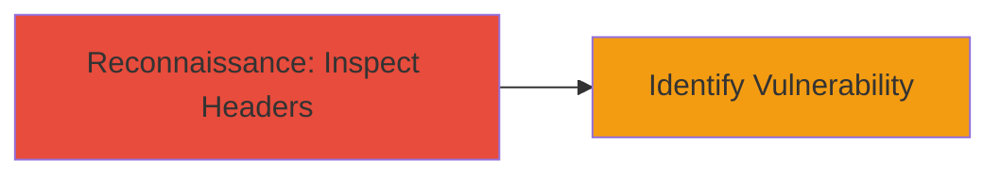

---
tags:
  - missing-security-headers
  - clickjacking
  - aws-s3
  - reconnaissance
type: attack_chain
tools: []
tactics:
  - '[[Reconnaissance]]'
verified: false
platforms:
  - Web
  - AWS
submitted: true
complexity: low
created_at: '2023-10-01T00:00:00Z'
procedures:
  - '[[procedures/Inspect-HTTP-Security-Headers-for-Clickjacking-Vulnerability]]'
step_count: 1
techniques:
  - '[[Vulnerability Scanning]]'
updated_at: '2025-12-14T17:28:12.615Z'
description: >-
  A reconnaissance-focused attack chain identifying the absence of critical
  security headers like X-Frame-Options on an AWS S3-hosted static website,
  enabling potential clickjacking attacks.
skill_level: beginner
impact_level: medium
id: 0d269d1d-1244-43ce-ab17-fd332f67ffce
validated: true
mitre_tactics:
  - '[[Reconnaissance]]'
mitre_techniques:
  - '[[Vulnerability Scanning]]'
---
# Discovery of Missing Security Headers Enabling Clickjacking on AWS S3 Static Website

Multi-stage attack chain demonstrating a complete attack workflow.

## Chain Metrics Dashboard

| Metric | Value |
|--------|-------|
| Chain Status | Unverified |
| Total Steps | 1 |
| Execution Time | ~1 minute |
| Skill Level | Beginner |
| Complexity | Low |
| Impact Level | Medium |

## Attack Flow Visualization



## Prerequisites & Requirements

### Required Tools

- Browser developer tools or [[commands/curl-check-headers]]

### Target Environment

- AWS S3 static website hosting
- Publicly accessible web endpoints
- No authentication required for header inspection

### Initial Access Requirements

- Internet access to the target S3 website
- No prior credentials or network position needed

## Detailed Attack Procedures

### Step 1: Inspect HTTP Response Headers
procedure: [[procedures/Inspect-HTTP-Security-Headers-for-Clickjacking-Vulnerability]]

**Objective**: Examine the HTTP response headers of the AWS S3 static website to detect the absence of security headers like X-Frame-Options, which exposes the site to clickjacking attacks.

**Instructions**: Use [[commands/curl-check-headers]] to fetch and inspect the headers from the target S3 website endpoint. For example, target a known S3-hosted site like the Legal Robot website or a verifiable test site.

```bash
curl -I https://example-s3-site.s3.amazonaws.com/
```

Review the output for the presence of headers such as X-Frame-Options: DENY or SAMEORIGIN. If absent, the site can be iframed on malicious pages.

**Expected Output**: HTTP response headers listing, e.g.,

```
HTTP/1.1 200 OK
Content-Type: text/html
...
(no X-Frame-Options)
```

**Success Indicators**:
- Absence of X-Frame-Options, Content-Security-Policy (frame-ancestors), or similar headers confirmed
- Potential for clickjacking validated by attempting to iframe the site in a test HTML page

## Attack Chain Summary

### Key Achievements

1. Identified missing security headers on AWS S3 static website
2. Demonstrated vulnerability to clickjacking via UI redressing
3. Highlighted resolution path using nginx proxy for header injection

## Technique & Tactic Coverage

### MITRE ATT&CK Techniques

- [[Vulnerability Scanning]]

### MITRE ATT&CK Tactics

- [[Reconnaissance]]

---
*Last updated: 2023-10-01T00:00:00Z*
