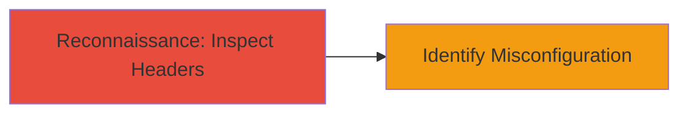

# Discovery of Missing X-XSS-Protection Header Weakening XSS Defenses

Multi-stage attack chain demonstrating a complete attack workflow.

## Chain Metrics Dashboard

| Metric | Value |
|--------|-------|
| Chain Status | Unverified |
| Total Steps | 1 |
| Execution Time | ~1 minute |
| Skill Level | Beginner |
| Complexity | Low |
| Impact Level | Low |

## Attack Flow Visualization



## Prerequisites & Requirements

### Required Tools

- [[tools/curl]]

### Target Environment

- Web platform
- HTTP/HTTPS access to the target site
- No specific ports required beyond standard 80/443

### Initial Access Requirements

- Public network access to the target URL
- No credentials needed
- No prior access required

## Detailed Attack Procedures

### Step 1: Inspect HTTP Response Headers
procedure: [[procedures/Inspect-HTTP-Response-Headers-for-Security-Misconfigurations]]

**Objective**: Examine the HTTP response headers of the target website to detect the absence of the X-XSS-Protection header, indicating weakened browser protections against reflective XSS.

**Instructions**: Use [[commands/curl-check-headers]] to fetch and inspect the headers of the target site:

```bash
curl -I https://hosted.weblate.org/
```

Review the output for the presence of security headers, specifically checking if X-XSS-Protection is missing.

**Expected Output**: HTTP response headers listing, such as:

```
HTTP/2 200 
server: nginx
content-type: text/html; charset=utf-8
... (no X-XSS-Protection)
```

**Success Indicators**:
- Headers retrieved without errors
- Confirmation that X-XSS-Protection header is absent

## Attack Chain Summary

### Key Achievements

1. Identified missing X-XSS-Protection header on https://hosted.weblate.org/
2. Assessed impact on browser XSS mitigations for IE, Chrome, and Safari
3. Highlighted potential for unmitigated reflective XSS if underlying vulnerabilities exist

## Technique & Tactic Coverage

### MITRE ATT&CK Techniques

- [[Gather Victim Host Information]]

### MITRE ATT&CK Tactics

- [[Reconnaissance]]

---
*Last updated: 2023-10-01T12:00:00Z*
