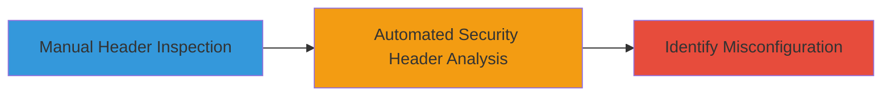

---
tags:
  - misconfiguration
  - xss
  - security-headers
  - reconnaissance
type: attack_chain
tools:
  - '[[tools/securityheaders-io]]'
tactics:
  - '[[Reconnaissance]]'
commands:
  - '[[commands/curl-check-headers]]'
platforms:
  - Web
complexity: low
procedures:
  - '[[procedures/Inspect-HTTP-Response-Headers-Manually]]'
  - '[[procedures/Analyze-Security-Headers-with-Online-Scanner]]'
step_count: 2
techniques:
  - '[[Active Scanning]]'
description: >-
  A reconnaissance chain to identify misconfigured X-XSS-Protection HTTP
  security headers on a target website, which fails to properly enable browser
  XSS protection and may allow reflected XSS attacks to bypass mitigations.
skill_level: beginner
impact_level: low
id: cea1426e-6fa6-41e9-8e0e-7eb752147d98
created_at: '2025-12-14T03:16:20.589Z'
updated_at: '2025-12-14T03:16:20.589Z'
verified: false
validated: true
submitted: true
mitre_tactics:
  - '[[Reconnaissance]]'
mitre_techniques:
  - '[[Active Scanning]]'
---
# Discovery of X-XSS-Protection Header Misconfiguration Enabling Potential XSS Bypass

## Overview

This attack chain demonstrates a simple reconnaissance workflow to detect a misconfiguration in the X-XSS-Protection HTTP security header on the target website https://www.sfl-tap.army.mil/. The header is incorrectly set to 'DENY', which is invalid for X-XSS-Protection and fails to activate the browser's XSS Auditor effectively. Instead, it should be '1; mode=block' to enable detection and blocking of reflected XSS attempts. This low-severity issue was identified using manual inspection and an online scanning tool, highlighting a potential weakness in XSS mitigation without demonstrating active exploitation. The chain focuses on passive discovery of security header flaws in public-facing web applications.

## Chain Metrics Dashboard

| Metric | Value |
|--------|-------|
| Chain Status | Unverified |
| Total Steps | 2 |
| Execution Time | ~5 minutes |
| Skill Level | Beginner |
| Complexity | Low |
| Impact Level | Low |

## Attack Flow Visualization



## Prerequisites & Requirements

### Required Tools

- [[tools/securityheaders-io]]
- curl (for manual inspection)

### Target Environment

- Publicly accessible web application
- No specific ports required (standard HTTP/HTTPS on 80/443)
- Internet access to the target site

### Initial Access Requirements

- No credentials needed
- Direct network access to the internet
- No prior access to the target required

## Detailed Attack Procedures

### Step 1: Manual Header Inspection
procedure: [[procedures/Inspect-HTTP-Response-Headers-Manually]]

**Objective**: Access the target website and manually review HTTP response headers to identify the X-XSS-Protection value.

**Instructions**: Use [[commands/curl-check-headers]] to fetch and display the response headers from the target URL.

```bash
curl -I https://www.sfl-tap.army.mil/
```

Inspect the output for the X-XSS-Protection header, noting if it is set to 'DENY' instead of the recommended '1; mode=block'.

**Expected Output**: HTTP headers including X-XSS-Protection: DENY, confirming the misconfiguration.

**Success Indicators**:
- Response headers retrieved successfully
- X-XSS-Protection header present but incorrectly valued

### Step 2: Automated Security Header Analysis
procedure: [[procedures/Analyze-Security-Headers-with-Online-Scanner]]

**Objective**: Submit the target URL to an online scanner to validate the misconfiguration and receive recommendations for proper header settings.

**Instructions**: Navigate to the securityheaders.io website and enter the target URL https://www.sfl-tap.army.mil/ for scanning. Review the report for details on the X-XSS-Protection issue and suggested fix.

**Expected Output**: Scan report indicating a misconfiguration in X-XSS-Protection, recommending '1; mode=block', and noting confusion with X-Frame-Options syntax.

**Success Indicators**:
- Scan completes without errors
- Report highlights the invalid 'DENY' value and low-severity impact on XSS protection

## Attack Chain Summary

### Key Achievements

1. Identified invalid X-XSS-Protection header value 'DENY' on the target site
2. Confirmed failure to enable browser XSS filter, increasing risk of reflected XSS bypass
3. Received remediation guidance to set header to '1; mode=block' for proper mitigation

## Technique & Tactic Coverage

### MITRE ATT&CK Techniques

- [[Active Scanning]]

### MITRE ATT&CK Tactics

- [[Reconnaissance]]

---
*Last updated: 2023-10-01*
