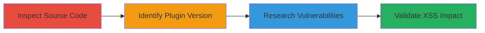

# Discovery of XSS Vulnerability in Yoast WordPress SEO Plugin on people.uber.com

Multi-stage attack chain demonstrating a reconnaissance workflow to identify and validate an XSS vulnerability in a WordPress plugin through passive source code inspection and vulnerability research.

## Chain Metrics Dashboard

| Metric | Value |
|--------|-------|
| Chain Status | Unverified |
| Total Steps | 3 |
| Execution Time | ~5 minutes |
| Skill Level | Beginner |
| Complexity | Low |
| Impact Level | Low |

## Attack Flow Visualization



## Prerequisites & Requirements

### Required Tools

- Web browser with developer tools
- Access to vulnerability databases like wpvulndb.com

### Target Environment

- WordPress-based website
- Publicly accessible web application
- No special services or ports required beyond standard HTTP/HTTPS (80/443)

### Initial Access Requirements

- No credentials required
- Public network access to the target site
- No prior access needed; passive reconnaissance only

## Detailed Attack Procedures

### Step 1: Inspect Website Source Code
procedure: [[procedures/Inspect-Website-Source-Code-for-Plugins]]

**Objective**: Examine the HTML source of the target site to identify installed plugins and their versions.

**Instructions**: Open the target website in a web browser and use developer tools to view the page source. Look for comments or meta tags that reveal WordPress plugin information. Alternatively, fetch the HTML using curl and search for plugin indicators:

```bash
curl -s http://people.uber.com/ | grep -i yoast
```

**Expected Output**: HTML source containing plugin names and versions, such as "Yoast WordPress SEO plugin v2.1.1".

**Success Indicators**:
- Plugin identifiers found in source code
- Version numbers visible in comments or scripts

### Step 2: Identify Vulnerable Plugin Version
procedure: [[procedures/Identify-Vulnerable-Plugin-Versions]]

**Objective**: Confirm if the identified plugin version matches known vulnerable releases.

**Instructions**: Cross-reference the extracted plugin version against WordPress plugin documentation or changelogs. For Yoast SEO v2.1.1, note that it predates patches for XSS issues.

**Expected Output**: Confirmation that v2.1.1 is outdated and potentially vulnerable.

**Success Indicators**:
- Version matches a known vulnerable release
- No evidence of updates or security patches

### Step 3: Research Known Vulnerabilities
procedure: [[procedures/Research-Known-Vulnerabilities-in-WordPress-Plugins]]

**Objective**: Validate the vulnerability by checking public databases for exploits and impacts.

**Instructions**: Search vulnerability databases using the plugin name and version. For example, query wpvulndb.com directly in a browser or via search:

Visit https://wpvulndb.com/vulnerabilities/8045 to review details on the XSS in Yoast v2.1.1.

**Expected Output**: Vulnerability report confirming XSS due to improper input sanitization, with potential for arbitrary JavaScript execution.

**Success Indicators**:
- Specific CVE or vulnerability ID found
- Details match the plugin and version

## Attack Chain Summary

### Key Achievements

1. Identified Yoast WordPress SEO plugin v2.1.1 via source code inspection
2. Confirmed vulnerability through database cross-reference
3. Assessed low-impact XSS potential for admin-targeted attacks via malicious links

## Technique & Tactic Coverage

### MITRE ATT&CK Techniques

- [[Software]] Software
- [[Vulnerability Scanning]] Vulnerability Scanning

### MITRE ATT&CK Tactics

- [[Reconnaissance]] Reconnaissance

---

*Last updated: 2023-10-01T00:00:00Z*
