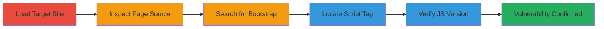

---
tags:
  - xss
  - recon
  - web
  - bootstrap
  - cve-2019-8331
  - wordpress
type: attack_chain
tools: []
tactics:
  - '[[Reconnaissance]]'
verified: false
platforms:
  - Web
submitted: true
complexity: low
created_at: '2024-01-01T00:00:00Z'
procedures:
  - '[[procedures/Load-and-Inspect-Target-Web-Page]]'
  - '[[procedures/Search-Page-Source-for-Bootstrap-Reference]]'
  - '[[procedures/Locate-Bootstrap-Script-Tag]]'
  - '[[procedures/Access-and-Verify-Bootstrap-JS-Version]]'
step_count: 4
techniques:
  - '[[Hardware]]'
updated_at: '2025-12-14T03:16:08.376Z'
description: >-
  A reconnaissance-focused attack chain to identify a Cross-Site Scripting (XSS)
  vulnerability (CVE-2019-8331) in the Bootstrap library loaded on a target
  WordPress site by manually inspecting page source and verifying the JavaScript
  file version.
skill_level: beginner
impact_level: high
id: 63aa0230-0980-4492-ba2f-01fc2808d129
validated: true
mitre_tactics:
  - '[[Reconnaissance]]'
mitre_techniques:
  - '[[Hardware]]'
---
# Discovery of XSS Vulnerability via Bootstrap 4.0.0 Version Inspection on WordPress Site

Multi-stage attack chain demonstrating a reconnaissance workflow to uncover a Cross-Site Scripting (XSS) vulnerability in the Bootstrap tooltip and popover components on https://sifchain.finance/, based on CVE-2019-8331. The chain involves manual browser inspection to confirm the use of vulnerable Bootstrap version 4.0.0, which allows XSS injection via unsanitized data-template, data-content, and data-title attributes. Successful identification enables further exploitation for session hijacking, cookie theft, sensitive data exposure, privileged access, and malware delivery.

## Chain Metrics Dashboard

| Metric | Value |
|--------|-------|
| Chain Status | Unverified |
| Total Steps | 4 |
| Execution Time | ~5 minutes |
| Skill Level | Beginner |
| Complexity | Low |
| Impact Level | High |

## Attack Flow Visualization

## Prerequisites & Requirements

### Required Tools

- Web browser with developer tools (e.g., Chrome DevTools)

### Target Environment

- Publicly accessible web application (WordPress-based)
- No special services or ports required beyond standard HTTP/HTTPS (ports 80/443)
- Network access: Direct internet connectivity to the target site

### Initial Access Requirements

- No credentials needed
- External network position (no prior access required)
- Target must be live and loadable in a browser

## Detailed Attack Procedures

### Step 1: Load and Inspect Target Web Page
procedure: [[procedures/Load-and-Inspect-Target-Web-Page]]

**Objective**: Access the target site and open developer tools to begin source code analysis, establishing the initial reconnaissance foothold.

**Instructions**: Open a web browser and navigate to the target URL, such as https://sifchain.finance/. Once loaded, right-click on the page and select "Inspect" or press Ctrl+Shift+I (Windows/Linux) or Cmd+Option+I (macOS) to open developer tools. Switch to the "Elements" or "Sources" tab to view the HTML structure and loaded resources.

**Expected Output**: Browser developer tools panel opens, displaying the page's DOM tree, network requests, and source code.

**Success Indicators**:
- Page loads without errors
- Developer tools accessible and showing page elements

### Step 2: Search Page Source for Bootstrap Reference
procedure: [[procedures/Search-Page-Source-for-Bootstrap-Reference]]

**Objective**: Scan the page source to identify references to the Bootstrap library, narrowing down potential vulnerable components.

**Instructions**: In the developer tools, use the search function (Ctrl+F or Cmd+F) within the Elements tab to query for "bootstrap.min.js". Review the results to locate any script tags referencing this file, noting the path and version query parameters if present.

**Expected Output**: Search results highlight script tags or references containing "bootstrap.min.js".

**Success Indicators**:
- At least one reference to bootstrap.min.js found
- Full URL path to the script identified

### Step 3: Locate Bootstrap Script Tag
procedure: [[procedures/Locate-Bootstrap-Script-Tag]]

**Objective**: Extract the exact script tag details for the Bootstrap file to prepare for version verification.

**Instructions**: In the Elements tab, navigate to the <head> or <body> section where scripts are loaded. Identify the specific script element, such as . Copy the src attribute URL for further analysis.

**Expected Output**: Full script tag and src URL copied to clipboard.

**Success Indicators**:
- Script tag located with complete src URL
- ID or other attributes noted (e.g., id="bootstrap-js")

### Step 4: Access and Verify Bootstrap JS Version
procedure: [[procedures/Access-and-Verify-Bootstrap-JS-Version]]

**Objective**: Directly access the Bootstrap JS file to confirm the vulnerable version 4.0.0, validating the XSS risk.

**Instructions**: Paste the extracted src URL (e.g., https://sifchain.finance/wp-content/themes/icos/assets/js/vendor/bootstrap.min.js?ver=5.7.2) into a new browser tab. Once loaded, use Ctrl+U (or Cmd+U) to view page source or search (Ctrl+F) for version indicators like "v4.0.0" in comments or code strings. Cross-reference with CVE-2019-8331 details to confirm vulnerability.

**Expected Output**: JS file content displays, revealing version "v4.0.0" in the minified code or headers.

**Success Indicators**:
- Version confirmed as 4.0.0
- Matches known vulnerable Bootstrap release for CVE-2019-8331

## Attack Chain Summary

### Key Achievements

1. Identified outdated Bootstrap library usage on target site
2. Confirmed XSS vulnerability presence via version check
3. Established foundation for potential exploitation of tooltip/popover components

## Technique & Tactic Coverage

### MITRE ATT&CK Techniques

- [[Hardware]]

### MITRE ATT&CK Tactics

- [[Reconnaissance]]

---
*Last updated: 2024-01-01T00:00:00Z*
