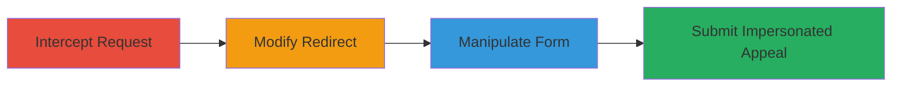

---
tags:
  - auth-bypass
  - http-manipulation
  - impersonation
  - web-exploit
type: attack_chain
tools:
  - '[[tools/Burp-Suite]]'
tactics:
  - '[[Initial Access]]'
verified: false
platforms:
  - Web
submitted: true
complexity: medium
created_at: '2023-10-01T00:00:00Z'
procedures:
  - '[[procedures/Intercept-Initial-GET-Request-to-Appeal-Endpoint]]'
  - '[[procedures/Modify-Server-Redirect-to-Success-Response]]'
  - '[[procedures/Manipulate-Form-Fields-via-Redirect-Tampering]]'
  - '[[procedures/Submit-Impersonated-Appeal-with-Victim-Email]]'
step_count: 4
techniques:
  - '[[Exploit Public-Facing Application]]'
  - '[[Valid Accounts]]'
updated_at: '2025-12-14T17:31:52.518Z'
description: >-
  Multi-stage attack exploiting improper authentication in a U.S. Department of
  Defense web application by intercepting and modifying HTTP responses to bypass
  login requirements and submit impersonated appeals.
skill_level: intermediate
impact_level: high
id: 45608db6-2c40-4601-af5e-6e81f1509726
validated: true
mitre_tactics:
  - '[[Initial Access]]'
mitre_techniques:
  - '[[Exploit Public-Facing Application]]'
  - '[[Valid Accounts]]'
---
# DoD Appeal System Authentication Bypass via HTTP Response Manipulation

Multi-stage attack chain demonstrating improper authentication vulnerability in a U.S. Department of Defense ASP.NET web application, allowing unauthenticated users to bypass login by tampering with HTTP responses and submit appeals impersonating others.

## Chain Metrics Dashboard

| Metric | Value |
|--------|-------|
| Chain Status | Unverified |
| Total Steps | 4 |
| Execution Time | ~5 minutes |
| Skill Level | Intermediate |
| Complexity | Medium |
| Impact Level | High |

## Attack Flow Visualization

## Prerequisites & Requirements

### Required Tools

- [[tools/Burp-Suite]]

### Target Environment

- Web platform (ASP.NET application)
- Access to /App/createappeal.aspx endpoint
- Network access to the DoD application server

### Initial Access Requirements

- No credentials required (unauthenticated access)
- Ability to intercept HTTP traffic (e.g., via proxy)
- Browser configured to route through interception tool

## Detailed Attack Procedures

### Step 1: Intercept Initial GET Request
procedure: [[procedures/Intercept-Initial-GET-Request-to-Appeal-Endpoint]]

**Objective**: Capture the initial request to the appeal creation endpoint to set up for response manipulation.

**Instructions**: Configure a proxy tool like Burp Suite to intercept traffic. Navigate to the appeal creation page and capture the GET request to /App/createappeal.aspx.

**Expected Output**: Intercepted GET request visible in the proxy tool.

**Success Indicators**:
- Request to /App/createappeal.aspx captured
- Server responds with a 302 redirect due to lack of authentication

### Step 2: Modify Server Redirect Response
procedure: [[procedures/Modify-Server-Redirect-to-Success-Response]]

**Objective**: Bypass authentication by changing the server's 302 redirect to a 200 success, allowing access to the form.

**Instructions**: Forward the captured request through the proxy, intercept the server's 302 response, and modify the status code to 200 before forwarding to the browser.

**Expected Output**: Browser loads the appeal creation form without redirecting to login.

**Success Indicators**:
- Form page renders successfully
- No further redirects to authentication page

### Step 3: Manipulate Form Fields
procedure: [[procedures/Manipulate-Form-Fields-via-Redirect-Tampering]]

**Objective**: Interact with form elements like dropdowns by repeatedly modifying 302 responses to 200 to bypass restrictions.

**Instructions**: Fill in form fields, and for each interaction (e.g., selecting dropdown options), intercept any 302 responses and change them to 200 to proceed.

**Expected Output**: All form fields populated without authentication interruptions.

**Success Indicators**:
- Dropdown selections and field inputs accepted
- Form remains accessible throughout interactions

### Step 4: Submit Impersonated Appeal
procedure: [[procedures/Submit-Impersonated-Appeal-with-Victim-Email]]

**Objective**: Enter a victim's email and submit the appeal, triggering a spoofed confirmation email.

**Instructions**: Input the target user's email in the email field, optionally validate via /app/CreateAppeal.aspx?email=[email], then submit the form.

**Expected Output**: Appeal submitted successfully, with a confirmation email sent to the victim's address.

**Success Indicators**:
- Submission confirmation
- Email sent to impersonated user

## Attack Chain Summary

### Key Achievements

1. Bypassed authentication without credentials
2. Impersonated users to submit appeals
3. Spoofed emails compromising confidentiality
4. Disrupted application integrity

## Technique & Tactic Coverage

### MITRE ATT&CK Techniques

- [[Exploit Public-Facing Application]]
- [[Valid Accounts]]

### MITRE ATT&CK Tactics

- [[Initial Access]]

---

*Last updated: 2023-10-01T00:00:00Z*
