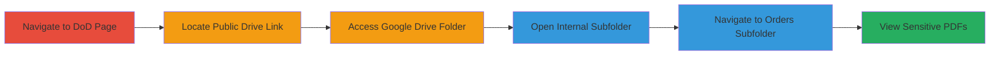

---
tags:
  - information-disclosure
  - pii-exposure
  - misconfiguration
  - google-drive
  - dod
type: attack_chain
tools: []
tactics:
  - '[[Initial Access]]'
verified: false
platforms:
  - Web
submitted: true
complexity: low
created_at: '2023-10-01T00:00:00Z'
procedures:
  - '[[procedures/Access-Exposed-Google-Drive-Folder]]'
step_count: 6
techniques:
  - '[[Exploit Public-Facing Application]]'
updated_at: '2025-12-14T17:25:18.163Z'
description: >-
  A multi-step discovery and access chain exploiting a public Google Drive link
  embedded on a U.S. Department of Defense website, leading to exposure of
  sensitive PII and operational details in military orders.
skill_level: beginner
impact_level: high
id: 1e0104ef-3b96-4fcf-a4c7-e2c7274f8dcb
validated: true
mitre_tactics:
  - '[[Initial Access]]'
mitre_techniques:
  - '[[Exploit Public-Facing Application]]'
---
# DoD Website Public Link Exposing Military PII via Google Drive Misconfiguration

Multi-stage attack chain demonstrating discovery and unauthorized access to sensitive military documents through a public misconfiguration.

## Chain Metrics Dashboard

| Metric | Value |
|--------|-------|
| Chain Status | Unverified |
| Total Steps | 6 |
| Execution Time | ~5 minutes |
| Skill Level | Beginner |
| Complexity | Low |
| Impact Level | High |

## Attack Flow Visualization

## Prerequisites & Requirements

### Required Tools

- Web browser (e.g., Chrome, Firefox)

### Target Environment

- Publicly accessible DoD website (.NET ASPX pages)
- Google Drive service
- No specific ports required (HTTPS/443 implied)

### Initial Access Requirements

- Internet access
- No credentials needed (public exposure)
- No prior access required

## Detailed Attack Procedures

### Step 1: Navigate to DoD Website Page
procedure: [[procedures/Access-Exposed-Google-Drive-Folder]]

**Objective**: Access the read-only DoD webpage containing the embedded public Google Drive link.

**Instructions**: Open a web browser and navigate to the specific DoD URL.

**Expected Output**: The read-only page loads, displaying main content with an embedded link below.

**Success Indicators**:
- Page loads without authentication
- URL matches the target read-only mode

### Step 2: Locate the Google Drive Link on the Page
procedure: [[procedures/Access-Exposed-Google-Drive-Folder]]

**Objective**: Identify the public Google Drive folder link embedded in the page.

**Instructions**: Scroll down below the main content of the page to locate the hyperlink to the Google Drive folder.

**Expected Output**: Visible link to https://drive.google.com/drive/folders/█████████.

**Success Indicators**:
- Link is present and clickable
- No login prompt on the page

### Step 3: Access the Google Drive Folder
procedure: [[procedures/Access-Exposed-Google-Drive-Folder]]

**Objective**: Enter the publicly accessible Google Drive folder without authentication.

**Instructions**: Click the embedded link or copy-paste the URL into a new browser tab to access the folder.

**Expected Output**: Google Drive folder opens, showing contents without requiring sign-in.

**Success Indicators**:
- Folder contents visible
- Sharing settings indicate public access

### Step 4: Open the Internal Folder
procedure: [[procedures/Access-Exposed-Google-Drive-Folder]]

**Objective**: Navigate into the subfolder containing internal documents.

**Instructions**: Within the main Google Drive folder, locate and click on the subfolder named "█████ Internal".

**Expected Output**: Subfolder opens, revealing additional directories including "Orders".

**Success Indicators**:
- Subfolder accessible
- No permission errors

### Step 5: Navigate to the Orders Subfolder
procedure: [[procedures/Access-Exposed-Google-Drive-Folder]]

**Objective**: Access the directory holding sensitive military orders.

**Instructions**: Inside the "█████ Internal" folder, click on the "Orders" subfolder.

**Expected Output**: "Orders" folder loads, displaying PDF files.

**Success Indicators**:
- Folder contents include PDF documents
- Files are downloadable or viewable

### Step 6: Access and View the Sensitive PDFs
procedure: [[procedures/Access-Exposed-Google-Drive-Folder]]

**Objective**: Retrieve and examine documents containing PII and operational details.

**Instructions**: Open individual PDF files within the "Orders" folder using the browser or download them.

**Expected Output**: PDFs reveal full names, SSNs, home addresses, marital status, dependents, security clearance levels, and operational info.

**Success Indicators**:
- PII visible in documents
- Potential for data extraction or screenshots

## Attack Chain Summary

### Key Achievements

1. Discovered public exposure of military PII via DoD website link
2. Accessed sensitive orders without authentication
3. Enabled potential identity theft and privacy violations

## Technique & Tactic Coverage

### MITRE ATT&CK Techniques

- [[Exploit Public-Facing Application]]

### MITRE ATT&CK Tactics

- [[Initial Access]]

---

*Last updated: 2023-10-01T00:00:00Z*
