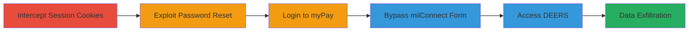

# DoD myPay Account Takeover via Insecure Password Reset and milConnect Form Bypass

Multi-stage attack chain demonstrating complete account takeover of DoD employee accounts in the myPay financial system, enabling access to sensitive data and chained access to DEERS via milConnect.

## Chain Metrics Dashboard

| Metric | Value |
|--------|-------|
| Chain Status | Unverified |
| Total Steps | 6 |
| Execution Time | ~5 minutes |
| Skill Level | Intermediate |
| Complexity | Medium |
| Impact Level | High |

## Attack Flow Visualization



## Prerequisites & Requirements

### Required Tools

- [[tools/Browser-Developer-Tools]]

### Target Environment

- Web platform
- Services: myPay, milConnect, DEERS
- No specific ports required (HTTPS/443)
- Network access: Public internet to DoD sites

### Initial Access Requirements

- No prior credentials needed
- Ability to intercept HTTP requests (e.g., via proxy)
- Valid session cookies from legitimate myPay access

## Detailed Attack Procedures

### Step 1: Intercept Session Cookies
procedure: [[procedures/Intercept-myPay-Session-Cookies]]

**Objective**: Obtain valid session cookies to authenticate requests to the myPay password reset endpoint.

**Instructions**: Visit the myPay site and use a proxy tool to capture cookies from a legitimate session request.

**Expected Output**: Captured cookies including LastMRH_Session, F5_ST, and MRHSession.

**Success Indicators**:
- Cookies extracted successfully
- Cookies can be included in subsequent requests without rejection

### Step 2: Exploit Password Reset Endpoint
procedure: [[procedures/Exploit-myPay-Password-Reset-Endpoint]]

**Objective**: Send a crafted request to change the target user's password without verification.

**Instructions**: Use the captured cookies in a POST request to the /api/session/personalsettings/ForgotPasswordChangeRequest endpoint with the target username and new password. Execute using [[commands/myPay-Password-Reset-Exploit]]:

```bash
curl -X POST 'https://mypay.dfas.mil/api/session/personalsettings/ForgotPasswordChangeRequest' \
  -H 'Cookie: LastMRH_Session=example; F5_ST=example; MRHSession=example' \
  -H 'Content-Type: application/json' \
  -d '{"Username":"targetuser","Password":"newpass","IsLimitedAccessAccount":false,"HasNagC":false,"HasNagF":false,"HasNagM":false,"HasNagN":false}'
```

**Expected Output**: 200 OK response confirming password change.

**Success Indicators**:
- Response indicates success
- Password is overwritten for the target

### Step 3: Login to Compromised myPay Account
procedure: [[procedures/Login-to-Compromised-myPay-Account]]

**Objective**: Authenticate to myPay using the newly set password to gain access to financial records.

**Instructions**: Navigate to the myPay login page and enter the target username and new password.

**Expected Output**: Successful login redirect to the myPay dashboard.

**Success Indicators**:
- Access to account dashboard
- Ability to view sensitive data like pay history and direct deposit details

### Step 4: Bypass milConnect Login Form Restrictions
procedure: [[procedures/Bypass-milConnect-Login-Form-Restrictions]]

**Objective**: Enable the disabled myPay login option on milConnect using developer tools.

**Instructions**: Visit the milConnect site, select the myPay option, and use [[tools/Browser-Developer-Tools]] to edit the form elements, removing disabled attributes from username/password fields and login button.

**Expected Output**: Form fields become editable.

**Success Indicators**:
- Form elements are enabled
- No client-side errors on input

### Step 5: Access DEERS via milConnect
procedure: [[procedures/Access-DEERS-via-milConnect]]

**Objective**: Submit the login form with compromised credentials to access full DEERS profile.

**Instructions**: Enter the compromised myPay username and password into the enabled form and submit.

**Expected Output**: Successful authentication and access to DEERS records.

**Success Indicators**:
- Login succeeds
- Access to comprehensive personnel data including full records

### Step 6: Exfiltrate and Modify Data

**Objective**: View, modify, and extract sensitive information from myPay and DEERS.

**Instructions**: Once logged in, navigate to financial and personnel sections to download or alter data such as addresses, partial SSNs, and direct deposits.

**Expected Output**: Data access and any modifications applied.

**Success Indicators**:
- Sensitive data exposed
- Changes (e.g., direct deposit) processed successfully

## Attack Chain Summary

### Key Achievements

1. Full takeover of any DoD myPay account without verification
2. Bypass of client-side restrictions to chain access to DEERS
3. Exposure and potential modification of highly sensitive military and financial data

## Technique & Tactic Coverage

### MITRE ATT&CK Techniques

- [[Valid Accounts]] Valid Accounts
- [[Exploit Public-Facing Application]] Exploit Public-Facing Application
- [[JavaScript]] JavaScript (for form manipulation)

### MITRE ATT&CK Tactics

- [[Initial Access]] Initial Access
- [[Credential Access]] Credential Access

---

*Last updated: 2023-10-01T00:00:00Z*
