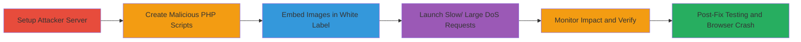

# DoS Attack on Chaturbate Asset Proxy via Reverse Slowloris and Chunked Responses

Multi-stage attack chain exploiting the lack of timeouts and size limits in Chaturbate's asset proxy (camo.stream.highwebmedia.com), allowing denial-of-service through slow periodic data sends (reverse Slowloris) and oversized chunked responses without Content-Length headers. The attack uses PHP scripts hosted on an attacker-controlled server, embedded as images in Chaturbate White Label profiles, causing the proxy to fetch and process malicious content, exhausting connections, bandwidth (up to 800 Mbps), memory, and crashing browsers.

## Chain Metrics Dashboard

| Metric | Value |
|--------|-------|
| Chain Status | Unverified |
| Total Steps | 6 |
| Execution Time | ~30-60 minutes per phase |
| Skill Level | Intermediate |
| Complexity | Medium |
| Impact Level | High |

## Attack Flow Visualization



## Prerequisites & Requirements

### Required Tools

- [[tools/PHP]]
- [[tools/nginx]]
- [[tools/curl]]
- [[tools/netstat]]
- [[tools/uuidgen]]
- [[tools/Browser-Chrome]]

### Target Environment

- Chaturbate White Label account with HTML editing access
- Publicly accessible attacker server (e.g., VPS with PHP and nginx)
- Ports: 80/443 open for HTTP/HTTPS
- Services: Web server, CDN (for proxy interaction)
- Tech Stack: Camo Asset Proxy 2.5.0

### Initial Access Requirements

- Valid Chaturbate White Label profile or page for embedding images
- Attacker-controlled domain/IP for hosting PHP scripts
- No credentials needed for proxy; relies on public-facing misconfiguration

## Detailed Attack Procedures

### Step 1: Setup Attacker Web Server

procedure: [[procedures/Setup-Attacker-Web-Server-with-PHP]]

**Objective**: Establish a server to host PHP scripts that simulate slow or large image responses, enabling the proxy to fetch malicious content.

**Instructions**: Configure a public web server with PHP and high timeouts using [[tools/nginx]].

**Expected Output**: Server accessible via HTTP, ready to serve PHP files.

**Success Indicators**:
- Server responds to HTTP requests
- PHP execution confirmed (e.g., phpinfo.php)

### Step 2: Create Malicious PHP Scripts

procedure: [[procedures/Create-Slow-Response-PHP-Script]]
procedure: [[procedures/Create-Large-Chunked-Response-PHP-Script]]
procedure: [[procedures/Create-Valid-Large-PNG-Script]]

**Objective**: Develop scripts for slow DoS (reverse Slowloris), large invalid responses, and valid oversized PNGs to exploit proxy weaknesses.

**Instructions**: Write slow.php (periodic small chunks), big.php (1GB chunked), and big_valid.php (457MB PNG) as detailed in procedures.

**Expected Output**: Scripts output chunked data with specified delays or sizes.

**Success Indicators**:
- Scripts return HTTP 500/200 with Transfer-Encoding: chunked
- Large files served without errors

### Step 3: Embed Images in Chaturbate White Label

procedure: [[procedures/Embed-Malicious-Images-in-Chaturbate-White-Label]]

**Objective**: Inject img tags pointing to attacker scripts into White Label HTML, triggering proxy fetches.

**Instructions**: Add  etc., to homepage or profile; observe URL rewriting to proxy hashes.

**Expected Output**: Images rewritten to https://camo.stream.highwebmedia.com/[hash]/attacker-path.

**Success Indicators**:
- Proxy URLs generated on page load
- No immediate errors in embedding

### Step 4: Launch Slow and Large DoS

procedure: [[procedures/Launch-Slow-and-Large-DoS-via-Proxy]]

**Objective**: Initiate concurrent requests to proxy endpoints, causing resource exhaustion via slow/large fetches.

**Instructions**: Use [[commands/curl-slow-dos-launch]] for slow attacks and [[commands/curl-large-dos-launch]] for bandwidth exhaustion; target specific IPs with --resolve.

```bash
time curl -s https://camo.stream.highwebmedia.com/4854b41b7c19a74ff2007dced08a28a6b67459a8/████ --resolve camo.stream.highwebmedia.com:443:██████32 > /dev/null &
```

**Expected Output**: Requests pend for 30+ minutes; high bandwidth (600-800 Mbps).

**Success Indicators**:
- Multiple pending connections
- Nginx logs show long response times

### Step 5: Verify and Monitor Impact

procedure: [[procedures/Verify-and-Monitor-DoS-Impact]]

**Objective**: Confirm proxy exhaustion through connection counts and logs.

**Instructions**: Run [[commands/jobs-check-pending]] and [[commands/netstat-connection-count]]; check nginx access logs.

```bash
jobs
netstat -nt | grep ESTABLISHED | grep -c ████32
```

**Expected Output**: Active jobs listed; connection count >10; logs with 1500s+ times.

**Success Indicators**:
- Pending requests confirmed
- High bytes sent in logs

### Step 6: Test Browser Crash and Post-Fix

procedure: [[procedures/Test-Browser-Crash-with-Large-Image]]
procedure: [[procedures/Post-Fix-DoS-Testing]]

**Objective**: Validate end-user impact and test after partial fixes.

**Instructions**: Load White Label in [[tools/Browser-Chrome]] for crash; use [[commands/curl-postfix-large]] with uuidgen for cache bypass.

**Expected Output**: Browser crashes on large PNG; post-fix requests timeout at 8s but backend continues.

**Success Indicators**:
- Browser instability
- Continued backend downloads

## Attack Chain Summary

### Key Achievements

1. Exhausted proxy sockets and bandwidth with few requests
2. Enabled proxied DoS on external sites
3. Crashed end-user browsers via valid large images
4. Bypassed CDN caching with 500 status and random queries

## Technique & Tactic Coverage

### MITRE ATT&CK Techniques

- [[Network Denial of Service]] Network Denial of Service
- [[Endpoint Denial of Service]] Endpoint Denial of Service
- [[Exploit Public-Facing Application]] Exploit Public-Facing Application

### MITRE ATT&CK Tactics

- [[Impact]] Impact

---

*Last updated: 2023-10-01T00:00:00Z*
