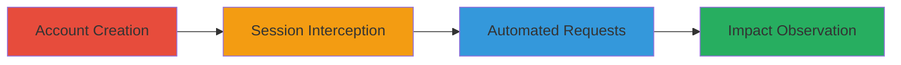

---
tags:
  - dos
  - api-abuse
  - rate-limiting-bypass
  - web-vulnerability
type: attack_chain
tools:
  - '[[tools/Burp-Suite]]'
  - '[[tools/dos.py-Python-Script]]'
tactics:
  - '[[Execution]]'
  - '[[Impact]]'
commands:
  - '[[commands/run-dos-python-script]]'
platforms:
  - Web
complexity: medium
procedures:
  - '[[procedures/Create-Account-on-Semmle-Platform]]'
  - '[[procedures/Intercept-Session-Cookies-with-Burp-Suite]]'
  - '[[procedures/Automate-Excessive-API-Requests-with-Python-Script]]'
  - '[[procedures/Observe-and-Verify-DoS-Impact]]'
step_count: 4
techniques:
  - '[[Python]]'
  - '[[Endpoint Denial of Service]]'
description: >-
  Authenticated DoS attack exploiting lack of rate limiting on internal API
  endpoints to overwhelm the Semmle server with excessive requests.
skill_level: intermediate
impact_level: high
id: 9f4bd57e-8c2e-48bc-8547-c9c6af705f6f
created_at: '2025-12-14T17:32:01.662Z'
updated_at: '2025-12-14T17:32:01.662Z'
verified: false
validated: true
submitted: true
mitre_tactics:
  - '[[Execution]]'
  - '[[Impact]]'
mitre_techniques:
  - '[[Python]]'
  - '[[Endpoint Denial of Service]]'
---
# DoS Attack on Semmle via Unprotected Internal API Endpoints

Multi-stage attack chain demonstrating a complete DoS workflow against Semmle's platform by exploiting unprotected internal API endpoints that lack rate limiting. An authenticated user can automate excessive GET and POST requests to overwhelm the server, potentially causing denial-of-service or buffer overflows due to heavy load.

## Chain Metrics Dashboard

| Metric | Value |
|--------|-------|
| Chain Status | Unverified |
| Total Steps | 4 |
| Execution Time | ~5-10 minutes |
| Skill Level | Intermediate |
| Complexity | Medium |
| Impact Level | High |

## Attack Flow Visualization



## Prerequisites & Requirements

### Required Tools

- [[tools/Burp-Suite]]
- [[tools/dos.py-Python-Script]]

### Target Environment

- Web platform (Semmle/LGTM at lgtm-com.pentesting.semmle.net)
- Required services/ports: HTTPS (443)
- Network access requirements: Internet access to the target domain

### Initial Access Requirements

- No prior credentials needed; create a new account
- Valid email for registration
- No special network position required

## Detailed Attack Procedures

### Step 1: Account Creation
procedure: [[procedures/Create-Account-on-Semmle-Platform]]

**Objective**: Gain authenticated access to the platform to enable API calls.

**Instructions**: Navigate to the registration page and create a new account using valid details.

**Expected Output**: Successful account creation and access to login page.

**Success Indicators**:
- Account registered
- Login prompt appears

### Step 2: Session Interception
procedure: [[procedures/Intercept-Session-Cookies-with-Burp-Suite]]

**Objective**: Capture session cookies and nonces required for authenticated API requests.

**Instructions**: Configure Burp Suite as a proxy, log in to the platform, and intercept the login requests to extract cookie and nonce values.

**Expected Output**: Captured cookie and nonce from HTTP requests.

**Success Indicators**:
- Session details intercepted
- Valid cookie and nonce obtained

### Step 3: Automated Requests
procedure: [[procedures/Automate-Excessive-API-Requests-with-Python-Script]]

**Objective**: Send endless requests to internal API endpoints to overload the server.

**Instructions**: Insert the captured cookie and nonce into the dos.py script and execute it using [[commands/run-dos-python-script]] to target endpoints like /internal_api/v0.2/getSuggestedProjects.

```bash
python dos.py
```

**Expected Output**: Continuous API requests being sent, visible in script output or network logs.

**Success Indicators**:
- Requests automating without errors
- Server response times degrading

### Step 4: Impact Observation
procedure: [[procedures/Observe-and-Verify-DoS-Impact]]

**Objective**: Confirm the DoS effect through server load indicators.

**Instructions**: Monitor the platform's responsiveness or use tools to observe server strain during the attack.

**Expected Output**: Platform slowdown, errors, or unresponsiveness.

**Success Indicators**:
- Server load increase
- Denial of service observed

## Attack Chain Summary

### Key Achievements

1. Authenticated access to unprotected APIs
2. Automation of excessive requests bypassing rate limits
3. Successful induction of server overload leading to DoS

## Technique & Tactic Coverage

### MITRE ATT&CK Techniques

- [[Python]]
- [[Endpoint Denial of Service]]

### MITRE ATT&CK Tactics

- [[Execution]]
- [[Impact]]

---
*Last updated: 2023-10-01T00:00:00Z*
