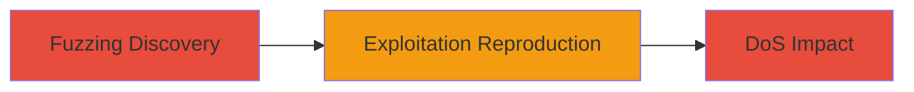

# DoS via Buffer Overflow and Invalid Memory Reads in Node.js Canvas Image Parsing

Multi-stage attack chain demonstrating discovery and exploitation of vulnerabilities in the Node.js canvas module for denial of service through image parsing crashes.

## Chain Metrics Dashboard

| Metric | Value |
|--------|-------|
| Chain Status | Unverified |
| Total Steps | 2 |
| Execution Time | ~30 minutes |
| Skill Level | Intermediate |
| Complexity | Medium |
| Impact Level | High |

## Attack Flow Visualization



## Prerequisites & Requirements

### Required Tools

- [[tools/AFL]]
- [[tools/ascii-art]]
- [[tools/Exploitable]]

### Target Environment

- Node.js runtime (version compatible with canvas 1.6.9)
- NPM for installing packages like ascii-art and canvas
- Cairo backend for canvas module
- Access to compile and run fuzzing setups

### Initial Access Requirements

- Local development environment or server with Node.js installed
- No network access required for local reproduction; for real attacks, user-supplied image upload endpoint in a service using canvas

## Detailed Attack Procedures

### Step 1: Fuzzing Discovery
procedure: [[procedures/Fuzz-Node-js-Canvas-for-Image-Parsing-Vulnerabilities]]

**Objective**: Identify vulnerabilities in PNG, JPG, and GIF parsing within the canvas module using fuzzing to trigger crashes.

**Instructions**: Set up AFL to fuzz the image parsing functions in canvas version 1.6.9. Compile the module with AFL instrumentation and run fuzzing sessions targeting parsing entry points.

**Expected Output**: Crash logs indicating segfaults from buffer overflows and invalid memory reads.

**Success Indicators**:
- AFL reports crashes in parsing routines
- Core dumps generated for further analysis

### Step 2: Exploitation Reproduction
procedure: [[procedures/Reproduce-Canvas-DoS-with-Crafted-Images-via-Ascii-Art]]

**Objective**: Reproduce the discovered vulnerabilities by passing crafted images to a package that uses canvas, causing Node.js process crashes.

**Instructions**: Install the ascii-art package, which depends on canvas, and execute the command with a malicious test image to trigger the segfault.

Use [[commands/ascii-art-process-image]]:

```bash
ascii-art image /full/path/to/test/image
```

Analyze the crash with [[tools/Exploitable]] in GDB to assess exploitability.

**Expected Output**: Node.js segfault and process termination.

**Success Indicators**:
- Service crashes upon image processing
- !exploitable indicates potential for code injection

## Attack Chain Summary

### Key Achievements

1. Discovered multiple parsing vulnerabilities via fuzzing
2. Reproduced DoS crashes in dependent packages
3. Assessed potential for escalation beyond DoS

## Technique & Tactic Coverage

### MITRE ATT&CK Techniques

- [[Endpoint Denial of Service]] Endpoint Denial of Service
- [[Exploit Public-Facing Application]] Exploit Public-Facing Application

### MITRE ATT&CK Tactics

- [[Impact]] Impact

---
*Last updated: 2023-10-01T00:00:00Z*
