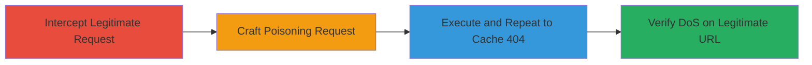

# DoS via Cache Poisoning on Shopify CDN using Backslash Path Normalization

Multi-stage attack chain demonstrating exploitation of a web cache poisoning vulnerability on Shopify's CDN domains (cdn.shopify.com and shopify-assets.shopifycdn.com). The cache server normalizes backslashes (\) to forward slashes (/) in URLs for key generation, but the origin server treats backslashes as invalid and returns 404 errors. By sending requests with backslashes, the 404 response is cached under the normalized legitimate key, poisoning the cache and causing denial of service for static files like JavaScript assets, disrupting services on *.myshopify.com, www.shopify.com, and accounts.shopify.com.

## Chain Metrics Dashboard

| Metric | Value |
|--------|-------|
| Chain Status | Unverified |
| Total Steps | 4 |
| Execution Time | ~5 minutes |
| Skill Level | Intermediate |
| Complexity | Medium |
| Impact Level | High |

## Attack Flow Visualization

## Prerequisites & Requirements

### Required Tools

- [[tools/Burp-Suite]]

### Target Environment

- Web platform with CDN (e.g., cdn.shopify.com, shopify-assets.shopifycdn.com)
- Required services: HTTP/HTTPS on port 80/443
- Network access: Direct internet access to target CDN domains

### Initial Access Requirements

- No credentials required
- Positioned on the same network as the target (internet-facing)
- No prior access needed; targets public-facing CDN

## Detailed Attack Procedures

### Step 1: Intercept Legitimate Request
procedure: [[procedures/Intercept-Legitimate-CDN-Request-with-Burp-Suite]]

**Objective**: Capture a legitimate HTTP GET request to a static file on the target CDN to use as a base for modification.

**Instructions**: Configure Burp Suite as a proxy in your browser. Navigate to a legitimate static file URL, such as https://cdn.shopify.com/static/javascripts/vendor/bugsnag.v7.4.0.min.js, and intercept the request in Burp Suite's Proxy tab.

**Expected Output**: Intercepted HTTP GET request with forward slashes in the path, ready for modification.

**Success Indicators**:
- Request intercepted successfully in Burp Suite
- Original request shows 200 OK response with file content when forwarded

### Step 2: Craft Poisoning Request
procedure: [[procedures/Craft-Cache-Poisoning-Request-with-Backslashes]]

**Objective**: Modify the intercepted request to use backslashes in the path, triggering a 404 from the origin while ensuring the cache normalizes it to the legitimate key.

**Instructions**: In Burp Suite, edit the path to replace forward slashes with backslashes (e.g., /static\javascripts\vendor\bugsnag.v7.4.0.min.js). Add a cache buster query parameter like ?cachebuster=123 to isolate testing without affecting production.

**Expected Output**: Modified request that, when sent, returns a 404 Not Found from the origin server.

**Success Indicators**:
- Path modified with backslashes
- Query parameter added for testing isolation

### Step 3: Execute and Repeat Request to Poison Cache
procedure: [[procedures/Execute-and-Repeat-Request-to-Poison-Cache]]

**Objective**: Send the modified request multiple times to ensure the 404 response is cached under the normalized legitimate path key.

**Instructions**: Forward the modified request through Burp Suite once to get the initial 404. Then, use Burp Repeater or Intruder to send it 5-10 times, forcing the cache to store the 404 response.

**Expected Output**: Multiple 404 responses, with the cache now poisoned for the normalized URL.

**Success Indicators**:
- Repeated requests all return 404
- Cache key poisoning confirmed by subsequent behavior

### Step 4: Verify Cache Poisoning and DoS Effect
procedure: [[procedures/Verify-Cache-Poisoning-and-DoS-Effect]]

**Objective**: Confirm the attack by accessing the original legitimate URL and observing the cached 404, demonstrating DoS.

**Instructions**: In the browser, request the original URL with the cache buster (e.g., https://cdn.shopify.com/static/javascripts/vendor/bugsnag.v7.4.0.min.js?cachebuster=123). The response should now be the cached 404 error page instead of the file.

**Expected Output**: 404 Not Found served from cache for the legitimate request.

**Success Indicators**:
- Legitimate URL returns cached 404
- Access to static assets disrupted, simulating broader service impact

## Attack Chain Summary

### Key Achievements

1. Successfully intercepted and modified legitimate CDN requests using Burp Suite.
2. Exploited path normalization discrepancy to poison cache with 404 responses.
3. Achieved DoS on static files, potentially affecting multiple Shopify services.
4. Demonstrated isolated testing with cache busters to avoid production disruption.

## Technique & Tactic Coverage

### MITRE ATT&CK Techniques

- [[Network Denial of Service]] Network Denial of Service
- [[Exploit Public-Facing Application]] Exploit Public-Facing Application

### MITRE ATT&CK Tactics

- [[Impact]] Impact

---

*Last updated: 2023-10-01T00:00:00Z*
