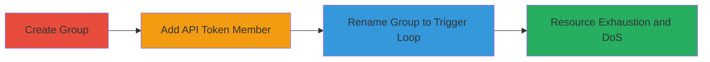

---
tags:
  - dos
  - resource-exhaustion
  - web-vulnerability
  - api
  - hackerone
type: attack_chain
tools:
  - '[[tools/python-requests]]'
  - '[[tools/python-json]]'
tactics:
  - '[[Impact]]'
verified: false
platforms:
  - Web
submitted: true
complexity: medium
created_at: '2023-10-01T00:00:00Z'
procedures:
  - '[[procedures/Create-HackerOne-Group]]'
  - '[[procedures/Add-API-Token-to-HackerOne-Group]]'
  - '[[procedures/Trigger-Infinite-Loop-by-Renaming-HackerOne-Group]]'
step_count: 3
techniques:
  - '[[Endpoint Denial of Service]]'
  - '[[Exploit Public-Facing Application]]'
updated_at: '2025-12-14T17:32:48.193Z'
description: >-
  A multi-step attack exploiting a vulnerability in HackerOne's group management
  feature, where adding an API token as a team member and renaming the group
  triggers a near-infinite loop, causing resource exhaustion and potential
  denial of service.
skill_level: intermediate
impact_level: high
id: 13f512ad-a124-41eb-90ff-7d723af4ddd3
validated: true
mitre_tactics:
  - '[[Impact]]'
mitre_techniques:
  - '[[Endpoint Denial of Service]]'
  - '[[Exploit Public-Facing Application]]'
---
# DoS via Infinite Loop in HackerOne Group Management with API Token Member

Multi-stage attack chain demonstrating a complete attack workflow exploiting a vulnerability in HackerOne's enterprise program group management, leading to server resource exhaustion and denial of service.

## Chain Metrics Dashboard

| Metric | Value |
|--------|-------|
| Chain Status | Unverified |
| Total Steps | 3 |
| Execution Time | ~5 minutes |
| Skill Level | Intermediate |
| Complexity | Medium |
| Impact Level | High |

## Attack Flow Visualization



## Prerequisites & Requirements

### Required Tools

- [[tools/python-requests]]
- [[tools/python-json]]

### Target Environment

- HackerOne platform (web-based)
- Access to an enterprise program for group management
- Valid user credentials with permissions to manage groups and API tokens

### Initial Access Requirements

- Authenticated session to HackerOne
- Program ID (e.g., [PROGRAM])
- No special network access beyond standard web connectivity

## Detailed Attack Procedures

### Step 1: Create New Group
procedure: [[procedures/Create-HackerOne-Group]]

**Objective**: Establish a group in the target program to serve as the vector for the exploit.

**Instructions**: Navigate to the group management page in the HackerOne program settings and create a new group. This can be verified by accessing the groups endpoint.

**Expected Output**: New group created, visible at https://hackerone.com/[PROGRAM]/groups.json with a unique group ID.

**Success Indicators**:
- Group listed in the management interface
- JSON response from /groups.json includes the new group entry

### Step 2: Add API Token to Group
procedure: [[procedures/Add-API-Token-to-HackerOne-Group]]

**Objective**: Introduce an API token as a team member to the group, setting up the condition for the loop vulnerability.

**Instructions**: Go to the API tokens page, select an existing token, manage its groups, and assign it to the newly created group. Verify membership via the team members endpoint.

**Expected Output**: API token assigned to the group, confirmed in https://hackerone.com/[PROGRAM]/team_members/[TEAM_MEMBER_ID].json.

**Success Indicators**:
- Token shows group membership in the UI
- API response lists the group under the token's attributes

### Step 3: Trigger Loop by Renaming Group
procedure: [[procedures/Trigger-Infinite-Loop-by-Renaming-HackerOne-Group]]

**Objective**: Rename the group to activate the infinite loop in serialization, causing repeated JSON data and resource exhaustion.

**Instructions**: Edit the group name in the management interface (e.g., change from 'Testing' to 'AAABC2'). Monitor responses for repetition. Use [[commands/verify-hackerone-group-loop]] to check API persistence.

```bash
python verify_hackerone_group_loop.py
```

**Expected Output**: API responses like /groups.json contain hundreds of repeated group JSON objects, leading to large payloads and potential 500 errors.

**Success Indicators**:
- Excessive repetition in JSON responses (over 500 entries)
- Server-side resource spikes (CPU/memory) observable via monitoring
- Occasional 500 errors on group-related endpoints

## Attack Chain Summary

### Key Achievements

1. Successful creation and manipulation of groups in HackerOne
2. Exploitation of API token membership to trigger infinite loop
3. Achievement of denial of service through resource exhaustion on the platform

## Technique & Tactic Coverage

### MITRE ATT&CK Techniques

- [[Endpoint Denial of Service]] Endpoint Denial of Service
- [[Exploit Public-Facing Application]] Exploit Public-Facing Application

### MITRE ATT&CK Tactics

- [[Impact]] Impact

---
*Last updated: 2023-10-01T00:00:00Z*
