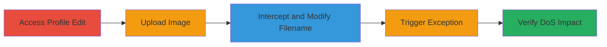

# DoS via Malicious Filename in ActiveStorage Profile Picture Upload

Multi-stage attack chain demonstrating a complete attack workflow exploiting filename validation flaws in ActiveStorage to deny service across HackerOne's application.

## Chain Metrics Dashboard

| Metric | Value |
|--------|-------|
| Chain Status | Unverified |
| Total Steps | 5 |
| Execution Time | ~5 minutes |
| Skill Level | Intermediate |
| Complexity | Medium |
| Impact Level | High |

## Attack Flow Visualization

## Prerequisites & Requirements

### Required Tools

- [[tools/Burp-Suite]]

### Target Environment

- Web platform (HackerOne application)
- Required services: HTTP/HTTPS on standard ports (80/443)
- ActiveStorage with S3 backend

### Initial Access Requirements

- Valid user account on HackerOne
- Network access to https://hackerone.com
- No prior elevated access needed; standard authenticated user suffices

## Detailed Attack Procedures

### Step 1: Access Profile Edit Page
procedure: [[procedures/Access-Profile-Edit-Page]]

**Objective**: Gain access to the profile editing interface to initiate the upload process.

**Instructions**: Log in to your HackerOne account and navigate to the profile edit page at https://hackerone.com/profile/edit.

**Expected Output**: Profile editing form loads, including the profile picture upload section.

**Success Indicators**:
- Edit profile page is accessible
- Upload form is visible

### Step 2: Upload Standard Profile Picture
procedure: [[procedures/Upload-Standard-Profile-Picture]]

**Objective**: Perform a baseline upload to capture the request structure for interception.

**Instructions**: Select a normal image file (e.g., JPG or PNG) and click the Update Profile button to submit the form.

**Expected Output**: Request is sent; profile updates successfully if not intercepted.

**Success Indicators**:
- Upload request is captured in proxy tool
- No errors during standard upload

### Step 3: Intercept and Modify Filename
procedure: [[procedures/Intercept-and-Modify-Filename-with-Burp]]

**Objective**: Alter the uploaded file's filename to include special characters that trigger ActiveStorage exceptions.

**Instructions**: Using [[tools/Burp-Suite]], intercept the upload request and modify the filename parameter to include whitespace or special characters like '+', '%20', or '%0d%0a'. For example, change the filename from 'image.jpg' to 'image%20+.jpg'.

**Expected Output**: Modified request is ready for forwarding.

**Success Indicators**:
- Filename parameter successfully altered in intercepted request
- No immediate rejection by the proxy

### Step 4: Forward Request and Trigger Error
procedure: [[procedures/Forward-Request-and-Trigger-Error]]

**Objective**: Submit the malicious upload to cause the exception in ActiveStorage.

**Instructions**: Disable interception in Burp Suite, forward the modified request, and refresh the profile update page.

**Expected Output**: Internal server error (500) occurs due to ActiveStorage failing to process the filename.

**Success Indicators**:
- Server returns 500 error on profile page
- Exception logged on the server side

### Step 5: Verify DoS on Multiple Pages
procedure: [[procedures/Verify-DoS-on-Multiple-Pages]]

**Objective**: Confirm the denial of service affects application-wide pages that render the profile picture.

**Instructions**: Navigate to pages like hacktivity, thanks, or directory sections that display the affected profile picture.

**Expected Output**: All such pages fail to load, showing internal server errors.

**Success Indicators**:
- Multiple pages (e.g., /hacktivity, /thanks) return 500 errors
- DoS impacts all users viewing the affected profile

## Attack Chain Summary

### Key Achievements

1. Successful upload of malicious filename triggering ActiveStorage exception
2. Application-wide DoS preventing access to profile-related pages
3. Demonstration of impact on user-facing sections like hacktivity and directory

## Technique & Tactic Coverage

### MITRE ATT&CK Techniques

- [[Endpoint Denial of Service]] Endpoint Denial of Service
- [[Exploit Public-Facing Application]] Exploit Public-Facing Application

### MITRE ATT&CK Tactics

- [[Privilege Escalation]] Impact

---
*Last updated: 2023-10-01T00:00:00Z*
