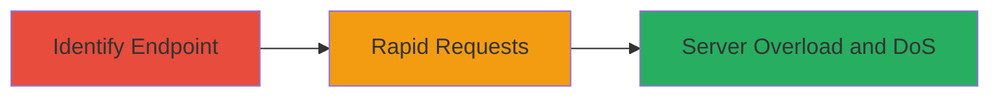

# DoS via Missing Rate Limiting on Weblate API Key Regeneration

Multi-stage attack chain demonstrating exploitation of unthrottled API key regeneration in Weblate to induce server errors and potential denial of service.

## Chain Metrics Dashboard

| Metric | Value |
|--------|-------|
| Chain Status | Unverified |
| Total Steps | 2 |
| Execution Time | ~5 minutes |
| Skill Level | Intermediate |
| Complexity | Medium |
| Impact Level | High |

## Attack Flow Visualization



## Prerequisites & Requirements

### Required Tools

- [[tools/curl]]

### Target Environment

- Web platform running Weblate (Python/Django-based translation management system)
- Access to authenticated user session for API key management
- No specific ports required beyond standard HTTPS (443)

### Initial Access Requirements

- Valid user credentials for Weblate account
- Network access to the Weblate instance
- Prior knowledge of the API key management feature

## Detailed Attack Procedures

### Step 1: Identify API Key Regeneration Endpoint
procedure: [[procedures/Locate-Weblate-API-Key-Regeneration-Endpoint]]

**Objective**: Locate the API endpoint or feature responsible for regenerating API keys in Weblate to assess for throttling mechanisms.

**Instructions**: Access the Weblate instance via web browser or API documentation. Navigate to the user profile or API settings section to identify the regeneration functionality. Use [[commands/curl-discover-endpoint]] to probe for the endpoint if API docs are unavailable:

```bash
curl -X GET https://target-weblate.com/api/user/keys/ -H "Authorization: Token YOUR_API_TOKEN" -v
```

Inspect responses for regeneration options, such as a POST endpoint like `/api/user/keys/regenerate/`.

**Expected Output**: Identification of the regeneration endpoint URL and confirmation of no rate limit mentions in docs or responses.

**Success Indicators**:
- Endpoint URL discovered (e.g., `/api/user/keys/regenerate/`)
- No throttling headers (e.g., no RateLimit-* in responses)

### Step 2: Exploit Lack of Rate Limiting with Rapid Requests
procedure: [[procedures/Exploit-Weblate-Rate-Limiting-Deficiency-with-Rapid-Requests]]

**Objective**: Send a high volume of rapid requests to the regeneration endpoint to overwhelm the server, triggering errors and demonstrating potential DoS.

**Instructions**: Authenticate with your API token and use a loop with [[commands/curl-rapid-regenerate]] to send 30+ requests in quick succession:

```bash
for i in {1..30}; do curl -X POST https://target-weblate.com/api/user/keys/regenerate/ -H "Authorization: Token YOUR_API_TOKEN" -d "{}"; done
```

Monitor responses for errors (e.g., code 6052) after approximately 30 requests, while noting successful processing of up to 685 keys in some cases.

**Expected Output**: Initial successes followed by server errors, indicating overload without throttling.

**Success Indicators**:
- Multiple successful regenerations (e.g., 685 keys processed)
- Server errors (e.g., 6052) after rapid requests, confirming lack of limits
- Potential service degradation or DoS on the endpoint

## Attack Chain Summary

### Key Achievements

1. Identified unthrottled API key regeneration feature in Weblate.
2. Demonstrated server overload via 30+ rapid requests, causing errors.
3. Highlighted potential for broader DoS abuse without key theft or further exploitation.

## Technique & Tactic Coverage

### MITRE ATT&CK Techniques

- [[Network Denial of Service]]

### MITRE ATT&CK Tactics

- [[Impact]]

---
*Last updated: 2023-10-01T00:00:00Z*
