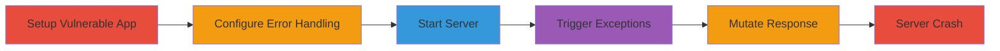

---
tags:
  - dos
  - rails
  - ruby
  - puma
  - rack
  - lograge
  - request-store
type: attack_chain
tools:
  - '[[tools/rails]]'
  - '[[tools/curl]]'
  - '[[tools/Puma]]'
  - '[[tools/lograge]]'
  - '[[tools/request_store]]'
  - '[[tools/Rack-Sendfile]]'
tactics:
  - '[[Impact]]'
verified: false
platforms:
  - Web
  - Ruby on Rails
submitted: true
created_at: '2023-10-01T00:00:00Z'
procedures:
  - '[[procedures/Setup-Vulnerable-Rails-App-with-Lograge]]'
  - '[[procedures/Define-Routes-for-Error-Handling]]'
  - '[[procedures/Create-ErrorsController-with-Not-Found-Action]]'
  - '[[procedures/Start-Rails-Server-in-Production-Mode]]'
  - '[[procedures/Send-Repeated-Malformed-Requests-via-Curl]]'
  - '[[procedures/Observe-Server-Crash-after-Sufficient-Requests]]'
step_count: 6
techniques:
  - '[[Endpoint Denial of Service]]'
  - '[[Exploit Public-Facing Application]]'
updated_at: '2025-12-14T17:26:36.525Z'
description: >-
  A multi-stage attack exploiting a flaw in Ruby on Rails'
  ActionDispatch::ShowExceptions middleware, where the non-frozen
  FAILSAFE_RESPONSE constant is mutated by middleware like lograge and
  request_store, leading to recursive Rack::BodyProxy objects and server crash
  via stack overflow.
id: cce303f6-a07e-4b6e-9e15-b711c02130e9
validated: true
mitre_tactics:
  - '[[Impact]]'
mitre_techniques:
  - '[[Endpoint Denial of Service]]'
  - '[[Exploit Public-Facing Application]]'
---
# DoS via Mutated FAILSAFE_RESPONSE in Rails ActionDispatch Middleware

Multi-stage attack chain demonstrating a complete DoS workflow by exploiting middleware mutation in Ruby on Rails, causing recursive response objects and server stack overflow.

## Chain Metrics Dashboard

| Metric | Value |
|--------|-------|
| Chain Status | Unverified |
| Total Steps | 6 |
| Execution Time | ~5 minutes |
| Skill Level | Intermediate |
| Complexity | Medium |
| Impact Level | High |

## Attack Flow Visualization



## Prerequisites & Requirements

### Required Tools

- [[tools/rails]]
- [[tools/curl]]
- [[tools/Puma]]
- [[tools/lograge]]
- [[tools/request_store]]

### Target Environment

- Ruby on Rails application (version vulnerable to this issue, e.g., pre-patch)
- Puma web server
- Ports: 3000
- Tech stack: Ruby, Ruby on Rails, Rack

### Initial Access Requirements

- Local access to set up and run the Rails app
- No remote credentials needed; simulates public-facing app
- Network access to localhost:3000

## Detailed Attack Procedures

### Step 1: Setup Vulnerable Rails App
procedure: [[procedures/Setup-Vulnerable-Rails-App-with-Lograge]]

**Objective**: Create a new Rails application and integrate the lograge gem to enable the vulnerability.

**Instructions**: Generate a new Rails app and add lograge to the Gemfile, then configure it in application.rb.

**Expected Output**: Gemfile updated and configuration applied.

**Success Indicators**:
- Lograge gem installed
- Configuration enabled without errors

### Step 2: Define Routes for Error Handling
procedure: [[procedures/Define-Routes-for-Error-Handling]]

**Objective**: Set up routes to handle exceptions, routing to an errors controller.

**Instructions**: Edit config/routes.rb to define root and error routes.

**Expected Output**: Routes file updated.

**Success Indicators**:
- Routes defined for root and 404 handling
- No syntax errors in routes

### Step 3: Create ErrorsController with Not Found Action
procedure: [[procedures/Create-ErrorsController-with-Not-Found-Action]]

**Objective**: Implement a controller to handle 404 errors, triggering the ShowExceptions middleware.

**Instructions**: Create app/controllers/errors_controller.rb with the not_found action.

**Expected Output**: Controller file created.

**Success Indicators**:
- Controller renders 404 status
- Action defined correctly

### Step 4: Start Rails Server in Production Mode
procedure: [[procedures/Start-Rails-Server-in-Production-Mode]]

**Objective**: Launch the server in a production-like environment to replicate real-world conditions.

**Instructions**: Use environment variables to start Puma server with limited threads.

Execute [[commands/start-rails-server-production]]:

```bash
RAILS_ENV=production RACK_ENV=production SECRET_KEY_BASE=foo RAILS_SERVE_STATIC_FILES=enabled RAILS_MAX_THREADS=2 RAILS_LOG_TO_STDOUT=enabled rails s
```

**Expected Output**: Server logs indicating startup on http://localhost:3000.

**Success Indicators**:
- Server listening on port 3000
- Production mode active

### Step 5: Send Repeated Malformed Requests via Curl
procedure: [[procedures/Send-Repeated-Malformed-Requests-via-Curl]]

**Objective**: Flood the server with malformed requests to trigger exception handling and mutate the response.

**Instructions**: Run a Ruby loop to send 1000 curl requests to a malformed path.

Execute [[commands/send-repeated-malformed-requests]]:

```bash
1000.times.each do |n| `curl -H "Accept: application/xml" -H "Content-Type: application/xml" -X GET http://localhost:3000///wp1/wp-includes/wlwmanifest.xml` end
```

**Expected Output**: Initial 404 responses, followed by crash after ~989 requests.

**Success Indicators**:
- Exceptions triggered
- Response body growth observed in logs

### Step 6: Observe Server Crash after Sufficient Requests
procedure: [[procedures/Observe-Server-Crash-after-Sufficient-Requests]]

**Objective**: Monitor for the stack overflow and server denial of service.

**Instructions**: Check server logs for the fatal error.

**Expected Output**: Log entry like "#<fatal: machine stack overflow in critical region>".

**Success Indicators**:
- Puma crashes into zombie state
- Application offline

## Attack Chain Summary

### Key Achievements

1. Successful setup of vulnerable Rails environment with lograge.
2. Triggered recursive mutation of FAILSAFE_RESPONSE via repeated exceptions.
3. Achieved DoS by crashing Puma server through stack overflow.

## Technique & Tactic Coverage

### MITRE ATT&CK Techniques

- [[Endpoint Denial of Service]]
- [[Exploit Public-Facing Application]]

### MITRE ATT&CK Tactics

- [[Impact]]

---
*Last updated: 2023-10-01T00:00:00Z*
