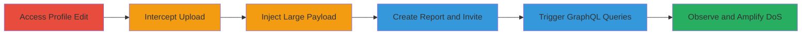

# DoS via Oversized Filename in Profile Picture Upload on HackerOne

Multi-stage attack chain demonstrating a complete denial of service workflow by exploiting unvalidated long filenames in profile picture uploads on HackerOne, leading to oversized GraphQL responses that cause delays, timeouts, and browser crashes on user profile pages.

## Chain Metrics Dashboard

| Metric | Value |
|--------|-------|
| Chain Status | Unverified |
| Total Steps | 6 |
| Execution Time | ~10 minutes |
| Skill Level | Intermediate |
| Complexity | Medium |
| Impact Level | High |

## Attack Flow Visualization

## Prerequisites & Requirements

### Required Tools

- [[tools/Burp-Suite]]

### Target Environment

- Web platform (HackerOne application)
- Required services: GraphQL API, profile upload endpoint
- Network access: Authenticated user account on HackerOne

### Initial Access Requirements

- Valid HackerOne user credentials
- Browser with proxy support (e.g., configured for Burp Suite)
- No prior elevated access needed; standard user account suffices

## Detailed Attack Procedures

### Step 1: Access Profile Edit Page
procedure: [[procedures/Upload-Oversized-Filename-Profile-Picture]]

**Objective**: Initiate the profile picture upload process to set up for payload injection.

**Instructions**: Log in to your HackerOne account and navigate to the profile settings. Select a small image file (e.g., a PNG) to upload as the profile picture.

**Expected Output**: The upload interface loads, ready for file selection.

**Success Indicators**:
- Profile edit page accessible at https://hackerone.com/settings/profile/edit
- File selection dialog opens

### Step 2: Intercept Upload Request
procedure: [[procedures/Intercept-and-Modify-Upload-Request]]

**Objective**: Capture the HTTP POST request for the profile picture upload using a proxy tool.

**Instructions**: Configure your browser to route traffic through Burp Suite. Select the image file and submit the upload; Burp Suite will intercept the request to the upload endpoint.

**Expected Output**: Intercepted POST request visible in Burp Suite, showing multipart form data including the filename.

**Success Indicators**:
- Request captured without errors
- Filename parameter identifiable in the request body

### Step 3: Inject Large Payload into Filename
procedure: [[procedures/Intercept-and-Modify-Upload-Request]]

**Objective**: Append an extremely large text payload to the filename to create an oversized string that propagates to GraphQL responses.

**Instructions**: In Burp Suite, edit the filename in the request by prepending a 3MB text payload (e.g., contents of a large payload.txt file) to the original filename, resulting in something like `<3MB_payload>original.png`. Forward the modified request to complete the upload.

**Expected Output**: Upload succeeds, and the profile picture is set with the oversized filename stored on the backend (e.g., S3).

**Success Indicators**:
- Server accepts the upload (HTTP 200 or redirect)
- Profile picture updates on the user's profile page

### Step 4: Create Dummy Report and Invite Participant
procedure: [[procedures/Create-Report-and-Invite-Participant]]

**Objective**: Create a test report and invite the account with the oversized filename to trigger inclusion in participant lists.

**Instructions**: Using your main account, create a new dummy report (e.g., via the reports creation interface). Then, invite the affected account as a participant using the endpoint https://hackerone.com/reports/<report-id>/participants/.

**Expected Output**: Invitation sent, and the affected user appears in the report's participant list.

**Success Indicators**:
- Report created successfully (e.g., report #654270)
- Participant added without errors

### Step 5: Trigger and Observe DoS Effects
procedure: [[procedures/Observe-DoS-Effects-on-Pages]]

**Objective**: Load pages that fetch user profile data via GraphQL to observe the impact of the oversized filename in responses.

**Instructions**: Navigate to affected pages such as the user's profile, reports list, program pages, thank you pages, or the specific report's participants page. Intercept GraphQL queries with Burp Suite if needed to inspect the huge JSON responses.

**Expected Output**: Pages load slowly or timeout; browser may crash due to processing large JSON payloads containing the 3MB filename.

**Success Indicators**:
- Delays exceeding 30 seconds on page loads
- GraphQL responses include the full oversized filename
- Browser resource exhaustion (high CPU/memory usage)

### Step 6: Amplify Impact with Multiple Invitations
procedure: [[procedures/Amplify-DoS-via-Multiple-Invitations]]

**Objective**: Invite additional accounts to the same report to multiply the junk data in GraphQL responses, escalating the DoS.

**Instructions**: Repeat the invitation process for another account (e.g., @fossnow27) to the same report, ensuring multiple oversized filenames are fetched in participant queries.

**Expected Output**: Further degradation in page performance, with even larger response sizes.

**Success Indicators**:
- Multiple participants added
- Amplified delays or crashes on affected pages
- Potential platform-wide slowdown if scaled

## Attack Chain Summary

### Key Achievements

1. Successful upload of profile picture with 3MB filename payload
2. Propagation of oversized data into GraphQL responses for user profiles and reports
3. Achieved denial of service effects including browser crashes and page timeouts
4. Demonstrated scalability for DDoS-like impact on HackerOne platform pages

## Technique & Tactic Coverage

### MITRE ATT&CK Techniques

- [[Endpoint Denial of Service]] Endpoint Denial of Service
- [[Exploit Public-Facing Application]] Exploit Public-Facing Application

### MITRE ATT&CK Tactics

- [[Impact]] Impact

---

*Last updated: 2023-10-01T12:00:00Z*
