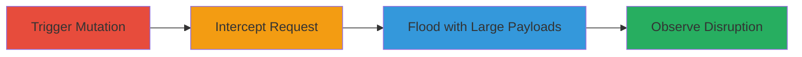

# DoS via Oversized Instruction Payload in CreateStructuredScope GraphQL Mutation

Multi-stage attack chain demonstrating exploitation of insufficient server-side input validation in the CreateStructuredScope GraphQL mutation on a Ruby on Rails backend, causing denial of service through resource exhaustion.

## Chain Metrics Dashboard

| Metric | Value |
|--------|-------|
| Chain Status | Unverified |
| Total Steps | 4 |
| Execution Time | ~5-10 minutes |
| Skill Level | Intermediate |
| Complexity | Medium |
| Impact Level | High |

## Attack Flow Visualization



## Prerequisites & Requirements

### Required Tools

- [[tools/Burp-Suite]]
- [[tools/Python-Requests]]

### Target Environment

- Web platform with GraphQL endpoint (e.g., https://hackerone.com/graphql on port 443)
- Ruby on Rails backend
- Authenticated access to scope management features

### Initial Access Requirements

- Valid authentication token (X-Auth-Token header)
- Session cookies for the target application
- Network access to the GraphQL endpoint

## Detailed Attack Procedures

### Step 1: Trigger CreateStructuredScope Mutation
procedure: [[procedures/Trigger-CreateStructuredScope-Mutation]]

**Objective**: Initiate the GraphQL mutation to create a structured scope, generating a baseline POST request for interception.

**Instructions**: Navigate to the scope management page in the application and attempt to add a new domain, which triggers the CreateStructuredScope mutation via a POST to /graphql.

**Expected Output**: A POST request is generated with operationName: CreateStructuredScope, including variables like asset_identifier, asset_type: URL, and instruction.

**Success Indicators**:
- Request captured in proxy tool
- No errors in initial mutation execution

### Step 2: Intercept and Modify GraphQL Request
procedure: [[procedures/Intercept-and-Modify-GraphQL-Request]]

**Objective**: Capture the legitimate request and prepare it for payload modification using a proxy.

**Instructions**: Configure Burp Suite as a proxy to intercept the POST request to /graphql. Inspect the JSON payload, noting fields like variables.instruction.

**Expected Output**: Intercepted request with full headers (User-Agent, Accept, X-Auth-Token, etc.) and JSON body visible for editing.

**Success Indicators**:
- Request successfully intercepted
- Authentication headers intact

### Step 3: Flood Server with Oversized Payloads
procedure: [[procedures/Flood-Server-with-Oversized-Payloads]]

**Objective**: Construct and send repeated requests with massively oversized instruction fields to exhaust server resources.

**Instructions**: Use the Python script [[commands/send-oversized-graphql-payloads]] to generate a large payload (e.g., 150,000+ Arabic characters) and loop requests 50+ times, or run from multiple terminals for amplification. Target endpoint: https://hackerone.com/graphql.

```python
import requests
# (Full script as defined in command)
```

**Expected Output**: Initial responses with 201 status, transitioning to 500 Internal Server Errors, with increasing delays (e.g., seconds per request).

**Success Indicators**:
- Status codes shift to 500
- Response times exceed 10+ seconds
- Printed output shows errors and content

### Step 4: Monitor and Confirm Service Disruption
procedure: [[procedures/Monitor-and-Confirm-Service-Disruption]]

**Objective**: Validate the DoS impact by observing errors and gathering external confirmation.

**Instructions**: Reload application pages and monitor for HTTP 500, 502, 504 errors. Check community channels (e.g., Discord) for reports of delays from other users.

**Expected Output**: Widespread errors (502/504 gateway timeouts) and user reports of service unavailability.

**Success Indicators**:
- Personal pages fail to load
- Community feedback confirms disruption

## Attack Chain Summary

### Key Achievements

1. Bypassed client-side 10k character limit by sending 150k+ payloads directly to server
2. Induced resource exhaustion leading to HTTP 500 errors
3. Caused cascading 502/504 errors disrupting service for all users
4. Demonstrated impact via external validation

## Technique & Tactic Coverage

### MITRE ATT&CK Techniques

- [[Network Denial of Service]]
- [[Exploit Public-Facing Application]]

### MITRE ATT&CK Tactics

- [[Impact]]

---

*Last updated: 2023-10-01T00:00:00Z*
