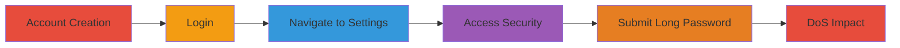

---
tags:
  - dos
  - nextcloud
  - resource-exhaustion
  - uncontrolled-input
  - password-change
type: attack_chain
tools: []
tactics:
  - '[[Impact]]'
verified: false
platforms:
  - Web
  - Nextcloud
submitted: true
complexity: low
created_at: '2024-01-01T00:00:00Z'
procedures:
  - '[[procedures/Create-Nextcloud-Account]]'
  - '[[procedures/Login-to-Nextcloud]]'
  - '[[procedures/Navigate-to-Security-Settings]]'
  - '[[procedures/Submit-Excessive-Password-for-DoS]]'
step_count: 5
techniques:
  - '[[Endpoint Denial of Service]]'
updated_at: '2025-12-14T17:26:30.629Z'
description: >-
  A denial-of-service attack exploiting the lack of password length limits in
  Nextcloud's user security settings, causing client browser freezes and
  potential server resource exhaustion.
skill_level: beginner
impact_level: high
id: bb2da879-a069-468d-b8e0-4fd8ef9fd76d
validated: true
mitre_tactics:
  - '[[Impact]]'
mitre_techniques:
  - '[[Endpoint Denial of Service]]'
---
# DoS via Uncontrolled Password Length in Nextcloud Security Settings

Multi-stage attack chain demonstrating a complete denial-of-service workflow against Nextcloud by submitting an excessively long password, leading to client-side freezing and potential server-side resource exhaustion.

## Chain Metrics Dashboard

| Metric | Value |
|--------|-------|
| Chain Status | Unverified |
| Total Steps | 5 |
| Execution Time | ~5 minutes |
| Skill Level | Beginner |
| Complexity | Low |
| Impact Level | High |

## Attack Flow Visualization

## Prerequisites & Requirements

### Required Tools

- Web browser (e.g., Chrome, Firefox)

### Target Environment

- Nextcloud instance accessible via web (e.g., https://nextcloud.example.com)
- No special ports or services required beyond standard HTTPS (443)

### Initial Access Requirements

- Public access to Nextcloud signup and login pages
- No prior credentials needed; account creation is part of the attack

## Detailed Attack Procedures

### Step 1: Create Account
procedure: [[procedures/Create-Nextcloud-Account]]

**Objective**: Establish initial access by registering a new user account on the target Nextcloud instance.

**Instructions**: Open a web browser and navigate to the Nextcloud signup page. Fill in the required fields with a username, email, and a standard short password (e.g., 8-12 characters). Submit the form to complete registration.

**Expected Output**: Confirmation of account creation and redirection to the login page or dashboard.

**Success Indicators**:
- Account successfully registered
- Able to proceed to login

### Step 2: Login to Account
procedure: [[procedures/Login-to-Nextcloud]]

**Objective**: Authenticate to gain access to the user's personal settings.

**Instructions**: On the login page, enter the newly created username and password. Click the login button to authenticate.

**Expected Output**: Successful login and redirection to the Nextcloud dashboard.

**Success Indicators**:
- Dashboard loads without errors
- User session established

### Step 3: Navigate to Settings
procedure: [[procedures/Navigate-to-Security-Settings]]

**Objective**: Access the personal settings area to reach the security configuration.

**Instructions**: From the dashboard, click on the user profile icon or menu, then select 'Settings' or 'Personal' to enter the settings section. Locate and click on the 'Security' tab or page.

**Expected Output**: Security settings page loads, displaying options like password change.

**Success Indicators**:
- Settings menu accessible
- Security page visible

### Step 4: Access Security Settings
procedure: [[procedures/Navigate-to-Security-Settings]]

**Objective**: Specifically load the password change form within security settings.

**Instructions**: Ensure the URL is at the security endpoint (e.g., /settings/user/security). If not, navigate directly via the browser to the full path like https://nextcloud.example.com/settings/user/security.

**Expected Output**: Password change form appears with fields for current password and new password.

**Success Indicators**:
- Form fields for password change are present
- No access restrictions

### Step 5: Submit Excessive Password for DoS
procedure: [[procedures/Submit-Excessive-Password-for-DoS]]

**Objective**: Trigger resource exhaustion by submitting an arbitrarily long password payload, causing client and server DoS.

**Instructions**: Enter the current (short) password in the verification field. In the new password fields (both confirmation and input), paste or generate a very long string by repeating '123456789' over 1000 times (aim for 9000+ characters). Submit the form.

**Expected Output**: Browser freezes or becomes unresponsive due to processing the long string; server may also hang, making the site unavailable.

**Success Indicators**:
- Client browser tab freezes or crashes
- Server response times out or site becomes unresponsive to other requests

## Attack Chain Summary

### Key Achievements

1. Successful account creation and authentication without detection
2. Navigation to vulnerable password change feature
3. Induction of DoS impacting client and server resources

## Technique & Tactic Coverage

### MITRE ATT&CK Techniques

- [[Endpoint Denial of Service]]

### MITRE ATT&CK Tactics

- [[Impact]]

---
*Last updated: 2024-01-01T00:00:00Z*
