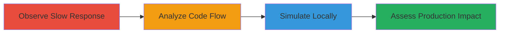

---
tags:
  - dos
  - resource-exhaustion
  - gcs
  - prow
  - kubernetes
  - memory-oom
type: attack_chain
tools:
  - '[[tools/ab-apache-benchmark]]'
tactics:
  - '[[Impact]]'
verified: false
platforms:
  - Web
  - Kubernetes
submitted: true
complexity: medium
created_at: '2023-10-01T00:00:00Z'
procedures:
  - '[[procedures/Trigger-Slow-Response-on-Spyglass-Endpoint]]'
  - '[[procedures/Identify-Vulnerability-in-Prow-Code]]'
  - '[[procedures/Simulate-DoS-with-Local-Go-Server-and-Load-Testing]]'
  - '[[procedures/Assess-Production-Impact-on-Prow-Infrastructure]]'
step_count: 4
techniques:
  - '[[Endpoint Denial of Service]]'
  - '[[Exploit Public-Facing Application]]'
updated_at: '2025-12-14T17:26:37.245Z'
description: >-
  Attack chain exploiting uncontrolled resource consumption in the Kubernetes
  Prow spyglass/lens endpoint by forcing large GCS object downloads into memory,
  leading to OOM and denial of service.
skill_level: intermediate
impact_level: high
id: f0f23cf5-4b7a-43e1-ad62-638fa69f436c
validated: true
mitre_tactics:
  - '[[Impact]]'
mitre_techniques:
  - '[[Endpoint Denial of Service]]'
  - '[[Exploit Public-Facing Application]]'
---
# DoS via Uncontrolled Resource Consumption in Kubernetes Prow Spyglass Endpoint

Multi-stage attack chain demonstrating a denial-of-service attack on the Kubernetes Prow infrastructure by exploiting the spyglass/lens endpoint to download large Google Cloud Storage (GCS) objects entirely into memory, causing out-of-memory (OOM) conditions under concurrent requests.

## Chain Metrics Dashboard

| Metric | Value |
|--------|-------|
| Chain Status | Unverified |
| Total Steps | 4 |
| Execution Time | ~5 minutes |
| Skill Level | Intermediate |
| Complexity | Medium |
| Impact Level | High |

## Attack Flow Visualization



## Prerequisites & Requirements

### Required Tools

- [[tools/ab-apache-benchmark]]

### Target Environment

- Kubernetes Prow infrastructure
- Access to public-facing spyglass/lens endpoint (https://prow.k8s.io/spyglass/lens)
- Google Cloud Storage with large objects (e.g., k8s-test-cache.tar.gz)
- Local Go environment for simulation

### Initial Access Requirements

- Public network access to Prow endpoint
- No authentication required for endpoint

## Detailed Attack Procedures

### Step 1: Observe Slow Response
procedure: [[procedures/Trigger-Slow-Response-on-Spyglass-Endpoint]]

**Objective**: Identify potential resource consumption issues by triggering a slow HTTP response on the spyglass/lens endpoint using a request that downloads a large artifact.

**Instructions**: Send a crafted HTTP request to the endpoint specifying a large GCS artifact in the 'artifacts' parameter.

**Expected Output**: Slow HTTP response due to full download and processing of the large file into memory.

**Success Indicators**:
- Response time exceeds several seconds
- Network traffic shows large data transfer from GCS

### Step 2: Analyze Code Flow
procedure: [[procedures/Identify-Vulnerability-in-Prow-Code]]

**Objective**: Examine the backend code to confirm the vulnerability in artifact fetching and reading without size limits.

**Instructions**: Review the source code in test-infra repository, focusing on the endpoint handler and GCS fetcher implementation.

**Expected Output**: Identification of ioutil.ReadAll() usage without limits on object size.

**Success Indicators**:
- Code paths confirmed leading to full memory load of arbitrary large objects
- No streaming or size checks present

### Step 3: Simulate Locally
procedure: [[procedures/Simulate-DoS-with-Local-Go-Server-and-Load-Testing]]

**Objective**: Reproduce the OOM condition in a controlled local environment using a mock Go server and concurrent requests.

**Instructions**: Implement a simple Go HTTP server that fetches and reads a large file into memory, then bombard it with concurrent requests using [[commands/ab-load-test-concurrent-requests]]:

```bash
ab -n 30 -c 30 http://localhost:8090/download
```

**Expected Output**: Server crashes with OOM error after concurrent requests.

**Success Indicators**:
- Local server process terminates due to memory exhaustion
- Benchmark shows failed requests and high latency

### Step 4: Assess Production Impact
procedure: [[procedures/Assess-Production-Impact-on-Prow-Infrastructure]]

**Objective**: Extrapolate the vulnerability's effect on the live Prow infrastructure under concurrent exploitation.

**Instructions**: Based on local simulation, craft and send multiple concurrent requests to the production endpoint with large artifacts.

**Expected Output**: Production server experiences OOM, leading to service unavailability.

**Success Indicators**:
- Slow or failed responses on production endpoint
- Infrastructure logs indicate memory pressure or restarts

## Attack Chain Summary

### Key Achievements

1. Triggered resource exhaustion via public endpoint
2. Confirmed lack of size limits in GCS artifact handling
3. Demonstrated OOM with concurrent requests
4. Assessed high-impact DoS on Kubernetes Prow

## Technique & Tactic Coverage

### MITRE ATT&CK Techniques

- [[Endpoint Denial of Service]]
- [[Exploit Public-Facing Application]]

### MITRE ATT&CK Tactics

- [[Impact]]

---

*Last updated: 2023-10-01T00:00:00Z*
