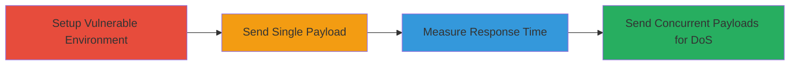

---
tags:
  - dos
  - django
  - unicode
  - normalization
  - web
  - windows
type: attack_chain
tools:
  - '[[tools/Burp-Suite]]'
tactics:
  - '[[Initial Access]]'
  - '[[Privilege Escalation]]'
verified: false
platforms:
  - Web
  - Windows
submitted: true
complexity: medium
created_at: '2023-10-01T00:00:00Z'
procedures:
  - '[[procedures/Setup-Vulnerable-Django-Server]]'
  - '[[procedures/Send-Single-Large-Unicode-Payload]]'
  - '[[procedures/Measure-Single-Request-Response-Time]]'
  - '[[procedures/Send-Concurrent-Unicode-Payloads-for-DoS]]'
step_count: 4
techniques:
  - '[[Exploit Public-Facing Application]]'
  - '[[Endpoint Denial of Service]]'
updated_at: '2025-12-14T17:26:48.796Z'
description: >-
  Multi-stage attack exploiting slow NFKC normalization in Django's
  UsernameField to cause denial of service on Windows systems.
skill_level: intermediate
impact_level: high
id: 12f5b7d9-0a8a-4c61-8d3e-dc0bc2d8a0c3
validated: true
mitre_tactics:
  - '[[Initial Access]]'
  - '[[Privilege Escalation]]'
mitre_techniques:
  - '[[Exploit Public-Facing Application]]'
  - '[[Endpoint Denial of Service]]'
---
# DoS via Unicode Normalization Exhaustion in Django UsernameField on Windows

Multi-stage attack chain demonstrating a denial of service exploit in Django's UsernameField due to slow NFKC normalization processing large Unicode inputs on Windows.

## Chain Metrics Dashboard

| Metric | Value |
|--------|-------|
| Chain Status | Unverified |
| Total Steps | 4 |
| Execution Time | ~5 minutes |
| Skill Level | Intermediate |
| Complexity | Medium |
| Impact Level | High |

## Attack Flow Visualization

## Prerequisites & Requirements

### Required Tools

- [[tools/Burp-Suite]]

### Target Environment

- Windows OS
- Django versions before 4.2.7, 4.1.13, or 3.2.23
- Python web stack
- Exposed admin login endpoint (e.g., /admin/)

### Initial Access Requirements

- Local or remote access to a Windows server running vulnerable Django
- Network access to the admin login page
- No prior credentials needed for unauthenticated DoS

## Detailed Attack Procedures

### Step 1: Setup Vulnerable Environment
procedure: [[procedures/Setup-Vulnerable-Django-Server]]

**Objective**: Prepare a local Django web server on Windows using a vulnerable version to host the admin interface.

**Instructions**: Install and run Django versions affected by the vulnerability, ensuring the admin app is enabled and accessible.

**Expected Output**: Running Django server with admin login page at http://localhost:8000/admin/.

**Success Indicators**:
- Server starts without errors
- Admin login page loads normally

### Step 2: Send Single Large Unicode Payload
procedure: [[procedures/Send-Single-Large-Unicode-Payload]]

**Objective**: Craft and send a POST request to the admin login with over 1 million invalid Unicode characters to trigger slow normalization.

**Instructions**: Use Burp Suite to intercept and modify the login request, injecting a large payload of characters like '¾' into the username field.

**Expected Output**: Request processes but takes approximately 4.4 seconds due to NFKC normalization.

**Success Indicators**:
- Delayed response observed
- No immediate crash, but significant processing time

### Step 3: Measure Single Request Response Time
procedure: [[procedures/Measure-Single-Request-Response-Time]]

**Objective**: Verify the impact of the payload by timing the response for a single request.

**Instructions**: Repeat the payload submission and monitor the time taken for the server to respond using Burp Suite's timing features.

**Expected Output**: Average response time of 4.4 seconds per request.

**Success Indicators**:
- Consistent delays confirming normalization bottleneck
- Server remains responsive but slowed

### Step 4: Execute Concurrent DoS
procedure: [[procedures/Send-Concurrent-Unicode-Payloads-for-DoS]]

**Objective**: Flood the server with multiple concurrent requests to amplify the DoS effect, causing timeouts.

**Instructions**: Configure Burp Suite to send 20 concurrent POST requests with the same large Unicode payload to overwhelm the server.

**Expected Output**: Requests result in 60-second wait times and 504 gateway timeout errors.

**Success Indicators**:
- Timeouts and errors on concurrent load
- Denial of service on forms using UsernameField

## Attack Chain Summary

### Key Achievements

1. Successful exploitation of NFKC normalization slowness on Windows
2. Demonstration of single-request delay and concurrent DoS
3. Impact on Django admin and any UsernameField-based forms

## Technique & Tactic Coverage

### MITRE ATT&CK Techniques

- [[Exploit Public-Facing Application]]
- [[Endpoint Denial of Service]]

### MITRE ATT&CK Tactics

- [[Initial Access]]
- [[Privilege Escalation]]

---
*Last updated: 2023-10-01T00:00:00Z*
