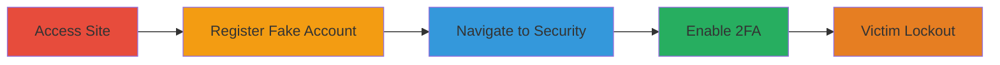

---
tags:
  - account-lockout
  - 2fa-hijack
  - unverified-email
  - dos
  - improper-access-control
type: attack_chain
tools:
  - '[[tools/Google-Authenticator]]'
tactics:
  - '[[Initial Access]]'
  - '[[Impact]]'
verified: false
platforms:
  - Web
submitted: true
complexity: low
created_at: '2023-10-01T00:00:00Z'
procedures:
  - '[[procedures/Access-XVideos-Homepage]]'
  - '[[procedures/Register-Account-with-Victim-Email]]'
  - '[[procedures/Access-Account-Security-Settings]]'
  - '[[procedures/Enable-2FA-with-Attacker-Authenticator]]'
step_count: 4
techniques:
  - '[[Exploit Public-Facing Application]]'
updated_at: '2025-12-14T17:24:48.252Z'
description: >-
  An attacker exploits the lack of email verification on XVideos to register an
  account with a victim's email, then enables 2FA using their own authenticator
  app, locking the victim out of account creation or recovery.
skill_level: beginner
impact_level: high
id: dcee7f4e-e8e1-421b-8df7-1c870843087e
validated: true
mitre_tactics:
  - '[[Initial Access]]'
  - '[[Impact]]'
mitre_techniques:
  - '[[Exploit Public-Facing Application]]'
---
# DoS via Unverified Email Registration and 2FA Hijacking on XVideos

Multi-stage attack chain demonstrating a complete denial-of-service workflow against XVideos account registration by exploiting unverified email signups and unauthorized 2FA enablement.

## Chain Metrics Dashboard

| Metric | Value |
|--------|-------|
| Chain Status | Unverified |
| Total Steps | 4 |
| Execution Time | ~5 minutes |
| Skill Level | Beginner |
| Complexity | Low |
| Impact Level | High |

## Attack Flow Visualization

## Prerequisites & Requirements

### Required Tools

- [[tools/Google-Authenticator]]

### Target Environment

- Web platform (xvideos.com)
- No specific services/ports required beyond standard HTTPS (443)
- Internet access to the target site

### Initial Access Requirements

- Victim's email address
- No prior credentials or network position needed
- Attacker must have a device capable of running Google Authenticator

## Detailed Attack Procedures

### Step 1: Access Homepage
procedure: [[procedures/Access-XVideos-Homepage]]

**Objective**: Gain initial access to the XVideos website to begin the registration process.

**Instructions**: Open a web browser and navigate to the XVideos homepage. No authentication is required at this stage.

**Expected Output**: The homepage loads successfully, displaying content and registration options.

**Success Indicators**:
- Homepage accessible without errors
- 'Join for free' button visible

### Step 2: Register Account with Victim's Email
procedure: [[procedures/Register-Account-with-Victim-Email]]

**Objective**: Create an unauthorized account using the victim's unverified email address.

**Instructions**: Click on the 'Join for free' section and fill out the registration form using the victim's email address. Submit the form without needing to verify the email, as the platform does not enforce it.

**Expected Output**: Account creation succeeds, and the attacker receives temporary login credentials or is redirected to login.

**Success Indicators**:
- Registration completes without email verification prompt
- Attacker can log in with the new account

### Step 3: Access Account Security Settings
procedure: [[procedures/Access-Account-Security-Settings]]

**Objective**: Navigate to the security settings of the newly created account to prepare for 2FA enablement.

**Instructions**: After logging in with the new account credentials, go to the account section and select the security settings page.

**Expected Output**: The /account/security endpoint loads, showing options including two-step verification.

**Success Indicators**:
- Security settings page accessible
- 2FA option visible and editable

### Step 4: Enable 2FA with Attacker's Authenticator
procedure: [[procedures/Enable-2FA-with-Attacker-Authenticator]]

**Objective**: Enable two-factor authentication using the attacker's own Google Authenticator app, permanently locking out the victim.

**Instructions**: In the security settings, select 'Two-step verification' and follow the prompts to scan the QR code or enter the secret key into the attacker's Google Authenticator app. Complete the setup by entering a generated TOTP code.

**Expected Output**: 2FA is enabled on the account, requiring the attacker's authenticator for future logins or resets.

**Success Indicators**:
- 2FA status shows as enabled
- Victim cannot register or reset password without the attacker's 2FA code

## Attack Chain Summary

### Key Achievements

1. Successful unverified account registration with victim's email
2. Unauthorized access to account security features
3. 2FA enablement without ownership verification, resulting in DoS
4. Permanent lockout of legitimate user from email-associated actions

## Technique & Tactic Coverage

### MITRE ATT&CK Techniques

- [[Exploit Public-Facing Application]]

### MITRE ATT&CK Tactics

- [[Initial Access]]
- [[Impact]]

---
*Last updated: 2023-10-01T00:00:00Z*
