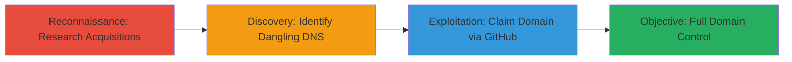

# Domain Takeover of Snapchat Acquisition Domain via Dangling GitHub Pages DNS

Multi-stage attack chain demonstrating a complete domain takeover workflow by exploiting abandoned DNS records from a company acquisition.

## Chain Metrics Dashboard

| Metric | Value |
|--------|-------|
| Chain Status | Unverified |
| Total Steps | 3 |
| Execution Time | ~15 minutes |
| Skill Level | Intermediate |
| Complexity | Medium |
| Impact Level | High |

## Attack Flow Visualization

## Prerequisites & Requirements

### Required Tools

- Web browser for research and verification
- GitHub account for claiming the repository

### Target Environment

- Public DNS resolution
- Access to Crunchbase or similar acquisition databases
- GitHub platform availability

### Initial Access Requirements

- No prior credentials needed
- Internet access for research and GitHub operations
- No specific network position required

## Detailed Attack Procedures

### Step 1: Research Company Acquisitions
procedure: [[procedures/Research-Company-Acquisitions-for-Domain-Takeover]]

**Objective**: Identify potentially abandoned domains from recent acquisitions that may have dangling DNS records.

**Instructions**: Use a search engine or database like Crunchbase to query acquisitions by the target company (e.g., Snapchat). Focus on acquired entities with custom domains. For example, search for "Snapchat acquisitions" and review company profiles for domain names like obviousengine.com.

**Expected Output**: List of acquired companies and their associated domains, such as obviousengine.com linked to Obvious Engineering.

**Success Indicators**:
- Acquired domains identified
- Links to company overviews confirmed (e.g., https://www.crunchbase.com/organization/obvious-engineering)

### Step 2: Identify Dangling DNS Records
procedure: [[procedures/Identify-Dangling-GitHub-Pages-DNS]]

**Objective**: Verify if the target domain resolves to an unclaimed or default service, indicating vulnerability to takeover.

**Instructions**: Visit the domain (e.g., obviousengine.com) in a web browser. Check for indicators of dangling records, such as a default GitHub Pages 404 page or unclaimed repository message, suggesting DNS points to username.github.io without an active repo.

**Expected Output**: Browser displays a GitHub Pages default page, confirming the DNS CNAME points to an unused GitHub-hosted site.

**Success Indicators**:
- Domain resolves but shows unclaimed GitHub content
- No custom content from the original owner

### Step 3: Claim Domain via GitHub
procedure: [[procedures/Claim-Domain-via-GitHub-Repository-Creation]]

**Objective**: Take control of the domain by creating and configuring a GitHub repository to hijack the DNS pointer.

**Instructions**: Log in to GitHub and create a new repository named exactly after the domain (e.g., obviousengine.com). Enable GitHub Pages in the repository settings, add a CNAME file with the domain name, and push an index.html file with custom content to verify control. Update DNS if needed, but in this case, the existing CNAME allows immediate hijacking.

**Expected Output**: The domain now resolves to the custom content hosted on the new GitHub Pages site.

**Success Indicators**:
- Custom page loads when visiting the domain
- Full control confirmed for hosting arbitrary content

## Attack Chain Summary

### Key Achievements

1. Identified vulnerable domain from acquisition research
2. Confirmed dangling DNS to unclaimed GitHub Pages
3. Achieved domain takeover, enabling phishing or malware hosting

## Technique & Tactic Coverage

### MITRE ATT&CK Techniques

- [[Gather Victim Host Information]] Gather Victim Host Information
- [[Exploit Public-Facing Application]] Exploit Public-Facing Application

### MITRE ATT&CK Tactics

- [[Reconnaissance]] Reconnaissance
- [[Initial Access]] Initial Access

---
*Last updated: 2023-10-01T00:00:00Z*
