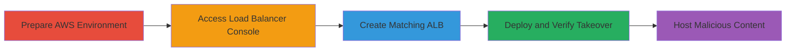

# Domain Takeover via Dangling AWS ELB CNAME Record

Multi-stage attack chain demonstrating a complete workflow for subdomain takeover by recreating a deleted AWS Elastic Load Balancer referenced in a dangling CNAME record. This allows an attacker to control traffic to the subdomain, such as traefik-livedemo.rocket.chat, and host phishing sites mimicking trusted branding to steal credentials.

## Chain Metrics Dashboard

| Metric | Value |
|--------|-------|
| Chain Status | Unverified |
| Total Steps | 4 |
| Execution Time | ~30 minutes |
| Skill Level | Intermediate |
| Complexity | Medium |
| Impact Level | High |

## Attack Flow Visualization

## Prerequisites & Requirements

### Required Tools

- [[tools/Automated-ELB-Creation-Script]]

### Target Environment

- AWS Account with permissions to create Elastic Load Balancers
- Target region: us-west-2
- Knowledge of the dangling CNAME target (e.g., a0e7eaaaa82f611e9b1cc0e9ccd15f3e-557536140.us-west-2.elb.amazonaws.com)

### Initial Access Requirements

- Valid AWS credentials (free tier account sufficient)
- No prior access to the target domain's AWS account needed, as this exploits public DNS misconfiguration

## Detailed Attack Procedures

### Step 1: Prepare AWS Account
procedure: [[procedures/Prepare-AWS-Account-for-ELB-Creation]]

**Objective**: Set up an AWS account and configure the correct region to access ELB resources.

**Instructions**: Log in to the AWS Management Console and select the us-west-2 region, where the dangling ELB reference exists. This ensures all subsequent actions target the correct environment.

**Expected Output**: AWS console loaded with us-west-2 region active.

**Success Indicators**:
- Region selector shows us-west-2
- No authentication errors

### Step 2: Access Load Balancer Section
procedure: [[procedures/Navigate-AWS-Console-to-Load-Balancers]]

**Objective**: Locate the Elastic Load Balancing service to initiate creation of a new load balancer.

**Instructions**: From the AWS console, navigate to the EC2 Dashboard, then under Load Balancing, select Load Balancers. This positions you to create a new resource.

**Expected Output**: Load Balancers dashboard visible.

**Success Indicators**:
- List of existing load balancers (or empty if none)
- 'Create Load Balancer' button available

### Step 3: Initiate ALB Creation with Target Name
procedure: [[procedures/Create-ALB-with-Matching-ELB-Name]]

**Objective**: Start the process of creating an Application Load Balancer using the prefix from the dangling CNAME to match the ELB name.

**Instructions**: Click 'Create Load Balancer', select Application Load Balancer type, and enter the name prefix (e.g., a0e7eaaaa82f611e9b1cc0e9ccd15f3e) extracted from the CNAME record.

**Expected Output**: ALB creation form populated with the target name.

**Success Indicators**:
- Name field accepts the input without validation errors
- ALB type selected

### Step 4: Deploy and Verify Takeover
procedure: [[procedures/Deploy-and-Verify-ELB-for-Domain-Takeover]]

**Objective**: Complete the ELB deployment and confirm the DNS name matches the dangling record for subdomain control.

**Instructions**: Finish the configuration, deploy the load balancer, and check the generated DNS name for the matching numeric suffix (e.g., -557536140.us-west-2.elb.amazonaws.com). Use [[tools/Automated-ELB-Creation-Script]] if manual attempts fail to iterate over suffixes.

**Expected Output**: New ELB active with DNS name resolving the subdomain (e.g., traefik-livedemo.rocket.chat points to the attacker's ELB).

**Success Indicators**:
- DNS query for subdomain returns attacker's ELB IP
- Ability to configure listeners for hosting phishing content

## Attack Chain Summary

### Key Achievements

1. Identified and exploited dangling CNAME for NXDomain takeover opportunity
2. Recreated ELB to gain control over trusted subdomain
3. Enabled hosting of malicious payloads under rocket.chat branding for credential phishing

## Technique & Tactic Coverage

### MITRE ATT&CK Techniques

- [[T1583.001]] Domains
- [[Exploit Public-Facing Application]] Exploit Public-Facing Application

### MITRE ATT&CK Tactics

- [[Initial Access]] Initial Access

---

*Last updated: 2023-10-01T00:00:00Z*
