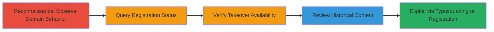

# Domain Takeover via Expired Domain Registration Enabling Phishing and Typosquatting

Multi-stage attack chain demonstrating reconnaissance and exploitation of an expired domain to achieve takeover, enabling phishing, credential theft, and site impersonation.

## Chain Metrics Dashboard

| Metric | Value |
|--------|-------|
| Chain Status | Unverified |
| Total Steps | 5 |
| Execution Time | ~10 minutes |
| Skill Level | Beginner |
| Complexity | Low |
| Impact Level | High |

## Attack Flow Visualization



## Prerequisites & Requirements

### Required Tools

- [[tools/whois]]
- [[tools/google-cache]]

### Target Environment

- Web-accessible domain
- Domain registrar services
- No special ports required; standard HTTP/HTTPS

### Initial Access Requirements

- Public internet access
- No credentials needed for reconnaissance
- Ability to register domains (for exploitation demo)

## Detailed Attack Procedures

### Step 1: Observe Domain Behavior
procedure: [[procedures/Detect-Expired-Domain-Registration]]

**Objective**: Identify signs of domain expiration by checking if the site displays unexpected content like parking ads instead of original material.

**Instructions**: Access the target domain using a web browser or [[commands/curl-access-url]] to fetch the homepage:

```bash
curl -s http://doesfranshaveashell.com/ | head -n 20
```

Look for indicators of a parking service, such as advertisement iframes or generic parking pages.

**Expected Output**: HTML response containing ad scripts or parking service branding rather than original site content.

**Success Indicators**:
- Site shows ads or parking page
- No original content loads

### Step 2: Query Domain Registration Status
procedure: [[procedures/Detect-Expired-Domain-Registration]]

**Objective**: Confirm expiration details using WHOIS to check registration status and dates.

**Instructions**: Use [[tools/whois]] or the [[commands/whois-query]] command to retrieve domain details:

```bash
whois doesfranshaveashell.com
```

Focus on expiration date (e.g., 2019-09-02) and status (e.g., clientTransferProhibited).

**Expected Output**: WHOIS output showing expired status and no active registrar control.

**Success Indicators**:
- Expiration date in the past
- Status indicates prohibition on transfer or redemption

### Step 3: Verify Takeover Availability
procedure: [[procedures/Verify-Domain-Takeover-Vulnerability]]

**Objective**: Test if the domain is vulnerable to takeover by accessing expected paths that should exist on the original site but return parking errors.

**Instructions**: Probe a known path like /keybase.txt using [[commands/curl-access-url]]:

```bash
curl -s http://doesfranshaveashell.com/keybase.txt -I
```

Expect a 404 from the parking service.

**Expected Output**: HTTP 404 or parking service error page.

**Success Indicators**:
- Non-original 404 response
- Confirmation of parking service control

### Step 4: Review Historical Site Content
procedure: [[procedures/Verify-Domain-Takeover-Vulnerability]]

**Objective**: Retrieve cached versions to understand the original site's purpose and verify the impact of expiration.

**Instructions**: Access Google Cache via [[tools/google-cache]] by searching for "cache:http://doesfranshaveashell.com/" in Google or using [[commands/curl-google-cache]] if automated:

```bash
curl -s 'https://webcache.googleusercontent.com/search?q=cache:http://doesfranshaveashell.com/' | grep -i keybase
```

Look for original Keybase verification content from before expiration (e.g., August 28, 2019).

**Expected Output**: Cached page showing original verification TXT record or site content.

**Success Indicators**:
- Historical content confirms original use (e.g., Keybase proof)
- Cache date predates expiration

### Step 5: Demonstrate Exploitation via Typosquatting
procedure: [[procedures/Demonstrate-Typosquatting-Exploit]]

**Objective**: Show potential for impersonation by registering a similar domain variant and setting up phishing elements.

**Instructions**: Register a typosquatted domain like 'doesfranhaveashell.com' via a registrar (cost ~$9.88/year), then host fake content using [[commands/curl-host-fake-page]] or a simple web server:

```bash
# Example: Serve fake login page (setup via registrar DNS)
echo '<html><form action="/login">Fake Login</form></html>' > index.html
python3 -m http.server 80
```

Configure DNS to point to your server and craft phishing forms for credential theft.

**Expected Output**: Accessible fake site mimicking the original for UI redressing or phishing.

**Success Indicators**:
- Variant domain registered successfully
- Fake site live and impersonating original

## Attack Chain Summary

### Key Achievements

1. Detected expired domain through behavioral observation and WHOIS confirmation.
2. Verified takeover vulnerability by probing paths and reviewing caches.
3. Demonstrated high-impact exploitation via typosquatting for phishing and impersonation.

## Technique & Tactic Coverage

### MITRE ATT&CK Techniques

- [[Gather Victim Host Information]] Gather Victim Host Information
- [[T1566.001]] Phishing: Spearphishing Attachment (adapted for site impersonation)
- [[T1583.001]] Acquire Infrastructure: Domains

### MITRE ATT&CK Tactics

- [[Reconnaissance]] Reconnaissance
- [[Initial Access]] Initial Access

---

*Last updated: 2023-10-01T00:00:00Z*
