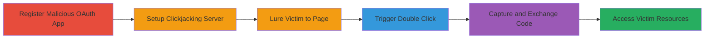

---
tags:
  - clickjacking
  - oauth
  - double-clickjacking
  - authorization-bypass
  - token-theft
type: attack_chain
tools:
  - '[[tools/Flask]]'
  - '[[tools/Webhook-Site]]'
tactics:
  - '[[Initial Access]]'
  - '[[Credential Access]]'
commands:
  - '[[commands/python-flask-server]]'
verified: false
platforms:
  - Web
submitted: true
complexity: medium
created_at: '2023-10-01T00:00:00Z'
procedures:
  - '[[procedures/Register-WakaTime-OAuth-Application]]'
  - '[[procedures/Setup-Malicious-Clickjacking-Server]]'
  - '[[procedures/Lure-Victim-to-Initial-Webpage]]'
  - '[[procedures/Trigger-Double-Click-Authorization]]'
  - '[[procedures/Capture-and-Exchange-OAuth-Code]]'
step_count: 5
techniques:
  - '[[Drive-by Compromise]]'
  - '[[Use Alternate Authentication Material]]'
updated_at: '2025-12-14T17:30:18.752Z'
description: >-
  A multi-stage attack exploiting a double clickjacking vulnerability in
  WakaTime's OAuth flow to authorize a malicious app and steal access tokens for
  full resource access.
skill_level: intermediate
impact_level: high
id: 88585588-922e-4247-bd9a-d53ba8db036b
validated: true
mitre_tactics:
  - '[[Initial Access]]'
  - '[[Credential Access]]'
mitre_techniques:
  - '[[Drive-by Compromise]]'
  - '[[Use Alternate Authentication Material]]'
---
# Double Clickjacking on WakaTime OAuth to Steal Access Tokens

Multi-stage attack chain demonstrating a complete workflow for exploiting a double clickjacking vulnerability in WakaTime's OAuth authorization at https://wakatime.com/oauth/authorize. Traditional protections like X-Frame-Options fail against this popup-based variant, allowing attackers to trick users into authorizing a malicious OAuth app via aligned buttons, leading to access token theft and full control over victim resources such as organizations.

## Chain Metrics Dashboard

| Metric | Value |
|--------|-------|
| Chain Status | Unverified |
| Total Steps | 5 |
| Execution Time | ~10 minutes |
| Skill Level | Intermediate |
| Complexity | Medium |
| Impact Level | High |

## Attack Flow Visualization



## Prerequisites & Requirements

### Required Tools

- [[tools/Flask]]
- [[tools/Webhook-Site]]

### Target Environment

- Web browser (any modern browser)
- Access to WakaTime developer portal
- Network access to host malicious pages

### Initial Access Requirements

- No prior credentials needed
- Victim must visit attacker's controlled webpage
- Attacker needs a public domain or localhost for PoC

## Detailed Attack Procedures

### Step 1: Register Malicious OAuth Application

procedure: [[procedures/Register-WakaTime-OAuth-Application]]

**Objective**: Create a legitimate-looking OAuth app on WakaTime to obtain client credentials for the attack.

**Instructions**: Navigate to https://wakatime.com/apps/new and register a new app with a redirect URI pointing to a controlled endpoint like webhook.site for capturing codes. Use scopes like read_orgs and write_orgs to request broad access.

**Expected Output**: Client ID (e.g., joUNHCTnWqQ9hsmrWS5CTokR) and registered redirect URI.

**Success Indicators**:
- App registration successful
- Client ID and redirect URI obtained

### Step 2: Setup Malicious Clickjacking Server

procedure: [[procedures/Setup-Malicious-Clickjacking-Server]]

**Objective**: Host webpages that facilitate the clickjacking by redirecting to OAuth and overlaying buttons.

**Instructions**: Download the PoC source (e.g., from 250805_wakatime_double_clickjacking.zip), update index.html with your client_id and redirect_uri, then start the Flask server using [[commands/python-flask-server]]:

```bash
python main.py
```

This serves index.html (initial lure page) and attack.html (popup with overlaid button) on http://127.0.0.1:5000 or a public domain.

**Expected Output**: Server running message, e.g., * Running on http://127.0.0.1:5000.

**Success Indicators**:
- Server starts without errors
- Pages accessible at / and /attack

### Step 3: Lure Victim to Initial Webpage

procedure: [[procedures/Lure-Victim-to-Initial-Webpage]]

**Objective**: Trick the victim into visiting the attacker's page, which initiates the OAuth flow and opens the clickjacking popup.

**Instructions**: Distribute the link to index.html (e.g., via phishing email or social engineering). Upon visit, the page redirects the current tab to the OAuth URL: https://wakatime.com/oauth/authorize?client_id=joUNHCTnWqQ9hsmrWS5CTokR&response_type=code&redirect_uri=https://webhook.site/15495620-7c98-4643-a6df-9e7864c0dead&scope=read_orgs,write_orgs and opens a new tab to /attack.

**Expected Output**: Victim's browser redirects to OAuth page; popup tab opens with 'Double Click' button.

**Success Indicators**:
- Victim loads index.html
- OAuth authorization page appears

### Step 4: Trigger Double-Click Authorization

procedure: [[procedures/Trigger-Double-Click-Authorization]]

**Objective**: Exploit user interaction to authorize the malicious app without awareness.

**Instructions**: The attack.html positions a 'Double Click' button precisely over the 'Connect my WakaTime account' button on the OAuth page. When the victim double-clicks (e.g., to interact), the first click closes the popup tab, and the second click submits the authorization form.

**Expected Output**: OAuth form submission; redirect to redirect_uri with authorization code.

**Success Indicators**:
- Popup closes on first click
- Authorization completes on second click

### Step 5: Capture and Exchange OAuth Code

procedure: [[procedures/Capture-and-Exchange-OAuth-Code]]

**Objective**: Intercept the authorization code and exchange it for an access token to access victim data.

**Instructions**: Monitor the redirect_uri (e.g., https://webhook.site/15495620-7c98-4643-a6df-9e7864c0dead?code=CODE) to capture the code. Use the WakaTime API to exchange it for a token: POST to https://wakatime.com/api/v1/oauth/token with client_id, client_secret, code, and grant_type=authorization_code.

**Expected Output**: Access token received; API calls to victim resources succeed (e.g., list organizations).

**Success Indicators**:
- Code captured in webhook
- Token exchange successful
- Access to scopes like read_orgs granted

## Attack Chain Summary

### Key Achievements

1. Bypassed OAuth protections via double clickjacking
2. Obtained unauthorized access token without user consent
3. Gained full read/write access to victim's WakaTime organizations

## Technique & Tactic Coverage

### MITRE ATT&CK Techniques

- [[Drive-by Compromise]] Drive-by Compromise
- [[Use Alternate Authentication Material]] Use Alternate Authentication Material

### MITRE ATT&CK Tactics

- [[Initial Access]] Initial Access
- [[Credential Access]] Credential Access

---

*Last updated: 2023-10-01T00:00:00Z*
