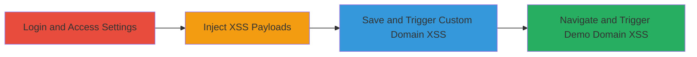

---
tags:
  - xss
  - stored-xss
  - javascript
  - admin-panel
  - session-hijacking
type: attack_chain
tools: []
tactics:
  - '[[Execution]]'
verified: false
platforms:
  - Web
submitted: true
complexity: medium
created_at: '2023-10-01T00:00:00Z'
procedures:
  - '[[procedures/Login-to-Federalist-and-Navigate-to-Site-Settings]]'
  - '[[procedures/Inject-XSS-Payloads-into-Domain-Fields]]'
  - '[[procedures/Save-Settings-and-Trigger-Custom-Domain-XSS]]'
  - '[[procedures/Navigate-to-Published-Site-and-Trigger-Demo-Domain-XSS]]'
step_count: 4
techniques:
  - '[[JavaScript]]'
updated_at: '2025-12-14T17:29:27.870Z'
description: >-
  A multi-stage attack exploiting stored XSS vulnerabilities in the Federalist
  admin panel's Custom Domain and Demo Domain fields to inject and trigger
  malicious JavaScript, enabling session hijacking and unauthorized actions in
  other admins' contexts.
skill_level: intermediate
impact_level: high
id: 6fd8b456-9c42-4166-bfd1-a47d64cae577
validated: true
mitre_tactics:
  - '[[Execution]]'
mitre_techniques:
  - '[[JavaScript]]'
---
---

# Double Stored XSS in Federalist Admin Panel for Admin Session Hijacking

Multi-stage attack chain demonstrating stored XSS exploitation in the Federalist platform's admin panel to inject JavaScript payloads into domain fields, which execute in the context of other administrators, leading to potential session theft, data access, or unauthorized modifications.

## Chain Metrics Dashboard

| Metric | Value |
|--------|-------|
| Chain Status | Unverified |
| Total Steps | 4 |
| Execution Time | ~5 minutes |
| Skill Level | Intermediate |
| Complexity | Medium |
| Impact Level | High |

## Attack Flow Visualization

## Prerequisites & Requirements

### Required Tools

- Browser with developer tools (e.g., Chrome DevTools for payload testing)

### Target Environment

- Federalist platform running locally or remotely (e.g., http://localhost:1337)
- Admin credentials for the Federalist instance
- Access to site settings via /sites/<siteid>/settings

### Initial Access Requirements

- Valid admin login credentials
- Network access to the Federalist admin panel (port 1337)
- No prior access needed beyond authentication

## Detailed Attack Procedures

### Step 1: Login to Federalist and Navigate to Site Settings
procedure: [[procedures/Login-to-Federalist-and-Navigate-to-Site-Settings]]

**Objective**: Gain authenticated access to the admin panel and reach the site settings page to prepare for payload injection.

**Instructions**: Log in to the Federalist admin interface and navigate to the specific site's settings page.

**Expected Output**: Access to the settings form at /sites/<siteid>/settings.

**Success Indicators**:
- Successful login without errors
- Site settings page loads with Custom Domain and Demo Domain fields visible

### Step 2: Inject XSS Payloads into Domain Fields
procedure: [[procedures/Inject-XSS-Payloads-into-Domain-Fields]]

**Objective**: Insert malicious JavaScript payloads into the Custom Domain and Demo Domain fields to store the XSS without immediate detection.

**Instructions**: Enter the payloads into the respective fields, using a semicolon in the Demo Domain to bypass any duplication checks.

**Expected Output**: Payloads accepted and form ready for submission.

**Success Indicators**:
- No validation errors on input
- Fields populated with javascript: payloads

### Step 3: Save Settings and Trigger Custom Domain XSS
procedure: [[procedures/Save-Settings-and-Trigger-Custom-Domain-XSS]]

**Objective**: Persist the injected payload and execute it by interacting with the 'View Website' button, demonstrating stored XSS in the admin context.

**Instructions**: Submit the form to save the settings, then click 'View Website' to trigger the payload from the Custom Domain field.

**Expected Output**: Alert box displaying the document domain (e.g., localhost).

**Success Indicators**:
- Settings saved successfully
- JavaScript alert pops up confirming execution

### Step 4: Navigate to Published Site and Trigger Demo Domain XSS
procedure: [[procedures/Navigate-to-Published-Site-and-Trigger-Demo-Domain-XSS]]

**Objective**: Trigger the second stored XSS payload in the published site view, affecting other admins who access the demo.

**Instructions**: Access the published site page and click 'view' on the demo site to execute the Demo Domain payload.

**Expected Output**: Second alert box showing the document domain.

**Success Indicators**:
- Published site page loads
- JavaScript alert executes from the stored Demo Domain payload

## Attack Chain Summary

### Key Achievements

1. Successful injection and storage of two XSS payloads in admin fields
2. Execution of payloads in the context of the admin session, proving potential for session hijacking
3. Bypass of basic input checks using semicolon variation, enabling persistent attacks on other users

## Technique & Tactic Coverage

### MITRE ATT&CK Techniques

- [[JavaScript]]

### MITRE ATT&CK Tactics

- [[Execution]]

---

*Last updated: 2023-10-01T00:00:00Z*
