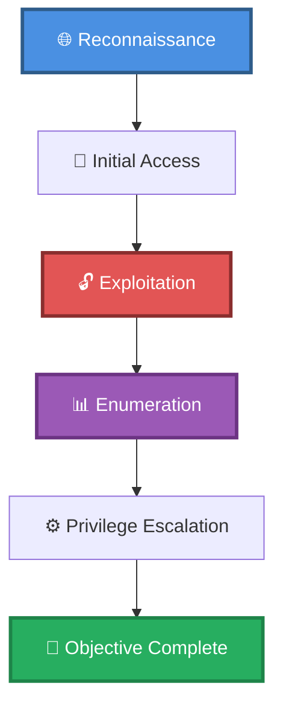

# 🎯 Drupal 7.x RCE Chain w/ Reverse Shell (no auth)

> **Enhanced Attack Chain Dashboard**

---

## 📊 Chain Metrics Dashboard

| Metric | Value |
|--------|-------|
| **Chain Status** | ⚠️ **UNVERIFIED** |
| **Total Steps** | `6` |
| **Execution Time** | ~1-2 hours |
| **Skill Level** | 🟢 Beginner-Intermediate |
| **Complexity** | Medium |
| **Impact Level** | 🟡 **MEDIUM** |

---

## 🎭 Attack Flow Visualization



---

## 🛠️ Prerequisites & Requirements

### Required Tools
```bash path=null start=null
# Tools will be listed here based on procedures
```

### Target Environment
- ✅ Windows target system
- ✅ Web application target
- ✅ Network connectivity to target

### Initial Access Requirements
- 🔓 Requirements based on first step of chain
- 🔓 See detailed procedures below

---

## 🔬 Detailed Attack Procedures

### **[Step 1]** Basic Port Scan with Service Enumeration

**Progress:** `█░░░░░░░░░` 16% | **Risk:** 🟢 Low

**Procedure:** [[Basic Port Scan with Service Enumeration]]

> 📝 **Objective:** Perform an Nmap port scan on a target and enumerate banners of ports 1-1024, as well as popular services (a full list can be found in /usr/share/nmap/nmap-services).

**Expected Output:**
- Refer to procedure documentation for details

**Success Indicators:** ✅ Objective achieved

---

### **[Step 2]** Directory Brute Force a Web App (Wfuzz)

**Progress:** `███░░░░░░░` 33% | **Risk:** 🟢 Low

**Procedure:** [[Directory Brute Force a Web App (Wfuzz)]]

> 📝 **Objective:** Enumerate a webs app's files and folders by performing a dictionary brute force attack.

**Expected Output:**
- Refer to procedure documentation for details

**Success Indicators:** ✅ Objective achieved

---

### **[Step 3]** Drupal 7.x Services Module RCE (CVE-2019-6340)

**Progress:** `█████░░░░░` 50% | **Risk:** 🔴 High

**Procedure:** [[Drupal 7.x Services Module RCE (CVE-2019-6340)]]

> 📝 **Objective:** Improper sanitation of input from non-form sources allows attackers to execute arbitrary code if either: the site uses a RESTful API the site has a module like JSON.API enabled.

**Expected Output:**
- Refer to procedure documentation for details

**Success Indicators:** ✅ Objective achieved

---

### **[Step 4]** Upgrade from a Website RCE to Netcat Reverse Shell (Windows)

**Progress:** `██████░░░░` 66% | **Risk:** 🔴 High

**Procedure:** [[Upgrade from a Website RCE to Netcat Reverse Shell (Windows)]]

> 📝 **Objective:** Download and execute Netcat to create  a reverse shell on a remote system. While Windows  can spawn reverse shells natively, the key functions are often blocked for security reasons, so a third party program like Netcat is required.

**Expected Output:**
- Refer to procedure documentation for details

**Success Indicators:** ✅ Objective achieved

---

### **[Step 5]** Enumerate Windows for Missing Patches and Hotfixes (Sherlock)

**Progress:** `████████░░` 83% | **Risk:** 🟢 Low

**Procedure:** [[Enumerate Windows for Missing Patches and Hotfixes (Sherlock)]]

> 📝 **Objective:** Use Sherlock to enumerate a Windows system for potential privilege escalation paths, including common vulnerabilities , unquoted service paths, missing patches, permission issues, and more.

**Expected Output:**
- Refer to procedure documentation for details

**Success Indicators:** ✅ Objective achieved

---

### **[Step 6]** Exploit the ClientCopyImage Vulnerability (MS15-051)

**Progress:** `██████████` 100% | **Risk:** 🔴 High

**Procedure:** [[Exploit the ClientCopyImage Vulnerability (MS15-051)]]

> 📝 **Objective:** Windows 2003, 2008, Vista, 7, and 2012  which have not been patched with KB3065979 may be vulnerable to MS15-051, a kernel exploit which can allow attackers to escalate privileges to SYSTEM. This exploit is architecture specific, so the build (x86 or x64) must match the target system.

**Expected Output:**
- Refer to procedure documentation for details

**Success Indicators:** ✅ Objective achieved

---

## 🎯 Attack Chain Summary

### Key Achievements
- ✅ Directory Brute Force a Web App (Wfuzz)
- ✅ Basic Port Scan with Service Enumeration
- ✅ Enumerate Windows for Missing Patches and Hotfixes (Sherlock)
- ✅ Drupal 7.x Services Module RCE (CVE-2019-6340)
- ✅ Exploit the ClientCopyImage Vulnerability (MS15-051)
- ... and 1 more procedures

---

## 📈 Technique & Tactic Coverage

---

**Last Updated:** 2023-05-29T16:48:53.162677+00:00 | **Chain Version:** 2.0 Enhanced | **Status:** ⚠️ Draft
