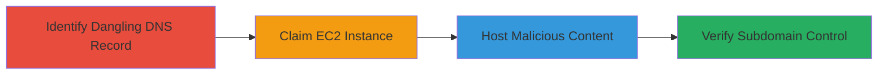

---
tags:
  - subdomain-takeover
  - aws
  - ec2
  - dns
type: attack_chain
tools: []
tactics:
  - '[[Initial Access]]'
  - '[[Reconnaissance]]'
verified: false
platforms:
  - AWS
submitted: true
complexity: medium
created_at: '2023-10-01T00:00:00Z'
procedures:
  - '[[procedures/Perform-Subdomain-Takeover-by-Claiming-Dangling-EC2-Instance]]'
  - '[[procedures/Host-and-Verify-Proof-of-Concept-on-Taken-Over-Subdomain]]'
step_count: 2
techniques:
  - '[[Exploit Public-Facing Application]]'
updated_at: '2025-12-14T04:51:26.561Z'
description: >-
  Attack chain exploiting a dangling DNS A record pointing to a terminated EC2
  instance, enabling subdomain takeover to host malicious content.
skill_level: intermediate
impact_level: high
id: 5250a6ba-5647-47b7-b335-273614db0c12
validated: true
mitre_tactics:
  - '[[Initial Access]]'
  - '[[Reconnaissance]]'
mitre_techniques:
  - '[[Exploit Public-Facing Application]]'
---
# EC2 Subdomain Takeover via Dangling DNS A Record

Multi-stage attack chain demonstrating a complete attack workflow exploiting a misconfigured DNS A record in AWS that points to a non-existent EC2 instance, allowing an attacker to claim the resource and gain control over a subdomain for hosting malicious content.

## Chain Metrics Dashboard

| Metric | Value |
|--------|-------|
| Chain Status | Unverified |
| Total Steps | 2 |
| Execution Time | ~30 minutes |
| Skill Level | Intermediate |
| Complexity | Medium |
| Impact Level | High |

## Attack Flow Visualization

## Prerequisites & Requirements

### Required Tools

- AWS Account (for claiming resources)
- DNS Enumeration Tools (e.g., manual dig or nslookup)

### Target Environment

- AWS Cloud Platform
- EC2 Service
- DNS Infrastructure with A records

### Initial Access Requirements

- Public access to DNS records
- Ability to register AWS resources (attacker must have an AWS account)
- No prior credentials needed for the target

## Detailed Attack Procedures

### Step 1: Identify and Claim Dangling EC2 Instance
procedure: [[procedures/Perform-Subdomain-Takeover-by-Claiming-Dangling-EC2-Instance]]

**Objective**: Discover the orphaned DNS A record and claim the associated EC2 resource to take over the subdomain.

**Instructions**: Query the target's DNS records to identify A records pointing to non-responsive IPs associated with terminated EC2 instances. Once identified, use an AWS account to launch an EC2 instance at the specified IP or claim the Elastic IP if applicable, effectively taking control of the subdomain resolution.

**Expected Output**: Successful launch of EC2 instance responding at the subdomain's IP, with DNS resolving to the attacker's controlled instance.

**Success Indicators**:
- DNS query shows A record to non-existent IP
- Attacker's EC2 instance is live and accessible via the subdomain

### Step 2: Host and Verify Proof-of-Concept
procedure: [[procedures/Host-and-Verify-Proof-of-Concept-on-Taken-Over-Subdomain]]

**Objective**: Host arbitrary content on the taken-over subdomain to demonstrate control and potential for malicious actions like phishing or CORS bypass.

**Instructions**: Upload and serve a proof-of-concept HTML page on the claimed EC2 instance. Access the subdomain URL to verify that the content loads, confirming subdomain takeover.

**Expected Output**: The PoC page (e.g., http://subdomain.target.com/poc.html) displays attacker-controlled content.

**Success Indicators**:
- Subdomain resolves to and serves the hosted PoC
- No errors in accessing the malicious content

## Attack Chain Summary

### Key Achievements

1. Identification of dangling DNS A record for terminated EC2 instance
2. Successful claiming of the EC2 resource for subdomain control
3. Hosting of PoC content enabling potential phishing or protection bypass

## Technique & Tactic Coverage

### MITRE ATT&CK Techniques

- [[Exploit Public-Facing Application]]

### MITRE ATT&CK Tactics

- [[Initial Access]]
- [[Reconnaissance]]

---
*Last updated: 2023-10-01T00:00:00Z*
